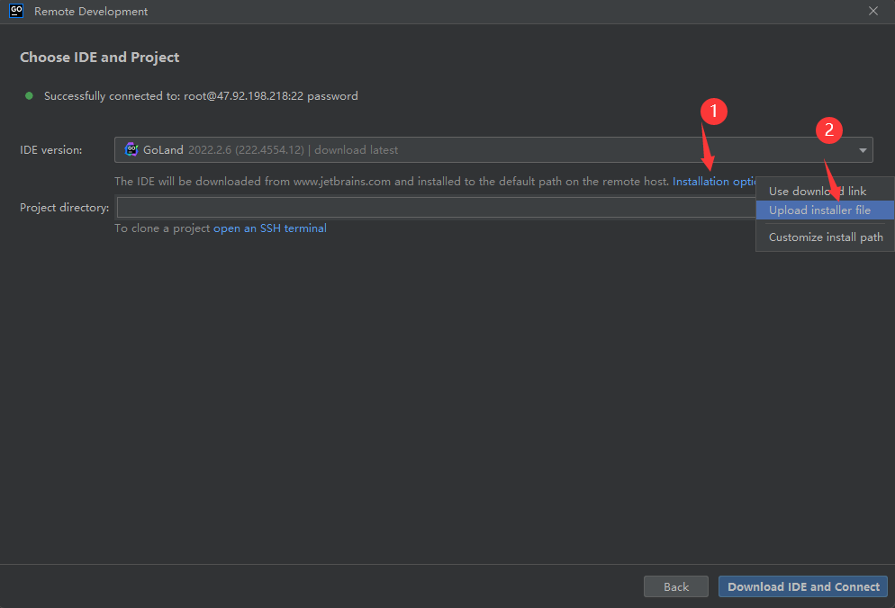
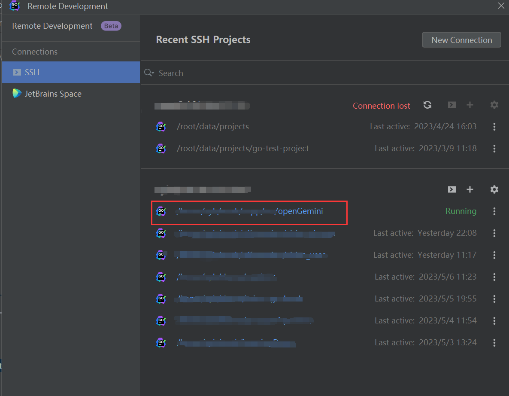

# Setup your IDE

Using an integrated development environment (IDE) can significantly simplify our development 
work and reduce the learning curve. When working with the Go language, 
it is recommended to use JetBrains' GoLand IDE. 
This article will describe how to utilize the remote development feature of GoLand to 
develop on a Linux server.

## Step1: Download Goland  
Download the Linux version of GoLand(tar.gz) from the [JetBrains website](https://www.jetbrains.com/go/download/#section=linux).

## Step2: Configure Remote Development

- Launch GoLand and select "Remote Development" from the file menu. 
- Choose "SSH Connect" and enter the host of your Linux server to establish an SSH connection.
- Next, you will see a UI as shown in the image below. From the installation options, select "Upload installer file".

- Select the tar.gz file downloaded previously and specify the directory you wish to open.
- Set the project directory that you wish to open.
- Click on "Upload and Connect" and wait for the configuration to complete.
- After completion, you will see the remote development version of the GoLand interface as follows.

- In future logins, simply find the previously opened project under the "SSH" section and connect to it.

