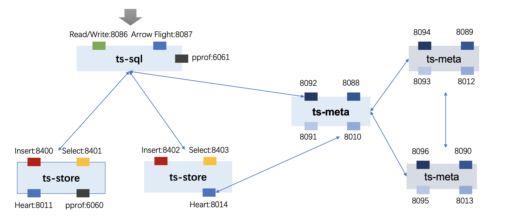
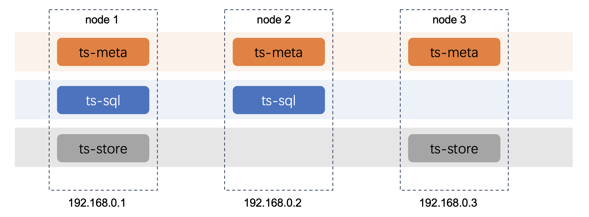

::: info
This document explores which components need to be deployed for manual deployment and helps familiarize yourself with how the open gemini cluster works. 
:::

Cluster deployment can deploy all three components of openGemini on one node, or distribute components to multiple nodes.

Download the binary package, refer to [installation and deployment]()

## Deployment of pseudo-cluster

Deploy a pseudo-cluster means all components of the openGemini are deployed on the same node. Currently, the community provides the deployment script install_cluster.sh.
```shell
> sh scripts/install_cluster.sh
```
Run the command to start an openGemini cluster on the local host without modifying the configuration file.   
The cluster includes one ts-sql, three ts-meta, and two ts-store. However, it only listens and runs on the local loopback address 127.0. 0.1. It can be used for local function testing and learning, and cannot provide external access services.  
If you want to use local IP address so that can access openGemini with other machines, you need to modify the configuration file. This method requires you to have a better understanding of the operating system and network.   

**Although possible, it is not recommended.**   

The following uses a cluster with one ts-sql, three ts-meta, and two ts-store as an example to show how to deploy a openGemini cluster.

### **Allocate ports**  

All nodes listen to the local IP address, such as 192.168.0.1, so all the same components cannot use the same port and need to be reallocated. The following port allocation can be made (for reference only)：



### **Modify the configuration file**  

The openGemini has only one cluster configuration file openGemini.conf. If only one ts-meta, one ts-sql, and one ts-store, or two or one of them are deployed on a node, The same component is not deployed on the same node. In this case, all components on the node share the same configuration file openGemini.conf.
Obviously, the pseudo-cluster cannot share one, because there are three ts-metas and two ts-stores on the same node. Therefore, we recommend a configuration file for each component. The method is as follows:

```shell
> cp –rf openGemini.conf sql.conf
> cp –rf openGemini.conf meta-1.conf
> cp –rf openGemini.conf meta-2.conf
> cp –rf openGemini.conf meta-3.conf
> cp –rf openGemini.conf store-1.conf
> cp –rf openGemini.conf store-2.conf
```
- **Modify the following information in the sql.conf file**  
  use 192.168.0.1 for example.
```toml
[common]
meta-join = ["192.168.0.1:8092", "192.168.0.1:8094", "192.168.0.1:8096"]
[http]
bind-address = "192.168.0.1:8086"
[logging]
# recommend change the directory.
path = "/path/openGemini/logs"
```
- **Modify the meta-1.conf file**

  Only the following information needs to be modified.

```toml
[common]
meta-join = ["192.168.0.1:8092", "192.168.0.1:8094", "192.168.0.1:8096"]
[meta]
bind-address = "192.168.0.1:8088"
http-bind-address = "192.168.0.1:8091"
rpc-bind-address = "192.168.0.1:8092"
# recommend replace /tmp with other director
dir = "/path/to/openGemini/data/meta/1"
[logging]
# replace /path
path = "/path/openGemini/logs"
[gossip]
bind-address = "192.168.0.1"
meta-bind-port = 8010
members = ["192.168.0.1:8010", "192.168.0.1:8012", "192.168.0.1:8013"]
```
- **Modify the meta-2.conf file**  
  
  Only the following information needs to be modified:
```toml
[common]
meta-join = ["192.168.0.1:8092", "192.168.0.1:8094", "192.168.0.1:8096"]
[meta]
bind-address = "192.168.0.1:8089"
http-bind-address = "192.168.0.1:8093"
rpc-bind-address = "192.168.0.1:8094"
# recommend replace /tmp with other director
dir = "/path/to/openGemini/data/meta/2"
[logging]
# replace /path
path = "/path/openGemini/logs"
[gossip]
bind-address = "192.168.0.1"
meta-bind-port = 8012
members = ["192.168.0.1:8010", "192.168.0.1:8012", "192.168.0.1:8013"]
```
- **Modify the meta-3.conf file**  
  Only the following information needs to be modified:
```toml
[common]
meta-join = ["192.168.0.1:8092", "192.168.0.1:8094", "192.168.0.1:8096"]
[meta]
bind-address = "192.168.0.1:8090"
http-bind-address = "192.168.0.1:8095"
rpc-bind-address = "192.168.0.1:8096"
# recommend replace /tmp with other director
dir = "/path/to/openGemini/data/meta/3"
[logging]
# replace /path
path = "/path/openGemini/logs"
[gossip]
bind-address = "192.168.0.1"
meta-bind-port = 8013
members = ["192.168.0.1:8010", "192.168.0.1:8012", "192.168.0.1:8013"]
```
- **Modify the store-1.conf file**

```toml
[common]
meta-join = ["192.168.0.1:8092", "192.168.0.1:8094", "192.168.0.1:8096"]
[data]
store-ingest-addr = "192.168.0.1:8400"
store-select-addr = "192.168.0.1:8401"
store-data-dir = "/path/to/openGemini/data/1"
store-wal-dir = "/path/to/openGemini/data/1"
store-meta-dir = "/path/to/openGemini/data/meta/1"
[logging]
# replace /path
path = "/path/openGemini/logs"
[gossip]
bind-address = "192.168.0.1"
store-bind-port = 8011
members = ["192.168.0.1:8010", "192.168.0.1:8012", "192.168.0.1:8013"]
```
- **Modify the store-2.conf file**
```toml
[common]
meta-join = ["192.168.0.1:8092", "192.168.0.1:8094", "192.168.0.1:8096"]
[data]
store-ingest-addr = "192.168.0.1:8402"
store-select-addr = "192.168.0.1:8403"
store-data-dir = "/path/to/openGemini/data/2"
store-wal-dir = "/path/to/openGemini/data/2"
store-meta-dir = "/path/to/openGemini/data/meta/2"
[logging]
# replace /path
path = "/path/openGemini/logs"
[gossip]
bind-address = "192.168.0.1"
store-bind-port = 8014
members = ["192.168.0.1:8010", "192.168.0.1:8012", "192.168.0.1:8013"]
```
**If you need to add a ts-store, change the port and run the ts-store again**

### Start the cluster  

Editing a Script

```
> cp –rf scripts/install_cluster.sh scripts/cluster.sh
> vim scripts/cluster.sh
```

Delete or comment out lines 27 to 38 in the cluster.sh script.

```shell
# generate config
for((i = 1; i <= 3; i++))
do
rm -rf config/openGemini-$i.conf
cp config/openGemini.conf config/openGemini-$i.conf
sed -i "s/{{meta_addr_1}}/${nodes[1]}/g" config/openGemini-$i.conf
sed -i "s/{{meta_addr_2}}/${nodes[2]}/g" config/openGemini-$i.conf
sed -i "s/{{meta_addr_3}}/${nodes[3]}/g" config/openGemini-$i.conf
sed -i "s/{{addr}}/${nodes[$i]}/g" config/openGemini-$i.conf

sed -i "s/{{id}}/$i/g" config/openGemini-$i.conf
done
```

Modify the configuration file and related log directories in the startup command.

```
~$ nohup build/ts-meta -config config/openGemini-1.conf -pidfile /tmp/openGemini/pid/meta1.pid > /tmp/openGemini/logs/1/meta_extra1.log 2>&1 &
```

Change to

```
~$ nohup build/ts-meta -config config/meta-1.conf -pidfile /path/openGemini/pid/meta1.pid > /path/openGemini/logs/1/meta_extra1.log 2>&1 &
```

After all the modification is complete, run the following command to start the pseudo-cluster:

```
> sh scripts/cluster.sh
```

## Deploy a standard cluster

The following shows the cluster deployment topology of openGemini, which includes 3 ts-meta (must), 2 ts-sql, and 2 ts-store.



In this deployment topology, there is no case where two identical components are deployed on the same node, and there is no port competition, which allows all components on the same node to share a configuration file. 

Taking Node1: 192.168.0.1 as an example, modify the openGemini.conf file as follows:

```toml
[common]
meta-join = ["192.168.0.1:8092", "192.168.0.2:8092", "192.168.0.3:8092"]
[meta]
bind-address = "192.168.0.1:8088"
http-bind-address = "192.168.0.1:8091"
rpc-bind-address = "192.168.0.1:8092"
# It is recommended that you change the directory.
dir = "/path/openGemini/data/meta/1"
[http]
bind-address = "192.168.0.1:8086"
[data]
store-ingest-addr = "192.168.0.1:8400"
store-select-addr = "192.168.0.1:8401"
# It is recommended that you change the directory.
store-data-dir = "/path/openGemini/data/1"
store-wal-dir = "/path/openGemini/data/1"
store-meta-dir = "/path/openGemini/data/meta/1"
[logging]
# It is recommended that you change the directory.
path = "/path/openGemini/logs"
[gossip]
bind-address = "192.168.0.1"
store-bind-port = 8011
meta-bind-port = 8010
members = ["192.168.0.1:8010", "192.168.0.2:8010", "192.168.0.3:8010"]
```

For the configuration files of Node2 and Node3, the following configurations are kept the same as the configuration file of Node1

```toml
[common]
meta-join = ["192.168.0.1:8092", "192.168.0.2:8092", "192.168.0.3:8092"]
[gossip]
store-bind-port = 8011
meta-bind-port = 8010
members = ["192.168.0.1:8010", "192.168.0.2:8010", "192.168.0.3:8010"]
```

You can just replace the IP addresses of other configuration items with the IP of Node2 (192.168.0.2) and the IP of Node3 (192.168.0.3) respectively, and the ports do not need to be changed.

:::tip

When OpenGemini pulls up a cluster, there are requirements for the order in which components are started

:::

First, start the ts-meta component on all three nodes

```
> nohup ts-meta --config openGemini.conf -pidfile meta.pid > meta_extra.log 2>&1 &
```

second, start all ts-store

```
> nohup ts-store --config openGemini.conf -pidfile store.pid > store_extra.log 2>&1 &
```

Finally, start all ts-sql

```
> nohup ts-sql --config openGemini.conf -pidfile sql.pid > sql_extra.log 2>&1 &
```
