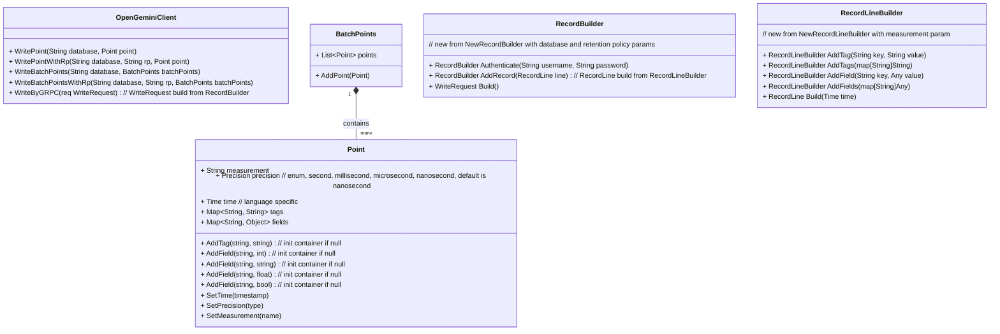

# Background

Due to the InfluxDB 1.X client largely being in maintenance mode, and openGemini continuously evolving, the community has decided to develop its own client SDK for openGemini to better support it. This includes functionalities like supporting multiple server addresses and the Apache Arrow Flight protocol.

# Client SDK Planned Features

- Support for connecting to multiple server addresses
- Support for the Apache Arrow Flight protocol
- Capabilities for SQL queries, structured queries, writing, and batch writing are detailed in the UML diagram below
- Default timeouts, with a connection timeout of 10 seconds and read/write timeout of 30 seconds

The methods described in this document assume that the programming language does not support overloading. If overloading is supported by the programming language, some optimizations and adjustments can be made to the method names.

# Client constructor params design


# Database & RetentionPolicy management design


# Write point design



# Query design


# QueryBuilder design


# Ping design


# Inner Http client design

Using a design similar to InnerHttpClient, encapsulate authentication, load balancing, retry logic, and more within the internal structure, providing a simple interface to the client. This enhances modularity and code clarity.


# Error handling

## Error message

### Scene1 http request failed

```
$operation request failed, error: $error_details
```

### Scene2 http response code is not 200~300

```
$operation error resp, code: $code, body: $body
```

### Scene3 other error

```
$operation failed, error: $error_details
# example:
writePoint failed, unmarshall response body error: json: cannot unmarshal number ...
```
