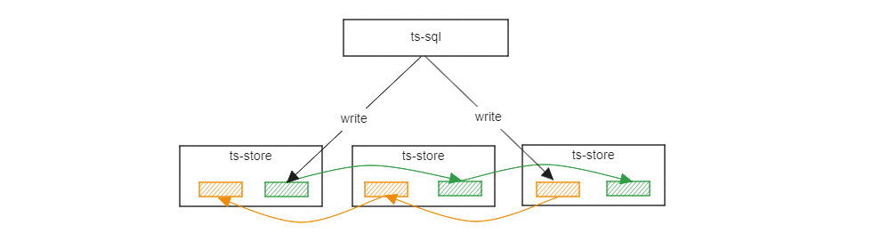
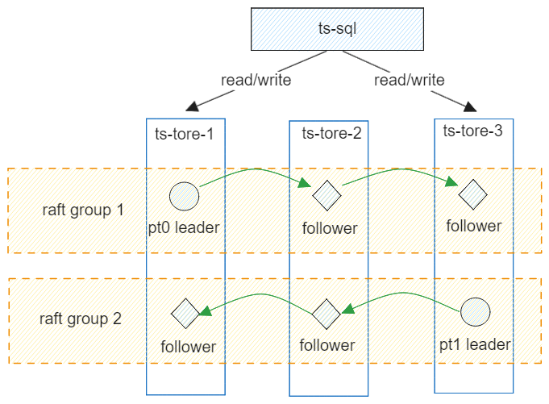
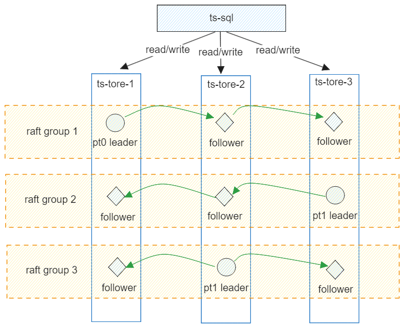
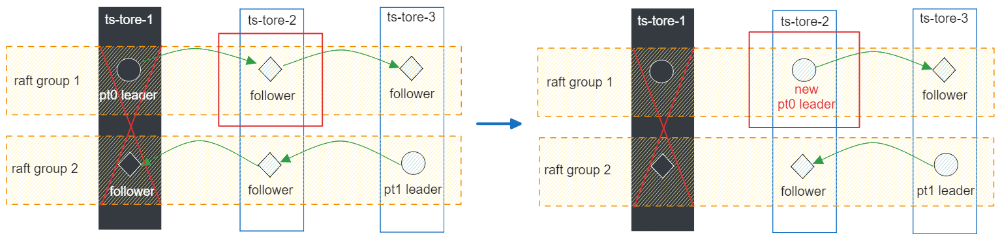

The openGemini data replica feature addresses the data reliability needs of various industries, including energy, IoT, and operations and maintenance (O&M) monitoring. In the current version, data replication is implemented using the Raft protocol. However, in scenarios where large volumes of data are written intensively, the replica feature can impact write performance.

In future versions, the distribution of data replicas will be optimized, and new data replication protocols will be introduced.

1. Address the issue of declining writing performance.

2. Support two replicas, however, currently only odd-numbered replicas greater than or equal to three are supported due to the limitations of the Raft protocol.



**Special instructions**

- The standalone version (ts-server) does not support data replicas.
- The current data replication is performed at the database level; table-level data replication is not supported.
- The number of ts-store nodes in a cluster must be a multiple of the number of replicas. For instance, if there are three replicas, the number of ts-store nodes must be at least three, but it can also be six or nine.
- Clusters running version 1.2.0 or earlier cannot be smoothly upgraded to multi-replica clusters. Data migration is required. The community will provide data import and export tools to facilitate this migration, which are expected to be released between September and October.
- It is advisable for the specifications of ts-store nodes in a multi-replica cluster to be larger, as replica data consumes both storage and computing resources. This is particularly important during fault occurrences when certain nodes must take over services, resulting in increased pressure beyond the original load. Therefore, it is essential to reserve additional space for emergencies.

## Configuration

Modifying the Configuration File openGemini.conf

```toml
[common]
ha-policy = "replication"

[meta]
ptnum-pernode = 2 #The recommended number of PTs per node is 2.
```

Create a database and set the number of replicas to three. The number of copies must be an odd number greater than zero.

```sql
CREATE DATABASE db0 REPLICATION 3
```

> PT stands for Partition, which is a logical concept in OpenGemini data management. For instance, if there are 100 devices and only one Partition exists in the database, all the data from those devices is stored within that single Partition. If there are two Partitions, each one manages the data from 50 devices. Data can be processed concurrently across multiple Partitions. Theoretically, if resources are adequate, the performance of multiple Partitions is superior.

The following figure illustrates the relationships among DB, PT, RP, SHARD, and Measurement.


## Replica Data Distribution

**Example 1**:  ptnum-pernode = 1, 3x ts-stores


Each node has only one PT, and data is written to the leader PT. The other two nodes function solely as passive data synchronization nodes and cannot share the service load.

**Example 2**:  ptnum-pernode = 2, 3x ts-stores



Each node has only two PTs. The three nodes can form two Raft groups. Each group has a PT leader, which is deployed on different nodes to distribute the service load.

**Example 3**:  ptnum-pernode = 3, 3x ts-stores



Each node contains three PTs. The three nodes can form three Raft groups, with each group having a PT leader deployed on different nodes to distribute service loads. Since each node maintains two PT copies, data is written synchronously, which consumes some computing and storage resources. It is recommended that you expand the specifications of the nodes.

**Example 4**:  ptnum-pernode = 3, 4x ts-stores


Each node has three PTs, and the four nodes can form only three Raft groups. The remaining ts-store-4 node is unable to find additional nodes to form Raft groups. As a result, the PTs on this node are offline and non-functional.

**Example 5**:  ptnum-pernode = 3, 6x ts-stores


Each node contains three PTs, and six nodes are organized into six Raft groups. Data is distributed across the nodes according to a hash algorithm based on the timeline.

## Read/Write Policies and Node Faults

Each replica group selects a leader PT. Read and write requests are directed exclusively to the leader PT. The ts-meta  is utilized to oversee the election of leader PTs across all replica groups, ensuring an even distribution among nodes. As illustrated in the figure below, if the ts-store-1 node fails, the PT follower of Raft group 1 on ts-store-2 is elected as the new leader  to handle service data.



## Advanced Multi-AZ Deployment

The prerequisite is that the cluster must be deployed across availability zones (AZs). Please modify the openGemini.conf configuration file.

```toml
[data]
availability-zone = "az1"

[meta]
rep-dis-policy = 1
```

Restart cluster after modifying the configuration file. The availability-zone parameter specifies the availability zone (AZ) to which the ts-store node belongs, while the rep-dis-policy parameter defines the distribution policy for the PT replica. The default value of rep-dis-policy is 0, which indicates that nodes are evenly distributed. If rep-dis-policy is changed to 1, nodes will be evenly distributed across the AZs. A balanced distribution among AZs represents a stricter distribution policy compared to even distribution among nodes.

