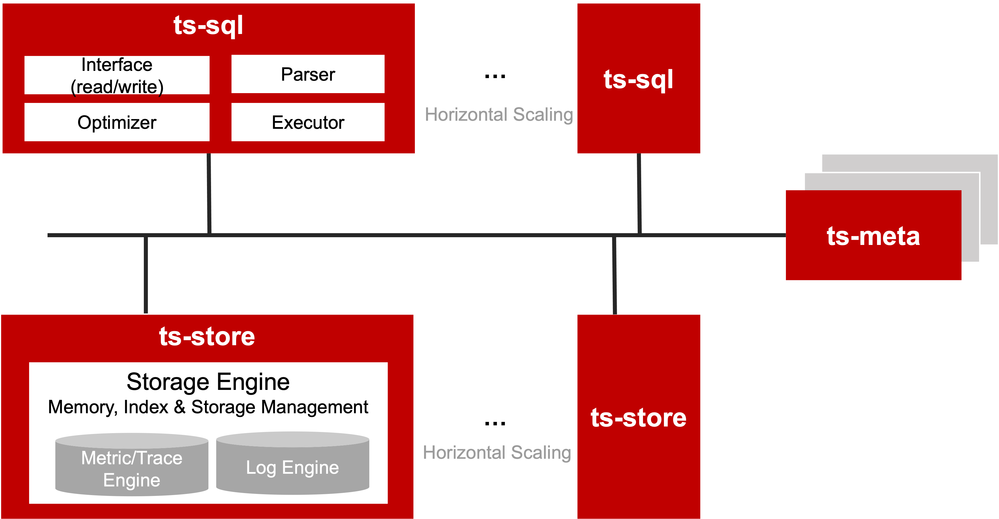

openGemini use MPP (Massively Parallel Processing) architecture.  

As shown in the figure, openGemini as a whole consists of three components: ts-sql, ts-meta, and ts-stores.

- **ts-sql**

It provides a unified read and write interface to data write and read. When the client writes data, ts-sql will verify the format of the received data, then hash and disperse the data according to the timeline name, forward the data to the corresponding ts-store node for storage. when the client queries data, ts-sql will generate a distributed query plan according to the Request, and distribute each subquery plan to each ts-store node, and finally summarize the data and return it to the Client.

ts-sql is stateless and can be scaled out according to workload.

- **ts-meta**

Manage the metadata information such as databases, tables, data partitions, retention policies, and cluster nodes in the database system.

- **ts-store**

ts-store provides efficient data storage and query. It uses LSM Tree, and the data is written in an appended way; when querying data, execute the subquery plan, retrieve the timeline involved in the query from the inverted index, after the data is read, filter the data according to the query conditions, and then return the data to ts -sql. It can be scaled out.
