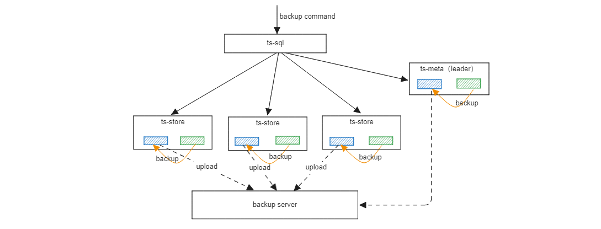

Data backup and restore are supported since openGemini v1.3.0.

All features included：

- Supports data backup in multiple deployment modes, such as single-node, cluster single-copy, and cluster multi-copy.
- Supports full backup and incremental backup.
- Incremental and full data restoration



**Special Instructions**

- Each incremental backup is generated based on the last full backup.
- Follow-up support new full backups can be created based on full backups and incremental backups 
- Currently, only the backup interface is provided to process data backup requests. The CLI command for backup is not provided.
- It takes some time to flush index files to disks. New index information (new database and new measurement) may not be backed up during backup.
- Data of each node can be backed up only on the local host. If a unified backup server is available, you need to manually upload the backup directory to the server for storage.

## Data backup

### Interface

```shell
POST debug/ctrl?mod=backup
```

Description of the parameters

+ `isInc=<bool>`: false indicates full backup, and true indicates incremental backup.
+ `backupPath=<string>`: backup path
+ `isNode<bool>`: Sets whether to back up only the data of the current node.
+ `isRemote=<bool>`: Reserved parameter. Backup to the remote end is not supported currently.

### Examples

```shell
curl -i -XPOST 'http://127.0.0.1:8086/debug/ctrl?mod=backup&backupPath=/tmp/openGemini/backup&isInc=false'
```

### ts-meta backup policy

+ Perform full backup for the meta node each time.
+ Backing Up Only the Leader Node

## Data Recovery

OpenGemini provides an independent data restoration tool to restore the backup data to the previous status. During the restoration, you need to run the ts-recover command on each node to restore data.


**Preparations Before the Recover**

- To restore data to the original cluster, stop the related processes (ts-meta and ts-store).

**recovery tool ts-recover uses**

```
> ts-recover [flags]
```

Description of Command Line Parameters：

- **config**，openGemini configuration file path
- **recoverMode**，Data restoration policy. The value 1 indicates full and incremental data restoration, and the value 2 indicates full data restoration.
- **fullBackupDataPath**，Full backup directory
- **incBackupDataPath**，Incremental backup directory

**Examples**

```shell
> ts-recover -config=openGemini.conf -recoverMode=2 -fullBackupDataPath=/tmp/openGemini/backup
```

Full and incremental data restoration

```shell
> ts-recover -config=openGemini.conf -recoverMode=1 -fullBackupDataPath=/tmp/openGemini/backup -incBackupDataPath=/tmp/openGemini/backup-inc
```
