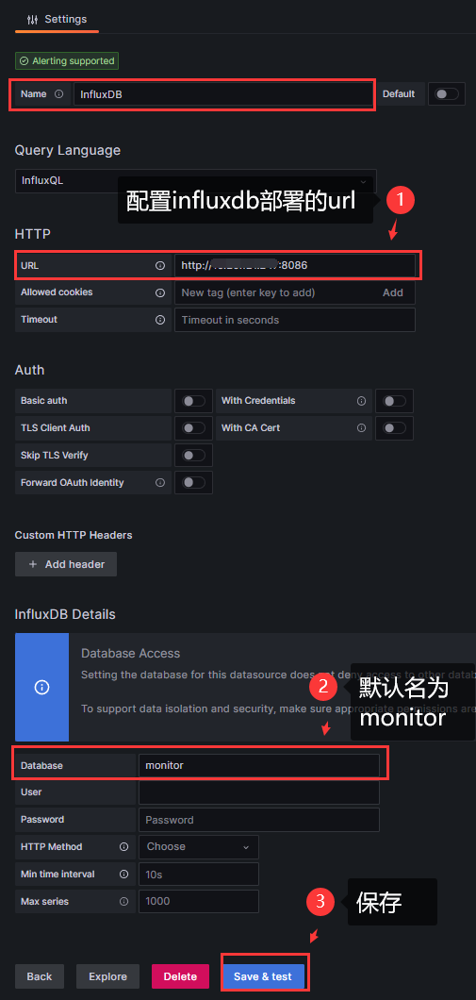

# 监控

openGemini提供了260+监控指标，来监控集群的各种状态，下面将介绍如何开启监控项，并结合Grafana可视化这些数据。
这里使用scripts文件下的install_cluster.sh和install_monitor.sh脚本文件在单机上模拟集群部署进行演示。

## 内核配置文件

ts-sql/ts-store/ts-meta, 开启监控的配置如下：

```editorconfig
[monitor]
   pushers = "http"
   store-enabled = true
   store-database = "_internal"
   store-interval = "10s"
   # store-path = "/tmp/openGemini/metric/{{id}}/metric.data"
   # compress = false
   http-endpoint = "127.0.0.1:8086"
   # username = ""
   # password = ""

[http]
  bind-address = "{{addr}}:8086"
```

- pushers，表示监控指标的推送方式，目前支持http和file两种方式，可以使用`http|file`表示两种方式都使用
- store-enable，表示是否开启monitor数据存储
- store-database，表示监控指标保存到的database的名称
- store-interval，表示保存数据的周期
- store-path，在pushers中包含`file`时生效，表示监控指标保存的路径和文件名称模板
- http-endpoint，表示监控指标通过http发送到的endpoint

::: tip
这里使用`127.0.0.1:8086`,端口与下面[http]中配置的一样，说明会将监控指标发送给在127.0.0.1:8086下暴露端口的openGemini数据库结点上
:::

## ts-monitor 配置文件
monitor的配置文件，在代码给的模板配置文件中已经有了详细的注释。
```editorconfig
[monitor]
    # localhost ip
    host = "{{addr}}"
    # Indicates the path of the metric file generated by the kernel. References openGemini.conf: [monitor] store-path
    # metric-path cannot have subdirectories
    metric-path = "/tmp/openGemini/metric"
    # Indicates the path of the log file generated by the kernel. References openGemini.conf: [logging] path
    # error-log-path cannot have subdirectories
    error-log-path = "/tmp/openGemini/logs"
    # Data disk path. References openGemini.conf: [data] store-data-dir
    disk-path = "/tmp/openGemini/data"
    # Wal disk path. References openGemini.conf: [data]  store-wal-dir
    aux-disk-path = "/tmp/openGemini/data/wal"
    # Name of the process to be monitored. Optional Value: ts-store,ts-sql,ts-meta.
    # Determined based on the actual process running on the local node.
    process = "ts-store,ts-sql,ts-meta"
    # the history file reported error-log names.
    history-file = "history.txt"
    # Is the metric compressed.
    compress = false

[report]
    # Address for metric data to be reported.
    address = "{{report_addr}}:8086"
    # Database name for metric data to be reported.
    database = "monitor"
    rp = "autogen"
    rp-duration = "168h"
```

## grafana
1. 启动集群和ts-monitor
    在OpenGemini的项目目录下输入如下命令
    ```shell
    bash scripts/install_cluster.sh
    bash scripts/install_monitor.sh 
    ```
    使用`ps`命令检验是否启动成功，应该能看到类似如下响应，启动了3个meta，3个store，1个sql和1个ts-monitor
    ```shell
    PID TTY          TIME CMD
    346114 pts/28   00:00:00 bash
    346353 pts/28   00:00:51 ts-meta
    346354 pts/28   00:00:50 ts-meta
    346355 pts/28   00:02:07 ts-meta
    346419 pts/28   00:01:12 ts-store
    346432 pts/28   00:00:51 ts-store
    346461 pts/28   00:00:55 ts-store
    346474 pts/28   00:00:28 ts-sql
    357880 pts/28   00:00:03 ts-monitor
    382071 pts/28   00:00:00 ps
    ```
    
2. grafana并查看监控数据

   - 由于OpenGemini与influxdb的协议是一致，配置数据源时选择influxdb
   
   
   
   - 增加dashboard，增加或导入一些已经有json配置文件，即可在grafana中看到OpenGemini的监控数据

   
