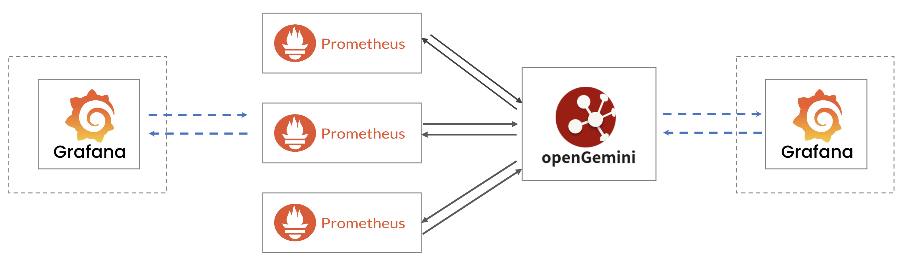
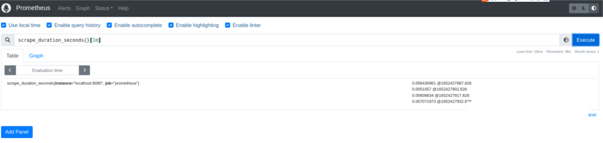
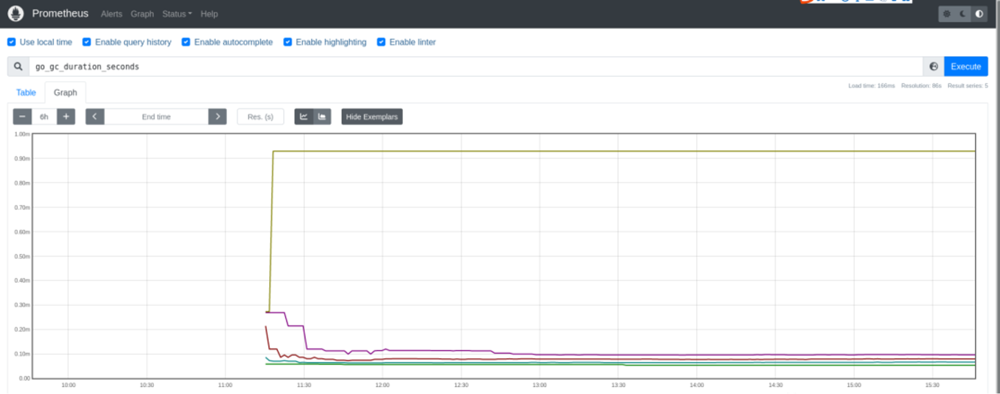

Prometheus is an open-source complete monitoring solution that completely disrupts the testing and alerting models of traditional monitoring systems, forming a new model based on centralized rule calculation, unified analysis, and alerting. Through the collection of data, it can achieve long-term trend analysis, comparative analysis, alerting, fault analysis and localization, data visualization, and other goals.

The local storage design of Prometheus can reduce the complexity of its own operation and management, and can also meet the needs of certain user scenarios. However, local storage also means that Prometheus cannot persist data for a long time, cannot store a large amount of historical data, and cannot flexibly expand and migrate. To maintain the simplicity of Prometheus, Prometheus defines two standard interfaces (remote_write/remote_read) so that users can interface based on these two interfaces to save the data to any third-party storage service, which is called Remote Storage in Promthues.

The combination of openGemini and Prometheus solves the problems of massive data storage and long-term historical data storage. At the same time, openGemini has the advantages of faster query efficiency and lower cost data storage, and is a better solution for remote storage and data persistence of Prometheus.

## solution introduction



openGemini supports distributed cluster deployment and stand-alone deployment, and can support multiple Prometheus nodes to write and query data simultaneously. In this solution, Grafana plugins can be added additionally, and the data source can be any node of openGemini or Prometheus. Although in terms of data visualization, there is a certain functional overlap between Prometheus and Grafana, this solution is actually complementary. Prometheus collects more diverse metrics and provides a powerful query language; Grafana, as a visual monitoring system, is more functional and has a more beautiful interface compared to Prometheus. In fact, it is very common for DevOps teams to use Grafana with Prometheus.

## Preparation

- Install openGemini, refer to the [installation and deployment]().

- Install Prometheus

  https://prometheus.io/download/

- Install Grafana (optional)

  https://grafana.com/docs/grafana/latest/setup-grafana/installation/

## Prometheus configuration

openGemini is compatible with Prometheus's remote read/write like InfluxDB, mainly using the interfaces: /api/v1/prom/read, /api/v1/prom/read/write.

Reference document: https://docs.influxdata.com/influxdb/v1.7/supported_protocols/prometheus/

**openGemini needs to manually create the corresponding database before starting Prometheus.**

- Modify the Prometheus configuration file prometheus.yml

  ```shell
  > vim prometheus.yml
  # add the following configuration items
  remote_write:
  - url: "http://127.0.0.1:8086/api/v1/prom/write?db=prometheus"
  remote_read:
  - url: "http://127.0.0.1:8086/api/v1/prom/read?db=prometheus"
  
  # restart Prometheus
  > systemctl restart prometheus
  > systemctl status prometheus
  ```

- In case openGemini have enabled authentication or HTTPS, it is necessary to modify the following configuration items

  ```shell
  > vim prometheus.yml
  # add the following configuration items
  # add username and password in rul
  remote_write:
  - url: "https://127.0.0.1:8086/api/v1/prom/write?db=prometheus&u=username&p=password""
  remote_read:
  # add username and password in rul
  - url: "https://127.0.0.1:8086/api/v1/prom/read?db=prometheus&u=username&p=password""
  
  # restart Prometheus
  > systemctl restart prometheus
  > systemctl status prometheus
  ```

## openGemini  configuration

- create database “prometheus”

```sql
> create database prometheus
> use prometheus
Using database prometheus

# check
> show measurements
name: measurements
name
----
go_gc_cycles_automatic_gc_cycles_total
go_gc_cycles_forced_gc_cycles_total
go_gc_cycles_total_gc_cycles_total
go_gc_duration_seconds
go_gc_duration_seconds_count
go_gc_duration_seconds_sum
go_gc_heap_allocs_by_size_bytes_total_bucket
go_gc_heap_allocs_by_size_bytes_total_count
go_gc_heap_allocs_by_size_bytes_total_sum
go_gc_heap_allocs_bytes_total
go_gc_heap_allocs_objects_total
go_gc_heap_frees_by_size_bytes_total_bucket
go_gc_heap_frees_by_size_bytes_total_count
go_gc_heap_frees_by_size_bytes_total_sum
go_gc_heap_frees_bytes_total
go_gc_heap_frees_objects_total
go_gc_heap_goal_bytes
...
```

- Enter the Prometheus Client interface: [http://127.0.0.1:9090](http://127.0.0.1:9090/). 

  **Execute queries (example):**

  ```
  scrape_duration_seconds{}[1m]
  ```

  

  **View the chart (for example)**

  ```
  go_gc_duration_seconds
  ```

  

For details，see  Grafana [get started with prometheus ](https://grafana.com/docs/grafana/latest/getting-started/get-started-grafana-prometheus/)
