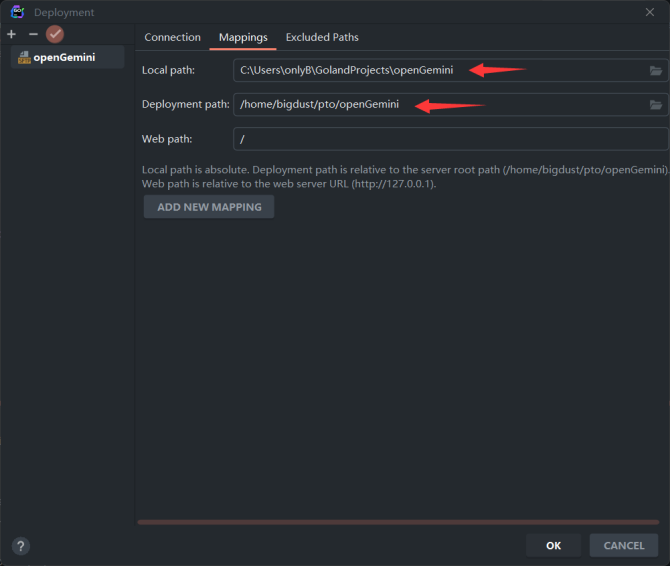

# Goland+WSL2远程debug

> - 已安装WSL2和较新版本的goland
> - WSL2已安装并启动SSH服务

## Windows侧操作

1. clone项目

2. **在goland配置SSH连接**
   2.1 通过goland的菜单栏Tools–>Deployment–>Configuration来添加远程调试的配置
   2.2 创建一个SFTP协议的配置，如图

   

   2.3 然后进入SSH configuration ， 如图输入SSH连接所需的信息，点击TEST CONNECTION后确定连接成功, 保存。

   

   2.4 进入Mappings， 建立项目目录的映射
   
   2.5 上传项目文件到WSL2 (用于同步项目内容如果已经上传过请忽略此步骤)<br>项目目录右键->Deployment- >上传项目到WSL2

3. **Run/Debug的配置**
   3.1 进入goland的菜单栏Runs–>Configurations
   3.2 创建一个Go Remote , Host 填用WSL2的 eth0 ip, 保存。

   

## WSL2侧操作

> 在WSL2中openGemini的目录

1. 编译二进制文件（如果已经编译，请忽略此步骤）

```python
  python3 build.py --clean
```

2. 在WSL2中安装较新版本delve

```go
  go install github.com/go-delve/delve/cmd/dlv@latest
```

3. 启动debug

> 若需指定配置文件请在该命令后加上  -- -config [配置文件path]

```bash
 dlv debug --headless --listen=:2345 --api-version=2 --accept-multiclient app/ts-server/main.go
```

## 最后建立连接并debug

1. 在goland点击调试，显示已连接则表明成功。

2. 另开一个虚拟机窗口进入openGemini 命令行进行debug。
   如：

2.1查询命令会调用serveQuery , 示例将断点打在serveQuery里面(handler.go的414行)

2.2 在openGemini命令行执行select * from h2o_feet on NOAA_water_database

2.3 程序运行到断点处暂停。

2.4 点击这里向后移动断点

