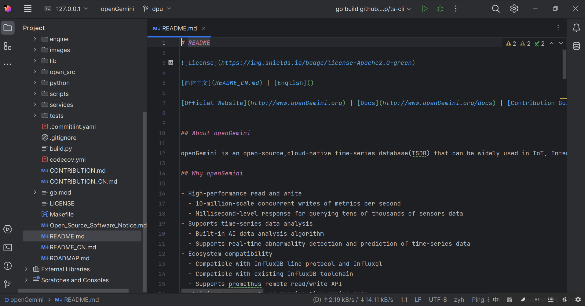
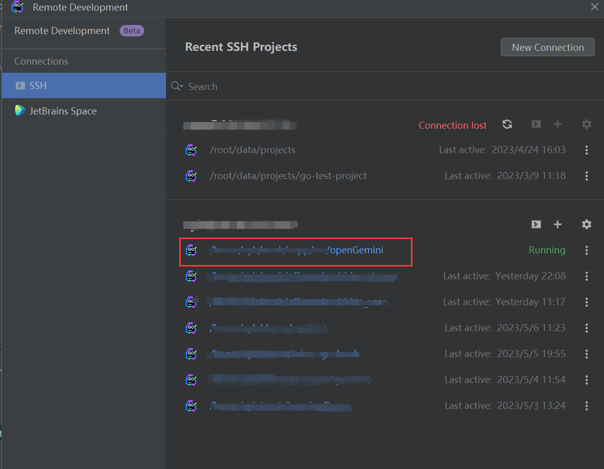

# 设置IDE
使用集成开发环境（IDE）可以显著简化我们的开发工作并减少学习成本。
在使用 Go 语言进行开发时，建议使用 JetBrains 的 GoLand IDE。
本文将描述如何利用 GoLand 的远程开发功能，在 Linux 服务器上进行开发。

## Step1: 下载 Goland
从[JetBrains 官网](https://www.jetbrains.com/go/download/#section=linux)下载 GoLand 的 Linux 版本（tar.gz文件）： .

## Step2: 配置远程开发：
- 启动 GoLand，并从“文件”菜单中选择“远程开发”。
- 选择“SSH 连接”，并输入您的 Linux 服务器的主机名以建立 SSH 连接。
- 接下来，您将看到一个 UI 界面，如下图所示。从安装选项中，选择“上传安装程序文件”。
   
- 选择之前下载的 tar.gz 文件。
- 设置您要打开的项目目录。
- 单击“上传并连接”，等待配置完成。
- 完成后，您将看到 GoLand 的远程开发版本界面，如下所示。
  
- 在以后的登录中，只需在“SSH”部分下找到先前打开的项目并连接即可。
  
