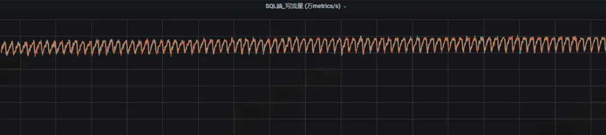
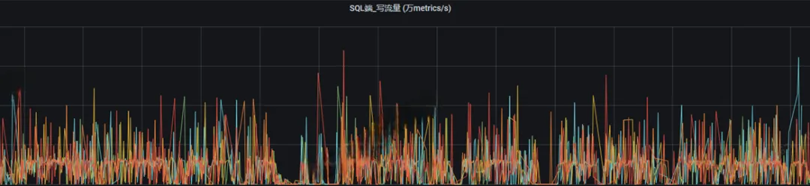
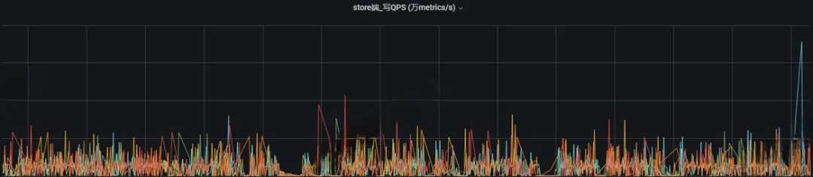
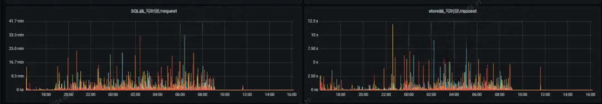
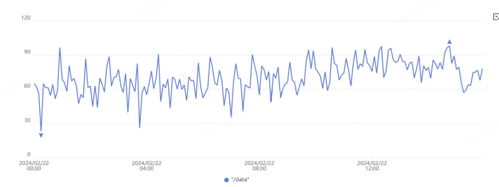
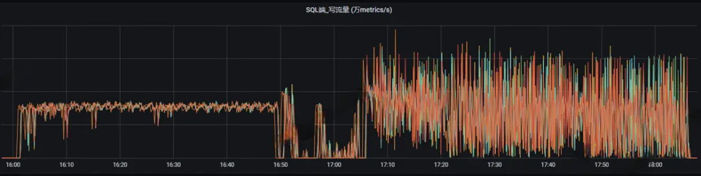

性能优化，不外乎内存和磁盘。本章节主要介绍openGemini写性能调优的基本方法和常用手段，需要根据实际测试情况，结合监控指标，慢慢调整参数。

## 选取写性能相关指标

以下⼏个点是出现写⼊异常能最直观快速发现异常点的⼏个关键监控数据：

**系统类**：CPU、内存、磁盘容量、磁盘IO 

**读写类**：集群流量、store写并发、SQL/Store写延迟、写Wal时延、SQL/Store写QPS、写Memtable时延

**压缩合并类**：乱序时间线占⽐、平均乱序⽂件、Compact耗时、乱序合并耗时、乱序⽂件总数

## 搭建内核监控

古语有云：工欲善其事，必先利其器。数据库是一个复杂的系统，出现写性能问题时，我们不能瞎猜，必须对症下药。这时内核监控就非常必要。

openGemini提供了260+项系统运行监控指标，来满足我们日常的监控告警需求和帮助问题定位。

openGemini两种方式搭建内核监控：

1. Gemix工具一键部署

   Gemix是一款自动化部署openGemini集群和配套集群监控的工具，还未部署openGemini集群的情况，推荐使用这种方式。

2. 手动部署

   对于使用单机的用户或者已经部署了openGemini集群，但还没有部署监控的用户，推荐动手自己搭建，详细教程见 [监控搭建](../maintenance/monitor.md)

openGemini还提供了详细的Grafana监控模板，获取地址：

https://github.com/openGemini/gemix/tree/main/embed/templates/dashboards

## 如何判断是否存在写性能问题?

通常业务趋于稳定后，数据库的写入流量和写QPS两个指标应该是规律波动且平稳



不论是sql还是store，如果**业务平稳的情况下**，写流量依然出现很多毛刺（波动比较大），这就代表写入性能遇到了瓶颈，需要我们进⾏优化。





## 常见问题：写时延大，波动厉害



### 问题排查方向：

1. #### 查看是否WAL写入时延大

   如下图所示，写时延已经达到秒级，这种情况必须要处理。如果WAL写时延波动平稳，时延在ns-ms级可以不用特别关注。

   

   解决办法：**为openGemini的WAL目录单独挂盘，**此办法效果明显。**推荐给WAL使用高性能磁盘**，一般给WAL使用磁盘空间仅需1GB即可，所以即使是最好的磁盘，成本也不会增加太多。

   相关配置

   ```
   [data.wal]
     wal-enabled = true
     ...
     store-wal-dir = "/path/to/wal" 
   ```

   WAL（全称是**Write-Ahead Logging**），是数据库系统中常见的一种手段，用于保证数据可靠性。即数据写入内存之前，先持久化一份到WAL文件中，当系统崩溃后可以通过*wal* 文件恢复还没有写入到数据文件中的数据。

   当写入流量很大时，WAL会频繁刷盘，写入到内存的数据同样也需要频繁刷盘，这就造成了对磁盘I/O的竞争，因此就造成了写WAL时延过高，导致大量写入请求得不到及时响应，向上表现为写时延增大，从而对写性能影响较大。

2. #### 查看是否存在磁盘I/O瓶颈

   如下图所示，写数据时，磁盘I/O利用率已经持续接近100%，这种情况，必须要为磁盘升级，更换性能更好的磁盘。

   

## 如WAL和磁盘瓶颈已解决，写入压力增大后，写时延继续波动，如何优化？

如下图所示，Wal瓶颈和磁盘I/O瓶颈解决之后，在一定数据量范围内可以写入平稳，但是内存和cpu仍然没有完全使用，磁盘利用率处于低位，并且稍微数据量稍微再上调一点就变得十分不稳定。



解决办法：**内存配置 & 吞吐量调优**

在openGemini内部，数据会先写入内存，内存写满之后自动触发数据刷盘。如果增大写数据缓存，减少数据刷盘的频率，从而提升写数据性能。

修改参数（这里配置的具体值仅为参考）:

```toml
[data.memtable]
  ...
  shard-mutable-size-limit = "1g"  #默认为60M
  node-mutable-size-limit = "16g"  #默认为200M
```

假设你的机器规格为**16U64GB**，可以将`shard-mutable-size-limit`上调到1GB，对应`node-mutable-size-limit`同步调到最大16GB。也就是说，不管openGemini有多少个Shard，所有Shard最多只能使用16GB内存。

**特别需要注意：**`shard-mutable-size-limit`这个参数Shard级别，如果openGemini创建了5个DB，则内存中至少会包含5个Shard，那么缓存的最大消耗为`5 * shard-mutable-size-limit`GB，你需要整体考虑内存分配，为查询预留内存资源。为了性能，内存不够用，建议扩内存。

**写入缓存如果被增加了，那么配套的要进一步放开数据刷盘的带宽才行，否则这里会成为瓶颈。**

修改参数（这里配置的具体值仅为参考）:

```toml
[data.compact]
  ...
  snapshot-throughput = "300m"  #80M
  snapshot-throughput-burst = "400m"  #90M
```

`snapshot-throughput=300M`表示一次可以刷300M数据到磁盘文件，默认是80M，这个值调大，可以加快数据刷盘效率。同样的，磁盘带宽总数有限，如果openGemini中有多个DB，那么这里的带宽不建议调的太大，否则会导致其他DB可使用的带宽不够。


## 超大规模数据写入，但可容忍丢失部分数据，如何优化？

如果遇到超大规模数据写入，上述方法都已用尽。进一步优化，有四种办法：

1. **若可容忍丢失部分数据，则可以关闭WAL。**修改配置后重启。

   ```toml
   [data.wal]
     wal-enabled = false
     ...
   ```

2. 集群横向扩容，可按1:1增加ts-sql和ts-store。不过，新增的ts-store需要等到下一个ShardGroup周期到来时才生效，比如shardGroup周期为7天（1月1日-1月7日），就要等到1月8日时，新的数据才会被写入到新增加的ts-store节点，**暂不支持数据从其他ts-store迁移。**

3. 集群纵向扩容，增加计算规格，升级性能更好的磁盘。

4. 使用高基数存储引擎，采用Arrow Flight协议写数据。不过需要提前对业务做好判断，一开始就选择高基数引擎，不支持将默认的时序引擎往高基数引擎变更。如果未能做好预判，要使用高基数存储引擎，只能修改业务，将新的数据写入到支持高基数引擎的新表中。

## 业务层对写性能有哪些优化方法？

一般来说，抛开磁盘性能，规格确定后，单个节点的数据处理效率是存在上限的，性能优化就是不断尝试，让性能无限接近那个上限值。前面介绍了内核和存储层面的优化，现在介绍客户端的优化。

### 批量写入

通常，openGemini的所有的客户端（SDK）都支持批量写入，通过减少网络交互时延，以提升单位时间内的数据吞吐量。每批次写入的数据量由客户端的`batchsize`参数控制，不同批量大小的数据，性能也不一样。

由于性能受到规格和硬件的影响比较大，很难给出`batchsize`的确定值。这就需要开发者从`batchsize=100, 200, 500, 1000, 5000`进行多次尝试，找到那个趋近的性能拐点的值。

社区的建议是，如果`batchszie=1000`的性能看似比`batchsize=500`的性能好，但`batchsize=500`的波动更为平稳，如若满足业务性能要求的前提下，请选择500。

### TAG的合理选择（非高基数引擎场景）

选择TAG字段，请尽量遵循如下原则：

1. 非必要，不要选维度非常大的字段作为TAG

   TAG的维度是指该字段下不同的值的数量，如果这个数量达到数十万以上，我们认为是一个高维度字段。openGemini内部会对时间线进行索引，时间线的规模是等于所有TAG的维度的叉积。TAG维度越大，时间线数量越大，索引也就越大，数据写入时，会检索索引，看本条数据所属时间线是否已经存在，不存在则需要创建索引项。因此，索引越大，查询时延越高，从而降低写性能。

   如果该字段维度大，但需要作为TAG，建议使用一些降维的手段，或者改用高基数引擎。

2. 非必要，不要选择无用字段作为TAG

   无用的TAG只能增加openGemini内部索引的负担。这里指的无用索引包含两层意思：

   a. 字段本身无意义，不会作为数据的过滤条件使用，也不会用于业务层参与计算。

   b. 字段参与业务层计算，但不会作为查询语句的过滤条件使用。

3. TAG字段的名字尽可能简短

   TAG字段的名字越短，索引占用内存空间越少，进行TAG匹配的效率越高。