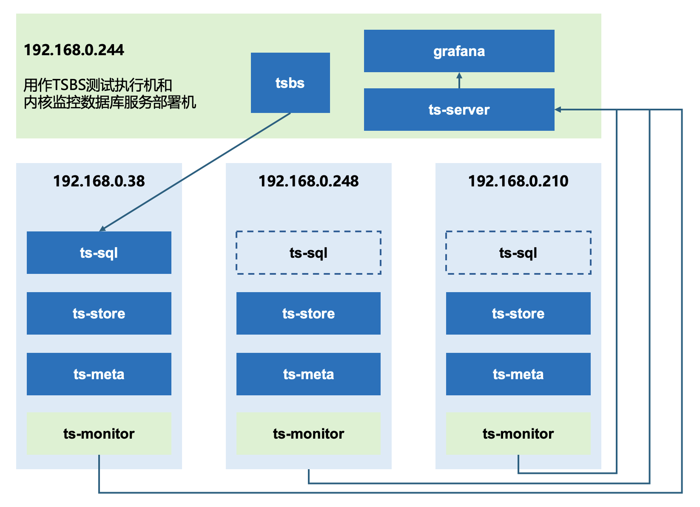
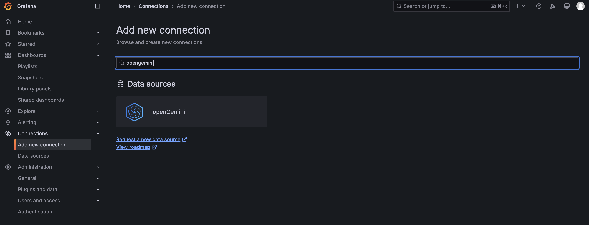
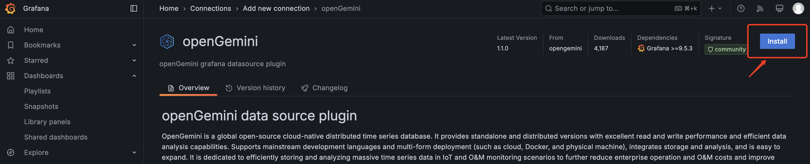
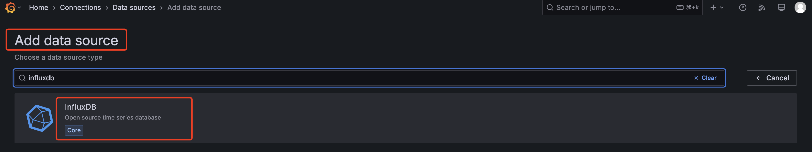
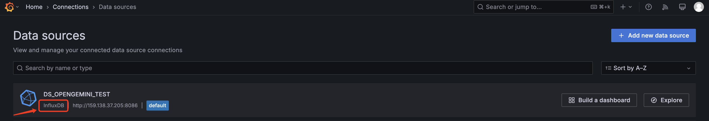
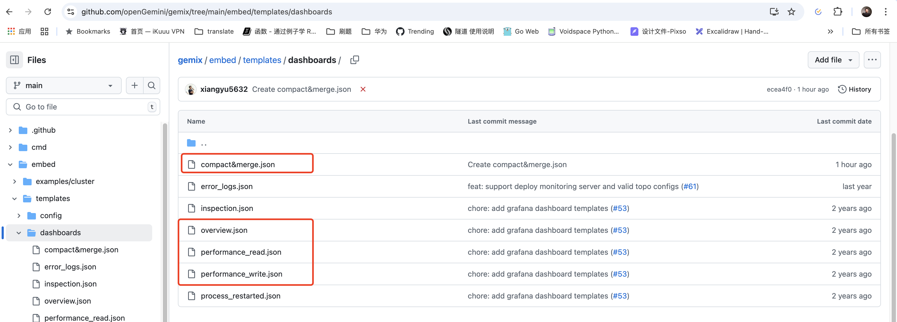
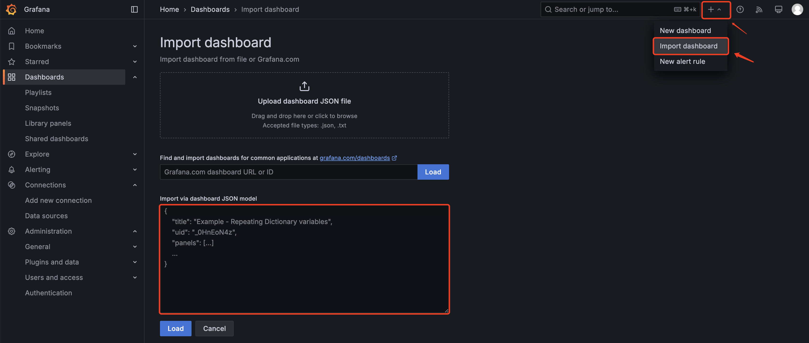
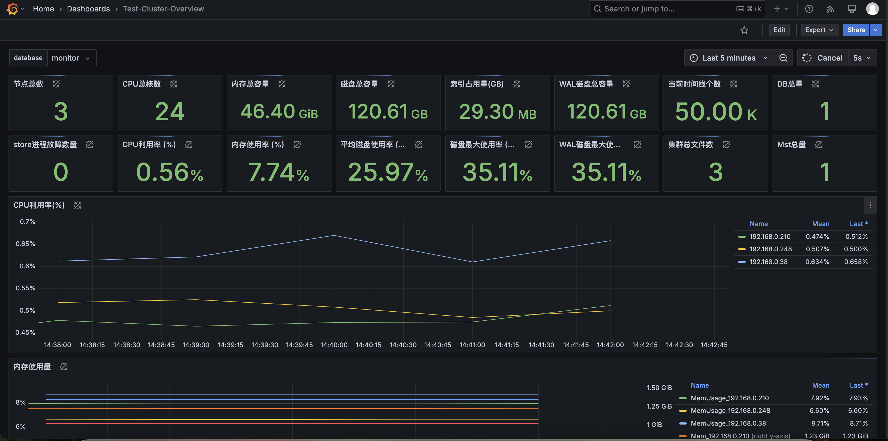
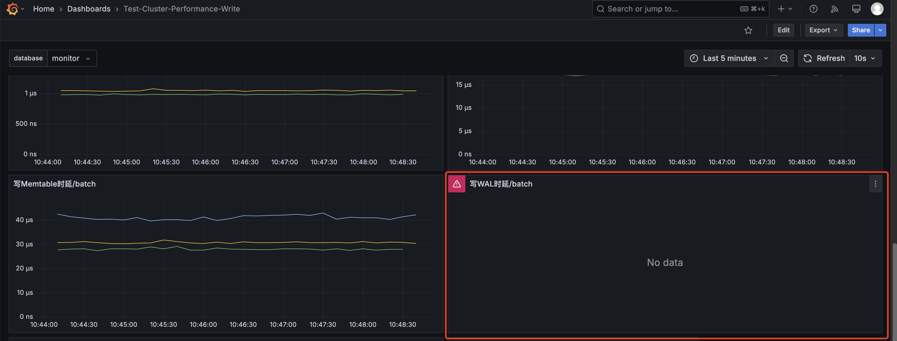

本教程分为5个部分，分别是

1. 集群安装
2. 搭建监控
3. 压测（TSBS）
4. 压测（手写工具）
5. 性能调优

## 安装

这里只介绍集群安装部署，因为单机可直接运行`ts-server --config path/to/openGemini.singlenode.conf`即可。部署openGemini集群需要的组件有：

- ts-sql，计算组件
- ts-store，存储组件
- ts-meta，集群元数据管理组件
- ts-monitor，内核监控组件（在后面搭建监控部分介绍）

1. ### 准备安装包

   - 二进制下载地址：https://github.com/openGemini/openGemini/releases

   - 源码编译(Linux 平台)，需要提前准备好编译环境

     - [GO](https://go.dev/dl/) version v1.22+
     - [Python](https://www.python.org/downloads/) version v3.7+

     ```
     > git clone https://github.com/openGemini/openGemini.git
     > cd openGemini
     > Python3 build.py
     # 编译后的二进制在build目录
     > cd build && ls
     ts-data  ts-meta  ts-monitor  ts-recover  ts-server  ts-sql  ts-store
     ```

2. ### 规划网络拓扑

   

   如上图所示，1台作为性能测试的执行机，同时也作为openGemini集群的监控服务器。其余3台部署openGemini集群（配置3副本需至少3节点），ts-sql可以部署多个，这里我们以部署1个ts-sql为例。

3. ### 安装和配置

   建议手动部署，不建议使用Gemix工具，因为：

   - Gemix需要联网，多数环境在内网
   - 工具生成的默认配置项太少
   - 不稳定（缺少维护）

   这里我们介绍`192.168.0.38`节点配置，**同一节点上的ts-sql、ts-meta、ts-store三个组件可以共用一个配置文件`openGemini.conf`**，其他节点照葫芦画瓢。

   打开`openGemini.conf`，仅配置如下地方：

   ```toml
   [common]
     meta-join = ["192.168.0.38:8092", "192.168.0.248:8092", "192.168.0.210:8092"]
     # 多副本配置“replication”，非副本保持默认即可
     ha-policy = "replication"
     pprof-enabled = true
   ```

   ```toml
   # 配置ts-meta
   [meta]
     bind-address = "192.168.0.38:8088"
     http-bind-address = "192.168.0.38:8091"
     rpc-bind-address = "192.168.0.38:8092"
     dir = "/path/to/openGemini/data/meta"
     # 如果机器规格高，ptnum-pernode可以配置3或者4，pt越多，占用系统资源越多。单机或者非3副本情况下，建议为1，最多为2
     ptnum-pernode = 2
   ```

   如果配置3副本，请参考 [副本数据分布](https://docs.opengemini.org/zh/guide/features/replication.html#%E5%89%AF%E6%9C%AC%E6%95%B0%E6%8D%AE%E5%88%86%E5%B8%83) 理解`ptnum-pernode`

   ```toml
   # 配置ts-sql
   [http]
     bind-address = "192.168.0.38:8086"
     # flight-address = "{{addr}}:8087" 注释
     
     # 以下部分可以根据实际需求配置
     # auth-enabled = false  需要用户名密码鉴权，可以开启这个配置
     # https-enabled = false 这里配置https和证书
     # https-certificate = ""
     # https-private-key = ""
     # max-body-size = 0 
     # max-connection-limit = 0 默认是cpu核数*125，8vcpu的最大连接数默认是1000
     # max-concurrent-write-limit = 0 最大写并发限制，默认是cpu核数*4，8vcpu最大写并发是32
     # max-concurrent-query-limit = 0 最大查询并发限制，默认是cpu核数，8vcpu最大查询并发是8
   ```

   ```toml
   # 配置内核日志
   [logging]
     path = "/path/to/openGemini/logs"
   ```

   ```toml
   # 配置ts-store
   [data]
     store-ingest-addr = "192.168.0.38:8400"
     store-select-addr = "192.168.0.38:8401"
     store-data-dir = "/path/to/openGemini/data"
     store-wal-dir = "/path/to/openGemini/data"
     store-meta-dir = "/path/to/openGemini/data/meta"
   ```

   ```toml
   # 配置所有组件的运行时监控
   [monitor]
     pushers = "file"  #内核监控指标写到文件，供ts-monitor采集
     store-enabled = true
     store-database = "monitor" 
     store-interval = "10s"
     # 末尾的斜线不能丢
     store-path = "/path/to/openGemini/metric/"
   ```

   ```toml
   # 集群管理配置
   [gossip]
     enabled = true
     log-enabled = true
     bind-address = "192.168.0.38"
     store-bind-port = 8011
     meta-bind-port = 8010
     sql-bind-port = 8012
     members = ["192.168.0.38:8010", "192.168.0.248:8010", "192.168.0.210:8010"]
   ```

   ```toml
   # 无人值守运维能力配置，当cpu、内存和Goroutine数量超过阈值后，自动抓取节点的火焰图，供事后根因分析
   [sherlock]
     sherlock-enable = true
     collect-interval = "10s"
     cpu-max-limit = 90
     dump-path = "/tmp"  #Golang的火焰图文件保存目录
     # max-num = 32 目录最多保留多少个火焰图文件数量  
     # max-age = 7  目录中的火焰图文件最长保留时间
   [sherlock.cpu]
   	# 如下两种情况会抓取火焰图
   	# 1. CPU利用率从30%开始，以25%的速度增长，持续10min
   	# 2. CPU利用率持续10min超过80%
     enable = true
     min = 30
     diff = 25
     abs = 80
     cool-down = "10m"
   [sherlock.memory]
     enable = true
     min = 25
     diff = 25
     abs = 80
     cool-down = "10m"
   [sherlock.goroutine]
     enable = true
     min = 10000
     diff = 20
     abs = 20000
     max = 100000
     cool-down = "30m"
   ```

   启动顺序：先启动3个ts-meta，然后启动ts-sql和ts-store，二者没有先后顺序

   **运行 ts-meta**（需指定配置文件路径和命令行输出日志路径）

   ```shell
   > nohup ts-meta -config /path/to/openGemini.conf -pidfile /path/to/openGemini/pid/meta.pid > /path/to/openGemini/logs/meta_extra.log 2>&1 &
   ```

   **运行 ts-sql和ts-store**（需指定配置文件路径和命令行输出日志路径）

   ```shell
   > nohup ts-sql -config /path/to/openGemini.conf -pidfile /path/to/openGemini/pid/sql.pid > /path/to/openGemini/logs/sql_extra.log 2>&1 &
   > nohup ts-store -config /path/to/openGemini.conf -pidfile /path/to/openGemini/pid/store.pid > /path/to/openGemini/logs/store_extra.log 2>&1 &
   ```

   通过`ts-cli`查看集群状态，`status`列均为alive，表示集群正常。

   ```sql
   > show cluster
   +---------------------+--------+--------------------+--------+----------+--------------+
   |        time         | status |      hostname      | nodeID | nodeType | availability |
   +---------------------+--------+--------------------+--------+----------+--------------+
   | 1742128142135295990 | alive  | 192.168.0.38:8091  |      1 | meta     | unavailable  |
   | 1742128142135295990 | alive  | 192.168.0.210:8091 |      2 | meta     | unavailable  |
   | 1742128142135295990 | alive  | 192.168.0.248:8091 |      3 | meta     | unavailable  |
   | 1742128142135295990 | alive  | 192.168.0.38:8400  |      4 | data     | available    |
   | 1742128142135295990 | alive  | 192.168.0.248:8400 |      6 | data     | available    |
   | 1742128142135295990 | alive  | 192.168.0.210:8400 |      7 | data     | available    |
   +---------------------+--------+--------------------+--------+----------+--------------+
   6 columns, 6 rows in set
   
   +------+-----------+----+------+-----------+-----------+-----------+----------+
   | opId | eventType | db | ptId | srcNodeId | dstNodeId | currState | preState |
   +------+-----------+----+------+-----------+-----------+-----------+----------+
   +------+-----------+----+------+-----------+-----------+-----------+----------+
   8 columns, 0 rows in set
   ```

## 搭建监控

在openGemini.conf里必须配置`[monitor]`

1. ### 在执行机上运行openGemini单机，用于接收ts-monitor写入的集群监控数据

   配置单机配置文件`openGemini.singlenode.conf`，主要是配置监听地址和存储目录

   ```toml
   [common]
     meta-join = ["192.168.0.244:8092"]
     ha-policy = "write-available-first"
     ignore-empty-tag = true
   
   [meta]
     bind-address = "192.168.0.244:8088"
     http-bind-address = "192.168.0.244:8091"
     rpc-bind-address = "192.168.0.244:8092"
     dir = "/root/openGemini/data/meta"
   
   [http]
     bind-address = "192.168.0.244:8086"
     # flight-address = "127.0.0.1:8087"
     # flight-enabled = true
     # flight-auth-enabled = false
   
   [data]
     store-ingest-addr = "192.168.0.244:8400"
     store-select-addr = "192.168.0.244:8401"
     store-data-dir = "/root/openGemini/data"
     store-wal-dir = "/root/openGemini/data"
     store-meta-dir = "/root/openGemini/data"
     enable-mmap-read = false
     
   [logging]
     path = "/root/openGemini/logs"
   
   # 其余配置项都可以注释
   ```

   运行`ts-server`

   ```shell
   > nohup ts-server -config /path/to/openGemini.singlenode.conf -pidfile /path/to/openGemini/pid/meta.pid > /path/to/openGemini/logs/server_extra.log 2>&1 &
   ```

2. ### 配置和运行ts-monitor

   回到openGemini集群节点上，打开ts-monitor配置文件`monitor.conf`，以节点 `192.168.0.38` 为例

   ```toml
   [monitor]
     # 一般为节点IP，用于区分采集的数据
     host = "192.168.0.38"
     # 与openGemini.conf中【monitor】--> store-path 配置保持一致，这样ts-monitor才知道取哪里采集监控数据
     metric-path = "/root/data/openGemini/metric"
     # 监控慢日志，与openGemini.conf中【logging】--> path 配置保持一致
     error-log-path = "/root/data/openGemini/logs"
     # 监控openGemini的数据存储空间，与openGemini.conf中【data】-->store-data-dir 配置保持一致
     disk-path = "/root/data/openGemini/"
     # 监控openGemini的WAL数据存储空间，与openGemini.conf中【data】-->store-wal-dir 配置保持一致
     # 特别要在路径末尾添加wal
     aux-disk-path = "/root/data/openGemini/wal"
     
     # 其余配置保持默认即可，无需配置
   
   # 仅其中某一个节点配置【query】即可，不需要每个节点都配
   [query]
     # 监控集群有多少DB，多少表，时间线数量等，需要访问ts-sql，发送查询语句查询
     query-enable = true
     http-endpoint = "192.168.0.38:8086"
     query-interval = "5m"
     # username = ""
     # password = ""
     # https-enable = false
   
   [report]
   	# 采集上来指标后，需要上报到执行机的ts-server数据库中，这里配置执行机的信息
     address = "192.168.0.244:8086"
   	# 写入的目标库
     database = "monitor"
     # 如果目标数据库设置了用户名和密码，在这里配上，否则数据上报失败
     # username = ""
     # password = ""
     # https-enable = false
     rp = "autogen"
     rp-duration = "168h"
     
   [logging]
     format = "auto"
     level = "info"
     path = "/root/openGemini/logs/"
     max-size = "64m"
     max-num = 30
     max-age = 7
     compress-enabled = true
   ```

   运行`ts-monitor`

   ```shell
   > nohup ts-monitor -config=/path/to/monitor.conf > /path/to/openGemini/logs/monitor_extra.log 2>&1 &
   ```

   使用`ts-cli`连接执行机上数据，可以查询到数据，表示配置都正确

   ```
   > show databases
   name: databases
   +---------+
   |  name   |
   +---------+
   | monitor |
   +---------+
   1 columns, 1 rows in set
   
   > use monitor
   > show measurements
   name: measurements
   +----------------+
   |      name      |
   +----------------+
   | cluster_metric |
   | err_log        |
   | errno          |
   | executor       |
   | httpd          |
   | meta           |
   | metaRaft       |
   | metadata       |
   | runtime        |
   | shelf          |
   | spdy           |
   | system         |
   +----------------+
   1 columns, 12 rows in set
   ```

   

3. ### 配置Grafana，监控openGemini运行情况

   下载Grafana，本文档以Grafana-11.5.0为例，选择其他版本可以访问[Grafana官网](https://grafana.com/grafana/download/11.5.0?edition=oss)

   ```shell
   > wget https://dl.grafana.com/oss/release/grafana-11.5.0.linux-amd64.tar.gz
   > tar -zxvf grafana-11.5.0.linux-amd64.tar.gz
   ```

   如果自定义Dashboard，推荐安装openGemini数据源

   

   

   配置openGemini数据源：配置访问执行机上ts-server的URL：http://192.168.0.244:8086, database：monitor

   

   如果使用社区提供的Dashboard模板，需要创建名为“DS_OPENGEMINI_TEST”的**InfluxDB**数据源（Data source）,并设为默认数据源。

   再次提醒，是InfluxDB数据源，数据源名字必须是`DS_OPENGEMINI_TEST`

   

   

   

   导入dashboard模板，访问：https://github.com/openGemini/gemix/tree/main/embed/templates/dashboards

   

   一般我们推荐导入红框内的4个Dashboard，导入具体步骤为（以overview.json文件为例）：

   - 打开overview.json文件
   - 复制文件内容（文件内容是json格式）
   - 选择Grafana页面右上角`import dashboard`，粘贴内容，点击导入（load）按钮即可

   

   整体的效果如下：

   

   

   **部分内容在Grafana新版本上显示不了数据，其原因是查询语句在新版本上不支持。举个例子，写WAL时延的Panel显示有问题：**

   

   原因是如下查询语句在高版本的Grafanfa上不兼容：

   ```sql
   SELECT difference("WriteWalDurationNs")/difference("WriteRowsBatch") as "Duration" 
   FROM $database.."performance" 
   WHERE $timeFilter group by hostname
   ```

   需改为：

   ```sql
   SELECT difference("WriteWalDurationNs")/(difference("WriteRowsBatch")+0.0001) as "Duration" 
   FROM $database.."performance" 
   WHERE $timeFilter group by hostname
   ```

## TSBS压测

1. tsbs下载地址：https://github.com/timescale/tsbs，需参考社区步骤自己编译

2. Devops测试数据生成（IoT测试场景类似）

   ```shell
   > nohub tsbs_generate_data --use-case="cpu-only" --seed=123 --scale=100000 --timestamp-start="2024-11-11T00:00:00Z" --timestamp-end="2024-11-12T00:00:01Z" --log-interval="10s" --format="influx" | gzip > /path/to/openGemini-test-data.gz &
   ```

   `scale=300000`表示生成的数据，时间线（可以理解为设备数）规模是30万，必填

   `timestamp-start`,`timestamp-end` 是生成的数据的起始和结束时间，必填

   `format=influx`, 因为openGemini兼容influxDB接口，因此可以用influxdb的数据格式测试，必填

   有两个地方需要提醒：

   - 时间线越多，时间越长，数据量就越大，数据准备时间是小时级，甚至天级。
   - 30万时间线，生成的数据量（压缩后）大约在80多GB，磁盘空余空间至少要100GB以上。

3. 创建测试DB

   `ts-cli` 客户端连接openGemini测试集群，创建测试数据库 *dbname*

   ```
   > create database dbname
   ```

4. 测试写性能

   ```shell
   > cat /path/to/openGemini-test-data.gz | gunzip | tsbs_load_influx --db-name="dbname" --urls="http://192.168.0.38:8086,http://192.168.0.248:8086" --workers=8 --batch-size=1000 --do-create-db=false --do-load=true
   ```

   `--db-name="dbname"` 是上面创建的DB名称。

   `--urls` 是`ts-sql`地址，可以配置多个，用逗号隔开

   `--workers=8` 是配置写数据并发量

   `--batch-size=1000` 配置单批写入的数据量，1000表示一批数据有1000条。可以是2000，甚至5000，不同的值，性能也不相同。

5. 生成查询语句

   ```shell
   > tsbs_generate_queries --use-case="cpu-only" --seed=123 --scale=100000 --timestamp-start="2024-11-11T00:00:00Z" --timestamp-end="2024-11-12T00:00:01Z" --queries=10 --query-type="single-groupby-1-1-12" --format="influx" |gzip > /path/to/single-groupby-1-1-12.gz
   ```

   上述命令会生成一个文件，包含10个query，每个query仅查询时间范围不一致。执行时会统计平均查询时延，最大值最小值等性能指标。

   tsbs有很多query type，需要为每个type生成一个查询语句文件。

   ### Devops / cpu-only

   | Query type            | Description                                                  |
   | --------------------- | ------------------------------------------------------------ |
   | single-groupby-1-1-1  | Simple aggregrate (MAX) on one metric for 1 host, every 5 mins for 1 hour |
   | single-groupby-1-1-12 | Simple aggregrate (MAX) on one metric for 1 host, every 5 mins for 12 hours |
   | single-groupby-1-8-1  | Simple aggregrate (MAX) on one metric for 8 hosts, every 5 mins for 1 hour |
   | single-groupby-5-1-1  | Simple aggregrate (MAX) on 5 metrics for 1 host, every 5 mins for 1 hour |
   | single-groupby-5-1-12 | Simple aggregrate (MAX) on 5 metrics for 1 host, every 5 mins for 12 hours |
   | single-groupby-5-8-1  | Simple aggregrate (MAX) on 5 metrics for 8 hosts, every 5 mins for 1 hour |
   | cpu-max-all-1         | Aggregate across all CPU metrics per hour over 1 hour for a single host |
   | cpu-max-all-8         | Aggregate across all CPU metrics per hour over 1 hour for eight hosts |
   | double-groupby-1      | Aggregate on across both time and host, giving the average of 1 CPU metric per host per hour for 24 hours |
   | double-groupby-5      | Aggregate on across both time and host, giving the average of 5 CPU metrics per host per hour for 24 hours |
   | double-groupby-all    | Aggregate on across both time and host, giving the average of all (10) CPU metrics per host per hour for 24 hours |
   | high-cpu-all          | All the readings where one metric is above a threshold across all hosts |
   | high-cpu-1            | All the readings where one metric is above a threshold for a particular host |
   | lastpoint             | The last reading for each host                               |
   | groupby-orderby-limit | The last 5 aggregate readings (across time) before a randomly chosen endpoint |

6. 测试查询性能

   ```shell
   > cat /path/to/single-groupby-1-1-12.gz | gunzip | tsbs_run_queries_influx --workers=8 --print-interval=0 --dbname=dbname --urls="http://192.168.0.38:8086,http://192.168.0.248:8086"
   ```

   `--workers=8` 表示查询并发数。如果前面单个场景生成的查询语句为10，那么并发最大为10。

## 压测（手写工具）

这一章节，我们介绍如何结合自己业务手戳工具测试性能。通常，基准测试工具的测试场景和实际业务场景存在差异，这时，我们要获得性能数据，就需要手写工具。

在这之前，我们需要明确几个需求：

1. 查询场景：梳理业务要根据什么条件，查询什么数据，都有哪些查询场景。
2. 数据模型：根据业务设计数据模型，业务如果用不到的数据，可以不存。具体需要做的事情：
   - 设计哪些字段做tag，哪些字段做field。openGemini会在TAG字段上创建倒排索引，一般TAG的基数不能太大，且必须是字符串类型。
   - openGemini的多值模型性能最好。何为多值模型，指一行数据存储多个指标数据，例如一行数据同时存储一台服务器的CPU和MEM指标。
   - 设计表，不推荐一个指标（测点）一张表。如果所有指标数据都存到一个表中，导致TAG和Field字段过多，比如超过1000，甚至更大，建议分表存储。TAG过多，索引性能会变差。Field过多，写入时数据解析开销会比较大，同时也会加大后台数据合并负担。
   - 一般来说，一个业务设计几十、几百张表是可以的。不建议设计出数万，甚至数十万表规模，对性能影响非常大。

为了方便大家业务接入和测试，openGemini提供了Go、Java、Python等语言的SDK，支持负载均衡。

- Go语言SDK：https://github.com/openGemini/opengemini-client-go
- Java语言SDK：https://github.com/openGemini/opengemini-client-java
- Python语言SDK：https://github.com/openGemini/opengemini-client-python

需要C/C++客户端的同学可以单独联系社区。

手写工具需要注意写入时间线数据的有序性。比如线程1在写设备A的数据，线程2也在写设备A的数据，这时可能造成数据乱序。openGemini虽然支持乱序数据处理，但是乱序数据太多的情况下，对性能影响比较大，主要是在乱序数据合并阶段。

因此，最佳实践是一个线程只写一台或多台设备数据，互相不要交叉。

## 性能调优

参考 https://opengemini.org/zh/blog/best_practice.html
