# 背景

由于Influxdb 1.X的客户端已经基本处于维护状态，同时openGemini仍在不断发展中，为了能够更好地支持openGemini，如支持对接多个服务端地址、支持对接Apache
Arrow Flight协议等，社区决定开发属于openGemini自己的客户端SDK。

# 客户端SDK规划功能

- 支持对接多个服务端地址
- 支持对接Apache Arrow Flight协议
- 支持Sql查询、结构化查询、写入、批量写入等，详见下文UML图
- 默认超时，连接超时10秒，读写超时30秒

本文的方法假定编程语言不支持重载，如编程语言支持重载，可以对方法名进行一些优化调整。

# 客户端构造参数设计


# Database & RetentionPolicy管理设计

```mermaid
classDiagram
    class OpenGeminiClient {
        + void CreateDatabase(String database)
        + void CreateDatabaseWithRp(String database, rpConfig RpConfig)
        + String[] ShowDatabases()
        + void DropDatabase(String database)
        + void CreateRetentionPolicy(String database, RpConfig rpConfig, bool isDefault)
        + void UpdateRetentionPolicy(String database, RpConfig rpConfig, bool isDefault)
        + RetentionPolicy[] ShowRetentionPolicies(String database)
        + void DropRetentionPolicy(String database, String retentionPolicy)
        + void CreateMeasurement(CreateMeasurementBuilder builder)
        + String[] ShowMeasurements(ShowMeasurementBuilder builder)
        + void DropMeasurement(String database, String retentionPolicy, String measurement)
        + Map[String]String[] ShowTagKeys(ShowTagKeysBuilder builder)
        + String[] ShowTagValues(ShowTagValuesBuilder builder)
        + Map[String]Map[String]String ShowFieldKeys(String database, Option<String> measurement)
        + String[] ShowSeries(ShowSeriesBuilder builder)
    }
    class RpConfig {
        + String Name // non-null
        + String Duration // non-null
        + String ShardGroupDuration // nullable
        + String IndexDuration // nullable
    }
    class CreateMeasurementBuilder {
        + CreateMeasurementBuilder Tags(String[] tags)
        + CreateMeasurementBuilder FieldMap(map[String]FieldType fields)
        + CreateMeasurementBuilder ShardType(ShardType shardType)
        + CreateMeasurementBuilder ShardKeys(String[] shardKeys)
        + CreateMeasurementBuilder FullTextIndex()
        + CreateMeasurementBuilder IndexList(String[] indexes)
        + CreateMeasurementBuilder EngineType(EngineType engineType)
        + CreateMeasurementBuilder PrimaryKey(String[] primaryKeys)
        + CreateMeasurementBuilder SortKeys(String[] sortKeys)
        + String build()
    }
    class ShowMeasurementBuilder {
        + ShowMeasurementBuilder Filter(ComparisonOperator operator, String regex)
        + String build()
    }
    class FieldType {
        <<enum>>
        Bool  // BOOL
        Int64  // INT64
        Float64 // FLOAT64
        String // STRING
    }
    class ShardType {
        <<enum>>
        Hash // HASH
        Range // RANGE
    }
    class EngineType {
        <<enum>>
        ColumnStore // columnstore
    }
    class ShowTagKeysBuilder {
        ShowTagKeysBuilder Database(String database)
        ShowTagKeysBuilder Measurement(String measurement)
        ShowTagKeysBuilder RetentionPolicy(String rp)
        ShowTagKeysBuilder Limit(int limit)
        ShowTagKeysBuilder Offset(int offset)
    }
    class ShowTagValuesBuilder {
        ShowTagValuesBuilder Database(String database)
        ShowTagValuesBuilder Measurement(String measurement)
        ShowTagValuesBuilder RetentionPolicy(String rp)
        ShowTagValuesBuilder Limit(int limit)
        ShowTagValuesBuilder Offset(int offset)
        ShowTagValuesBuilder With(String[] keys)
        ShowTagValuesBuilder Where(String key, ComparisonOperator operator, String value)
    }
    class ShowSeriesBuilder {
        ShowSeriesBuilder Database(String database)
        ShowSeriesBuilder Measurement(String measurement)
        ShowSeriesBuilder RetentionPolicy(String rp)
        ShowSeriesBuilder Limit(int limit)
        ShowSeriesBuilder Offset(int offset)
        ShowTagValuesBuilder Where(String key, ComparisonOperator operator, String value)
    }
```



# 写入点位设计


# 查询设计


# 查询构造器设计


# Ping 设计


# Inner Http client 设计

使用类似InnerHttpClient的设计，将鉴权、负载均衡、重试等逻辑封装在内部，对client提供简单的接口。增强模块化和代码清晰度。


# 错误处理

## 错误信息

### 场景1 http请求失败

```
$operation request failed, error: $error_details
```

### 场景2 http响应码不符合预期

```
$operation error resp, code: $code, body: $body
```

### 场景3 其他异常

```
$operation failed, error: $error_details
# example:
writePoint failed, unmarshall response body error: json: cannot unmarshal number ...
```
