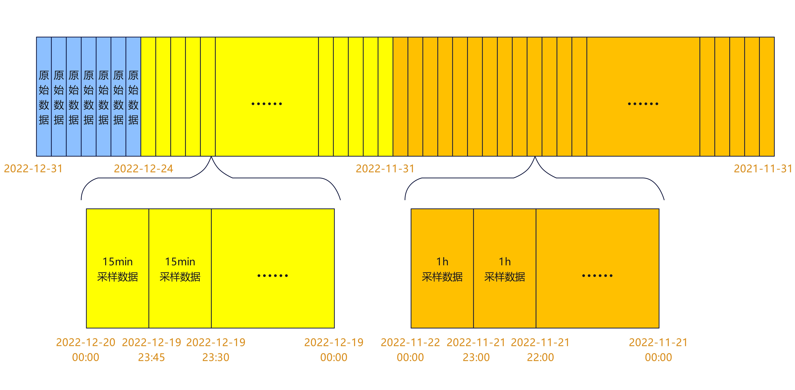

**背景介绍**
在DevOps或Iot等场景中，用户对近期数据更敏感，很多时候只需要对近期指定数据进行完整的数据查询，而对较久远的数据仅进行数据趋势查询，即采样数据的查询，因此对久远的低价值数据，我们可以通过降采样的方式进行数据的采样缩放。

**降采样**
降采样即一定时间间隔内的数据点，基于一定规则，聚合为一个或一组值，从而达到降低采样点数，减少整体存储数据量，进而减轻存储和查询计算的压力。

**多级降采样**
多级降采样与普通降采样的区别在于，多级降采样可以对不同时间段的数据进行不同的降采样策略。
实际业务中用户对不同时间段的降采样要求是不一样的，用户可能对近期的数据比较敏感而对长远的数据需求较少，所以需要根据实际业务对数据进行不同的多级降采样策略。采用多级降采样的方式既满足了用户对高价值数据的查询需求，又兼顾了存储效率。

**场景举例**
多重降采样场景举例：7天内原始数据直接入库，7-30天数据，15min粒度降采样后入库，30天-12个月的数据，1h粒度降采样后入库。
如下图所示，假设今天是2022-12-31，蓝色部分是7天内的数据，黄色部分是7-30天数据，橙色部分是30天-12个月的数据。每过一段时间，数据库会把蓝色部分的数据以15min为粒度聚合放到黄色区域中；每过一段时间，数据库会把黄色部分以1h为粒度聚合放到橙色区域中，注意这里1h是15min的倍数，所以可以方便地聚合。



## 创建降采样
**语法：**

```sql
Create DownSample [on <rp_name>| on <dbname>.<rp_name>|  ]((dataType(aggregators)...)) With Duration <timeDuration> SampleInterval(time Durations) TimeInterval(time Durations)
```
**参数说明：**

|  Duration |SampleInterval   |TimeInterval   |
| ------------ | ------------ | ------------ |
| 降采样后数据的保留时间 |执行下一级降采样时间  |采样Interval   |

**聚合方法定义格式：**

```sql
dataType(aggfunctions...)
```
**聚合方法举例：**

 ```sql
integer(first,sum,count,last,min,max)
 ```
```sql
integer(min,max),float(sum)
```
**限制说明：**

- SampleInterval, TimeInterval 指定的采样策略数量必须相同，比如其中有一项的数量是3，其他项的数量也必须是3；
- SampleInterval, TimeInterval 为一一对应关系、每个数组内为倍数关系；

**举例说明：**

首先，创建一个保留策略rp1，数据保留时长为7天，每天1个shard

```sql
 > create retention policy rp1 on mydb duration 7d replication 1 shard duration 1d
```
其次，假设需要在刚新增的rp1之上创建一个降采样任务，采样后的数据的保留时长设为7天，过去1天内的数据保持数据明细，过去1天-2天内的数据按1分钟粒度对数据进行采样，2天以后的数据，按3分钟的粒度对数据进行降采样。

```sql
> Create DownSample on rp1
 (float(sum,last),integer(max,min))
 With Duration 7d 
 sampleinterval(1d,2d)
 timeinterval(1m,3m)
```

需要⚠️注意的是：

这里的Duration控制降采样后的数据的保留时长，会同步更新rp1的Duration。可以设置为和rp的duration相同值。仅支持first，last，sum，max，min，mean，count 7种。float(sum,last)代表表内所有float类型的字段都使用sum()和last()聚合函数对数据进行降采样，integer(max,min)同理。

**约束条件：**

sampleinterval(1d,2d)，后一个时间是前一个时间的整数倍关系。这种写法是不正确的: sampleinterval(2d,3d) ❌ 

同样，timeinterval(1m,3m) ✅，timeinterval(5m,6m) ❌

sampleinterval 和 timeinterval括号内的值的数量也要一一对应。

sampleinterval(1d,2d)   timeinterval(1m,3m) ✅

sampleinterval(1d,2d)   timeinterval(3m)  ❌

sampleinterval(1d)   timeinterval(1m,3m) ❌


## 显示降采样
**语法：**
show 默认database 所有 downsample tasks：

```sql
SHOW DOWNSAMPLES
```
show 指定database 所有 downsample tasks:
```sql
SHOW DOWNSAMPLES ON <dtabase name>
```
**举例说明：**

```sql
> show downsamples on db0
rpName  field_operator                   duration  sampleInterval    timeInterval waterMark
------  --------------                   --------  --------------    ------------ ---------
autogen float{sum,last},integer{max,min} 168h0m0s  24h0m0s,48h0m0s   1m0s,3m0s    1s,10s
rp1     float{sum,last},integer{max,min} 720h0m0s  24h0m0s,168h0m0s  1m0s,3m0s    1s,1m0s
rp2     bool{last},int{max,min,first}    2400h0m0s 168h0m0s,360h0m0s 30m0s,1h0m0s 10m0s,10h0m0s
```
## 删除降采样
**语法：**
删除数据库的所有降采样：
```sql
Drop DownSamples
Drop DownSamples on db0
```
删除指定RP的降采样：
```sql
Drop DownSample on rp1
Drop DownSample on db.rp
```