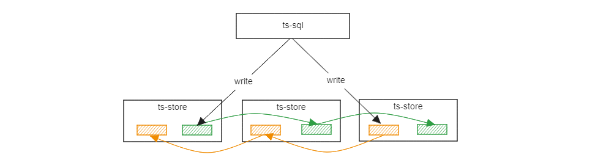
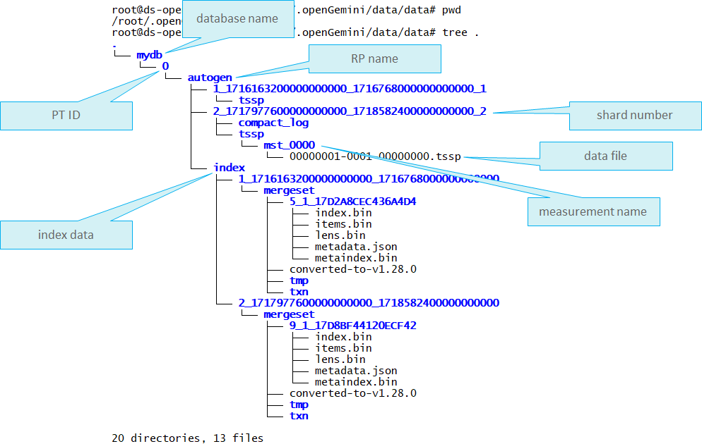
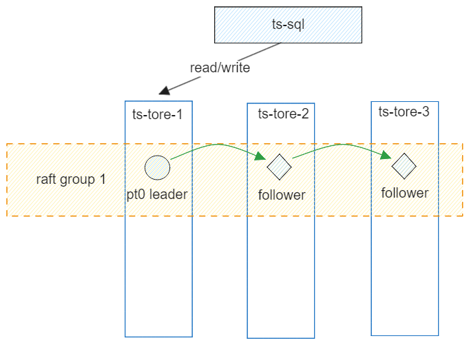
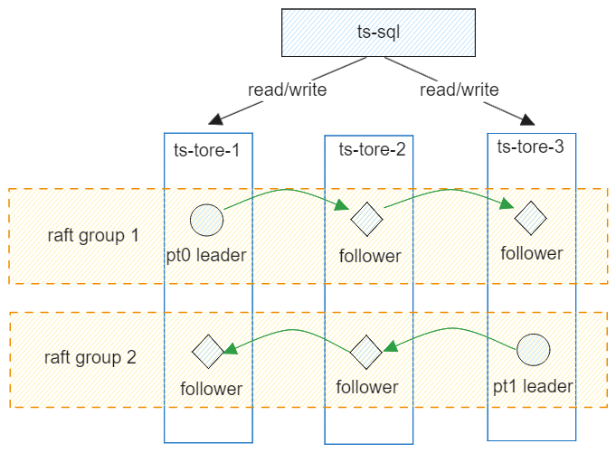
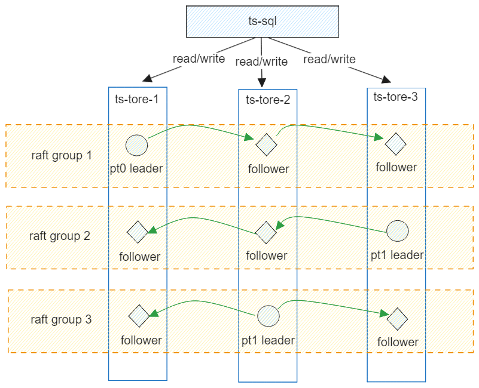
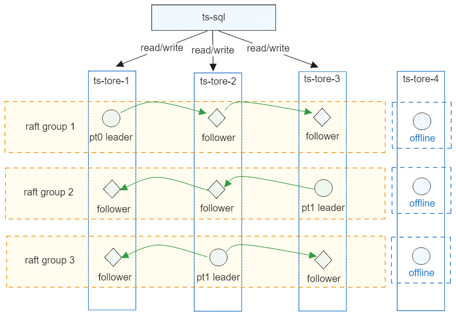
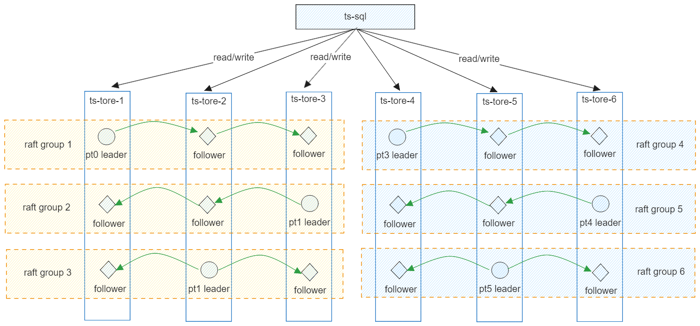
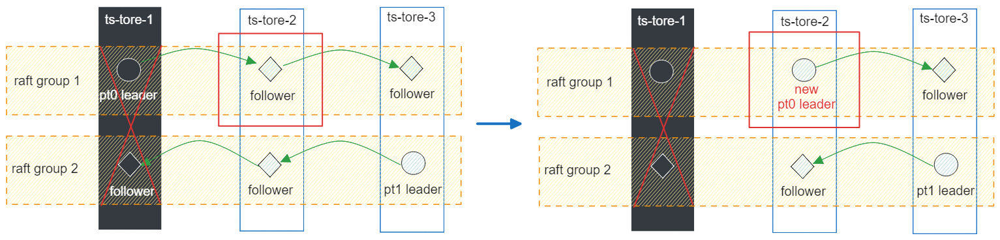

## 数据多副本

openGemini的数据副本能力，可以满足工业、能源、物联网、运维监控等领域对数据可靠性的要求。当前版本的数据副本主要基于raft协议实现，在大量数据密集写入的场景下，副本能力对写性能有一定的影响。

后续版本会不断迭代，进一步优化数据副本分布，并推出新的数据副本协议：

1. 解决写性能损伤的问题
2. 支持2数据副本，当前主要受raft协议限制，必须3个数据副本起



**特别说明**

- 单机版本(ts-server)不支持数据副本
- 当前为DB级数据副本，不支持表级数据副本
- 集群中ts-store节点数量必须是副本数量的倍数，换句话说，如果是3副本，ts-store节点数量至少是3个，可以是6个或者9个
- v1.2.0及以下版本的集群不能平滑升级到多副本集群，需要做数据迁移。社区提供数据导入导出工具以支撑数据迁移（计划9-10月发布）
- 建议多副本集群的ts-store节点规格更大一些，因为副本数据同样会消耗存储和计算资源。尤其是出现故障时，其中一些节点因为需要业务接管，从而导致的压力会比原来更大，要为突发情况预留一些空间

## 配置

修改配置文件openGemini.conf

```toml
[common]
ha-policy = "replication"

[meta]
ptnum-pernode = 2 #每个节点的PT数量，推荐设置为2
```

创建数据库，指定副本数量为3，目前副本数仅支持大于0的奇数。

```sql
CREATE DATABASE db0 REPLICATION 3
```

> PT是单词Partition的缩写，是openGemini数据管理的一个逻辑概念。举个例子，假设有100台设备数据，如果数据库下面仅有一个PT，那么数据全部存到该PT下。如果有2个PT，那么每个PT会各自管理50台设备数据。PT之间是可以并发处理数据，理论上如果资源充足的情况下，多PT性能会更优。

DB、PT、RP、SHARD、MEASUREMENT之间的关系如下图所示：



## 副本数据分布

**示例1：** ptnum-pernode = 1，ts-store 3个



每个节点仅有一个PT，数据会写入PT leader节点，其他两个节点只能作为被动的数据同步节点，无法分担业务压力，类似一主两从。

**示例2：** ptnum-pernode = 2，ts-store 3个



每个节点仅有2个PT，3个节点可以组成2个raft组，每个组一个pt leader，落在不同节点上，可以分担业务压力。

**示例3：** ptnum-pernode = 3，ts-store 3个



每个节点有3个PT，3个节点可以组成3个raft组，每个组一个pt leader，落在不同节点上，可以分担业务压力。由于每个节点都有2个副本PT会同步写入数据，因此会占用部分计算和存储资源。建议适当扩大节点规格。

**示例4：** ptnum-pernode = 3，ts-store 4个



每个节点有3个PT，4个节点依然只能组成3个raft组，剩余ts-store-4节点由于无法找到更多节点与其组成raft组，因此该节点上的PT是离线的，无法工作。

**示例5：** ptnum-pernode = 3，ts-store 6个



每个节点有3个PT，6个节点组成6个raft组，数据按时间线hash打散分布在节点上。

## 读写策略与节点故障

每个副本组会选出一个主pt，读写请求只会路由到 leader pt上，通过ts-meta来统一管理所有副本组主pt的选举使其在节点间尽量均匀分布。如下图所示，若ts-store-1节点故障，则原来raft group 1在ts-store-2上的pt follower会被选为新主，承接业务数据。



## 多AZ部署进阶

前提条件是集群跨AZ部署。修改配置文件openGemini.conf

```toml
[data]
availability-zone = "az1"

[meta]
rep-dis-policy = 1
```

配置文件修改后启动，配置项availability-zone标识ts-store节点所属AZ，rep-dis-policy标识副本pt的分布策略，默认为0表示会尽量在节点间均匀分布，1表示会尽量在AZ间均匀分布，AZ间均衡分布是比节点间均匀分布更严格的分布策略。
