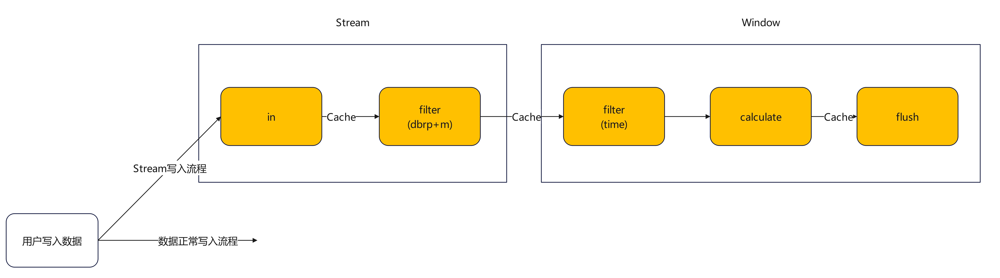

当数据量较大，时间线较多，特别是，聚合前后，时间线下降数个数量级时，推荐使用流式计算做前聚合。流计算具有计算快，网络开销小，纯内存，对底层无影响等优点。连续查询适用场景参考文档 [Continue Query](./continue_query.html)



整体流程如上图所示，用户写入数据如果被指定stream，Copy一份数据走stream的流程。
ts-store侧的stream计算目前分为两个模块，Stream和window，整体是一个五级pipeline。
Stream模块，负责任务管理，数据接入以及初步过滤。
Window模块，负责时间窗口过滤，计算，以及数据下盘。

## 创建Stream

可以通过如下方式向时间线中加入一条流计算来实现前聚合，加入流计算后，数据就可以一边写入，一边聚合。

```sql
CREATE STREAM test INTO db0.autogen.cpu1 ON SELECT sum("usage_user") AS "sum_usage_user" FROM "telegraf"."autogen"."cpu" group by time(1m),"cpu","host" delay 20s
```
该语句的含义是，创建一个流式聚合的任务“test”，把写入"telegraf"."autogen"."cpu"（db为Telegraf，RP为autogen，表为cpu）的数据进行计算，结果写入表cpu1中，聚合方法为sum("usage_user")。其中，delay 20s表示容忍的时间延迟，如果数据由于网络中断，导致在当前时间窗 1m + 20s的时间内未到达，这个数据将被丢弃，不再当前时间窗内被计算，新的其他数据会在下一个时间窗内计算。

## 查看Stream

通过这条指令可以查看数据库内所有的流计算：
```sql
SHOW STREAMS
```
## 删除Stream
通过这条指令可以删除数据库内的流计算：
```sql
DROP STREAM <流计算的名字>
```
