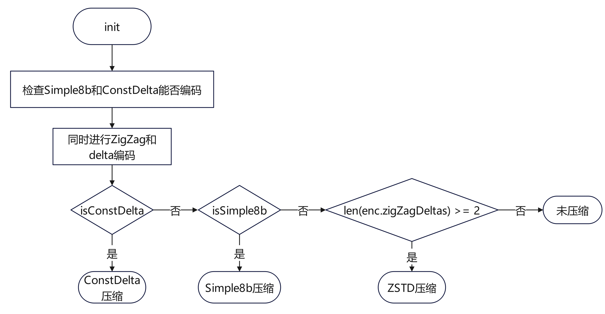

## 编码格式
##### delta
差分编码又称增量编码，编码时，第一个数据不变，其他数据转换为与上一个数据的delta。该算法应用广泛，如需要查看文件的历史更改记录（版本控制、Git等）。在时序数据库中，很少单独使用，一般搭配Simple8b或者Zig-Zag一起使用，压缩效果更好。

举例说明：假如原数组为[10000,10001,10002,10003,10004,10005]，delta编码后就会变成[10000,1,1,1,1,1]再进行ZigZag编码，压缩效果很好。
##### ZigZag
Zig-zag 算法的核心思想是减少数据中无效的 0，比如正整数 1，32位计算机系统中表示为
$$
00000000,00000000,00000000,00000001
$$
计算机存储时需要用4个字节，如果去掉前面部分多余的0，则至少可以节约3/4的存储空间。如果是负数，计算机中采用补码表示，比如−1，32位计算机系统中表示为

$$
11111111,11111111,11111111,11111111
$$
通过公式
$$
(n << 1)\wedge(n >> 31)
$$
的变换，转换成

$$
00000000,00000000,00000000,00000001
$$
即把负数转换成小整数，再进行压缩。该算法同样对于小正整数或者小负整数（如 −1，−2）的压缩效果好，对大整数或大负整数效果不佳。

##### Simple8b
Simple8b 是 64 位算法，维护了一个查找表，实现将多个整形数据压缩到一个 64bit 长整型中。其中前 4 位表示选择器，用来标记每个值使用多少bit，后面 60 位用于存储数据。

如上图所示，Integers Coded表示可压缩的数据集大小，Bits Per Integer表示每个整数分配多少 Bits 来表示，比如要压缩8个数据，选择器选择8，每个数据用7个 bits 表示，但是如果某个数据的值超过了7个 bits 的表示范围，那么就需要尝试用选择器9，只能压缩前7个数据，每个数据用8个bits来表示，以此类推。第一次未压缩的数据将压缩到一个新的64bit的长整型中，由此可见simple8b算法对小整数的压缩效果比较好，对大整数的压缩效果不佳。

##### Zstandard
Zstandard 简称"zstd"（发音 zee standard），主要应用场景为实时流压缩，其数据压缩比与zlib 接近，但又有非常高的数据压缩效率和压缩速度。zstd算法实现是基于FSE和Huffman编码对数据进行压缩，由于算法内容比较繁杂，具体可参照 RFC8878 的描述。

##### Snappy
Snappy是Google开源的压缩算法实现，它的设计目标是追求速度而不是最高的压缩率。
Snappy借鉴了LZ77的思路，并对其做了许多优化，与zlib的最快模式相比，Snappy对于大多数输入来说都快一个数量级，但生成的压缩文件要大20%到100%,该算法的基本思想是在序列S(S1, S2, S3, ..., Sn) 中寻找相同的子序列S_{i,i+l}  = S_{j,j+l}（这里的序列可以是字符、也可以是数值），并用（tag，offset，lenght）三元组代替重复的序列，其中tag为标签，是一个指定的数值，offset表示相对位移 (j−i)，length 表示匹配的子序列长度。
例如有如下字符串ABFDGHEOHNFLESSDGLSJGOGHEOHNFLESSDG其中GHEOHNFLESSDG 重复出现，长度为13，为方便理解算法原理，在这里我们忽略掉匹配相同子串的过程，则可用（1,18,13）替代重复出现的GHEOHNFLESSDG 字符串。

##### RLE
RLE全称（run-length encoding），翻译为游程编码，又译行程长度编码，又称变动长度编码法（run coding）。游程编码是一种简单的非破坏性资料压缩法，其好处是加压缩和解压缩都非常快。其方法是计算连续出现的资料长度压缩之。RLE可以对连续相同字符进行压缩。
举例，对于ABBBBBBBBA，可以压缩为1A8B1A。

##### Gorilla
Gorilla paper compression是facebook发布的论文中提到的关于float类型的压缩实现。Gorilla相比于别的压缩方式对双精度float的压缩率更好。由于算法内容比较繁杂，具体可参照论文Gorilla: A Fast, Scalable, In-Memory Time Series Database中的描述。

##### Bit-packing
Bit-packing 数据压缩算法的核心思想是将数据按照位(bit)进行打包和存储，以减少数据的存储空间。它利用了数据中存在的冗余性和重复性，通过将多个数据项合并为一个较小的数据单元来减少存储空间的使用。Bit-packing 数据压缩算法通常使用无符号整数来表示数据，因此不能直接处理负数。如果需要处理负数，可以使用一些技巧来转换为无符号整数进行处理。
在bit-packing中，数据项按照顺序排列，并且每个数据项占用相同数量的位数。这样可以确保数据的顺序和结构不会改变。例如，如果有一组整数需要存储，每个整数占用8位，那么bit-packing算法将把这些整数按顺序排列，并将它们合并到一个字节中，每个整数占用一个字节的一部分位。

## 源码解析

##### int类型
在lib/encoding/int.go中定义了int类型的编码，一共涉及5种编码：ConstDelta、Simple8b、ZSTD、ZigZag和delta。在Integer类下有可以设置编码类型的方法，也有编码与解码的方法。

int类型加密流程图如下:


int类型的encoder初始化函数如下，先调用reset()，isConstDelta和isSimple8b都设成true，然后假如数组长度小于3，isConstDelta和isSimple8b都设成false，然后对数组同时进行进行zigzag加密和delta加密，同时判断数字差是否超过simple8b要求的最大值，如果超过就把isSimple8b设成false；同时判断每两个数之间的差值是否为定值，如果为定值那么设isConstDelta为true。

```go
func (enc *Integer) init(arr []int64) {
	enc.reset()
	if len(arr) < 3 {
		enc.isSimple8b = false
		enc.isConstDelta = false
		return
	}

	v0 := arr[0]
	enc.zigZagDeltas = append(enc.zigZagDeltas, ZigZagEncode(v0))
	delta := arr[1] - arr[0]
	zigZagEnc := ZigZagEncode(delta)
	if enc.isSimple8b && zigZagEnc > simple8b.MaxValue {
		enc.isSimple8b = false
	}
	enc.zigZagDeltas = append(enc.zigZagDeltas, zigZagEnc)

	for i := 2; i < len(arr); i++ {
		delta = arr[i] - arr[i-1]
		zigZagEnc = ZigZagEncode(delta)
		enc.isConstDelta = enc.isConstDelta && enc.zigZagDeltas[i-1] == zigZagEnc
		if enc.isSimple8b && zigZagEnc > simple8b.MaxValue {
			enc.isSimple8b = false
		}
		enc.zigZagDeltas = append(enc.zigZagDeltas, zigZagEnc)
	}
}
```
##### time类型

在lib/encoding/timestamp.go中定义了timestamp类型的编码，一共涉及4种编码：ConstDelta、delta、Simple8b和Snappy。在Time类下有可以设置编码类型的方法，也有编码与解码的方法。这里的ConstDelta就是当数组内相邻两个数的差值固定时，可以采用这种编码方式。

time类型编码流程图如下:


Encoding方法和encodingInit方法如下：
```go
func (enc *Time) Encoding(in []byte, out []byte) ([]byte, error) {
	times := util.Bytes2Uint64Slice(in)
	if len(times) < 3 {
		return enc.packUncompressedData(in, out)
	}

	enc.encodingInit(times)
	if enc.isConstDelta {
		return enc.constDeltaEncoding(out)
	} else if enc.isSimple8b {
		return enc.simple8bEncoding(out)
	} else {
		return enc.snappyEncoding(in, out)
	}
}
```
```go
func (enc *Time) encodingInit(times []uint64) {
	timesN := len(times)
	if cap(enc.deltas) < timesN {
		enc.deltas = make([]uint64, 0, timesN)
	}
	enc.deltas = enc.deltas[:timesN]

	enc.isConstDelta = true
	enc.deltas[timesN-1] = times[timesN-1] - times[timesN-2]
	enc.isSimple8b = enc.deltas[timesN-1] < simple8b.MaxValue
	enc.scale = scale(enc.deltas[timesN-1])
	for i := timesN - 2; i > 0; i-- {
		enc.deltas[i] = times[i] - times[i-1]
		for enc.scale > 1 && enc.deltas[i]%enc.scale != 0 {
			enc.scale = enc.scale / 10
		}
		enc.isConstDelta = enc.isConstDelta && enc.deltas[i] == enc.deltas[i+1]
		enc.isSimple8b = enc.isSimple8b && enc.deltas[i] < simple8b.MaxValue
	}
	enc.deltas[0] = times[0]
}
```

##### float类型

在lib/compress/float.go中定义了float类型的编码，一共涉及4种编码：Snappy、Gorilla、Same和RLE。当数组长度小于4的时候不进行压缩，数组长度小于8的时候不进行RLE压缩。这里的Same编码就是数组内每个数都相同时可以采用这种编码。

float类型加密流程图如下:


AdaptiveEncoding方法源码如下：
```go
func (c *Float) AdaptiveEncoding(in []byte, out []byte) ([]byte, error) {
	values := util.Bytes2Float64Slice(in)
	ctx := GenerateContext(values)
	defer ctx.Release()

	if ctx.NotCompress() {
		return c.compressNull(in, out), nil
	}

	if ctx.Same() {
		out = append(out, floatCompressedSame<<4)
		return c.rle.SameValueEncoding(in, out)
	}

	if ctx.RLE() {
		out = append(out, floatCompressedRLE<<4)
		return c.rle.Encoding(in, out)
	}

	var err error
	func() {
		if ctx.Snappy() {
			out = append(out, floatCompressedSnappy<<4)
			out, err = SnappyEncoding(in, out)
			return
		}

		out, err = GorillaEncoding(in, out)
		out = append(out[:1], out...)
		out[0] = floatCompressedGorilla << 4
	}()

	if err != nil {
		return nil, err
	}

	// compression ratio greater than 90%
	if len(out) > len(in)*90/100 {
		out = c.compressNull(in, out[:0])
	}
	return out, nil
}
```

##### bool类型
在lib/encoding/bool.go中定义了bool类型的编码，只有Bitpack一种编码形式。编码函数如下：
```go
func (enc *Boolean) Encoding(in []byte, out []byte) ([]byte, error) {
	enc.buf.Reset(out)
	if enc.bw == nil {
		enc.bw = bitstream.NewWriter(enc.buf)
	} else {
		enc.bw.Reset(enc.buf)
	}

	values := util.Bytes2BooleanSlice(in)
	var count [4]byte
	numberenc.MarshalUint32Copy(count[:], uint32(len(values)))
	_ = enc.buf.WriteByte(byte(boolCompressedBitpack << 4))
	_, _ = enc.buf.Write(count[:])

	for _, v := range values {
		_ = enc.bw.WriteBit(bitstream.Bit(v))
	}

	_ = enc.bw.Flush(bitstream.Zero)

	return enc.buf.Bytes(), nil
}
```

##### string类型

在lib/encoding/string.go中定义了string类型的编码，一共涉及2种编码：Snappy和Zstd。String类型如果不指定编码类型默认是Snappy，也可以指定为Zstd编码。