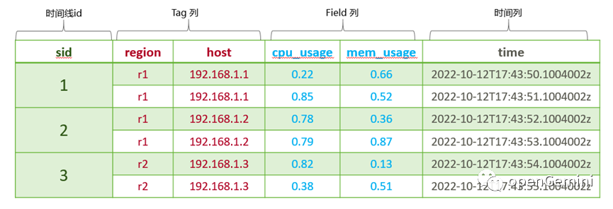
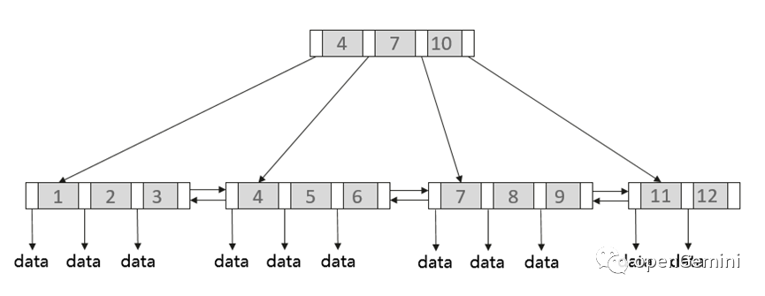

本文主要介绍openGemini 索引组织结构设计的关键点。

## **为什么需要索引**

在数据库中，数据往往按主键组织。在 openGemini 中，数据同样也是按照主键 sid 来组织，同一个时间线的数据组织在一起。如下是一张时序数据逻辑表结构：



sid 代表时间线对应的 id，也就是时序数据的主键；tag 列是标签列，用于描述时序数据，常常用来做条件过滤；field 列是指标列，代表时间线的指标数据；时间列表示指标数据产生的时间点。

如上图，表示主机设备的监控数据，如果我们要查询某个 region 下某个 host 对应的cpu 使用率该怎么办呢？这是一种典型的多维查询场景，在传统关系型数据库中，如果没有对相关列建立索引则需要全表扫描，找到所有满足条件的行数据，效率极低。

在海量时序数据场景中，怎么才能做到高效地查询呢？毫无疑问，那就是对所有 tag 列建立索引，通过 tag 列的索引能够快速定位到满足条件的所有 sid，然后再通过 sid 便能快速地获取到对应的行数据。其中，tag 到 sid 的索引便称为多维倒排索引。

## **多维倒排索引组织结构**

在关系型数据库中，一般使用一棵 B+ 树来组织索引数据，如下图：



在 B+ 树中，数据存放在节点中，每个节点可以存放多个 key，节点间通过指针连接起来。非页子节点内部的指针指向子节点，key 左边的指针指向小于当前 key 的节点，右边的指针指向大于等于当前 key 的节点。叶子节点中存放 key 和其对应的数据或者指向数据的指针，叶子节点间通过前后指针组成一个双向链表。

可以看出B+ 树的组织结构非常适合点查和范围查询。但由于 B+ 树是平衡树，数据在写入时，需要对节点进行分裂合并以保证树的平衡性，从而会带来大量的随机 io 和写放大。

众所周知，时序数据场景往往会伴随着海量时间线，也就意味着会有海量时间线的写入，因此索引的写入性能至关重要。如果时序数据库效仿传统关系数据库 B+ 树的结构来组织索引数据显然是行不通的。那 openGemini 是如何组织索引数据的呢，又是如何带来高效查询写入性能的呢？

为了解决 B+ 树写入性能的问题，openGemini 使用了目前业界比较流行 LSM Tree ( Log-structured merge Tree) 这种结构来存储索引数据。LSM Tree 其实提供的是一种抽象思想，数据写入就像写日志一样顺序写入，以append 的方式追加写入。一般的实现方式都是现在内存中维护一个 buffer，然后等 buffer 达到一定阈值再一波刷盘，将随机写转换成顺序写，并在后台周期性的将磁盘上的数据进行合并。这里内存的数据结构其实没有规定用什么，在大部分 kv 存储引擎中一般会在内存中维护一个跳表保证 key 的有序性。

openGemini选用了一种称为mergeset 的结构作为索引存储，这种结构本质上也是 LSM Tree 的一种实现，索引数据写入时也是先写入内存的 buffer， buffer 按block 组织，每个 block 就是一个简单的 item（代表一个索引项）数组，写入时仅仅是简单地追加写入，因此写入的复杂度是 O(1)。写满一个 block 后切新的 block，当 block 达到一定数量或者 flush 周期到达时，将 block 内的数据排序后刷到磁盘上。最终索引的组织结构如下：


这个结构看起来和 B+ 树很像，最下面一层是最原始的索引项 item，按照 block 来组织，每个 block 内的 item 分别有序，所以在 block 内部搜索某个 item 的时间复杂度是 O(logn)，不同 block 中的数据可能有交叉。

为了加快索引查询的速度，对所有 item 的 block 再建立一层索引，也就是索引数据的索引，我们暂且称为二级索引。二级索引也是按照 block 组织，每个 block 内的项称为 BlockHeader，一个 BlockHeader 索引一个 item Block，所以一个 index block 可以索引多个 item block。BlockHeader 存储了一个 item blcok 的相关信息，比如 item block 的第一个item、item 的个数、item block 的偏移及大小等。index block 内部按照firstItem 排序，可以在 O(logn) 的时间复杂度查找到相应的 item block。

是不是有了二级索引就够了呢，在海量时间线场景下，二级索引可能依旧较大，为了能够进一步加快索引的查询，又增加了一层索引，称之为 meta index。顾名思义，meta index 就是 index 的元数据，也就是二级索引的索引，暂且称之为三级索引吧。meta index 也是按 block 组织，每个项称为 metaindexRow，里面存储了 index Block 中第一个 BlockHeader 对应的 firstItem、BlockHeader 的数量、index block的偏移及大小。和 index block 类似，metaindex block 内也是按照 firstItem 排序，因此查询效率很高。

可以看到，mergeset 通过多层索引组织结构，不论是点查还是范围查询，其性能都和 B+ 树相当。

## **文件组织结构**

上面介绍了索引的组织结构，在 mergeset 中，整个组织结构称之为 part，也就是内存中的索引数据每刷入到磁盘中便形成这样一个 part。part 中 items、index、metaindex 在磁盘上是以单独的文件组织的，文件组织如下所示：


part 过多会导致文件数过多，同时也会影响查询性能，因此，mergeset 会在后台对 part 进行合并。同时，我们也可以看出 items -> index -> metaindex 数据量呈二个数量级降低。假设原始索引数据 items 有 1TB，那么最终的metaindex 只有 100MB，因此 mergeset 中 metaindex 会完全载入内存，进一步提高查询速度。

## **举个例子**

以查询r1 region中IP地址为192.168.1.1这台主机过去一小时内的CPU平均利用率为例。

```sql
SELECT mean(cpu_usage)
FROM cpu_info
WHERE region=‘r1’ AND host=‘192.168.1.1’ AND time > now()-1h
```

索引结构如下图所示：


一级索引中，item的key逻辑上由tagkey=tagvalue组成，例如host=192.168.1.1。item的value逻辑上是该tag对应的所有时间线ID组成的数组，例如【sid1,sid2,sid3,...】。在此基础上形成二级索引和三级索引，并按字典序进行组织。

在上述查询的例子中涉及tag的条件有两个，分别是：

1. region=r1
2. host = 192.168.1.1

需要通过查询倒排索引分别找到对应item，才知道需要在哪些时间线(sids)中读取数据，查询索引的步骤如下：

1. 根据条件region=r1，从顶层（三级）索引metaIndexRow，通过二分查询找到包含key(region=r1)的item在二级索引的位置。
2. 读取对应二级索引block，再一次通过二分查询找到包含key(region=r1)的item在一级索引的Block位置。
3. 读取对应一级索引block，二分查询找到item，读取到region=r1对应的时间线【sid1,sid2,sid3,...】

同理，读取到host=192.168.1.1对应的时间线【sid2,sid3,sid4,...】,最后求集合的交集，得到region=r1 and host =192.168.1.1组合条件下的时间线【sid2,sid3,...】
