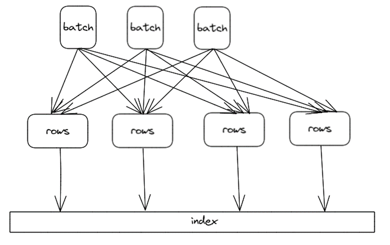
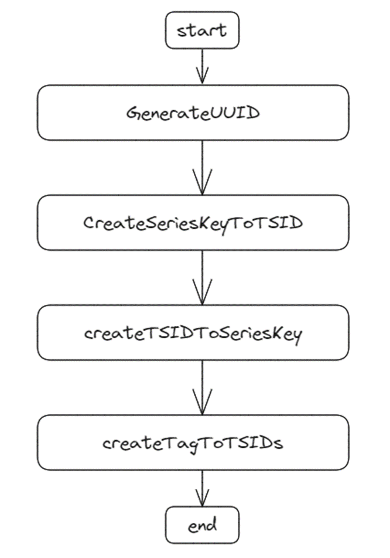
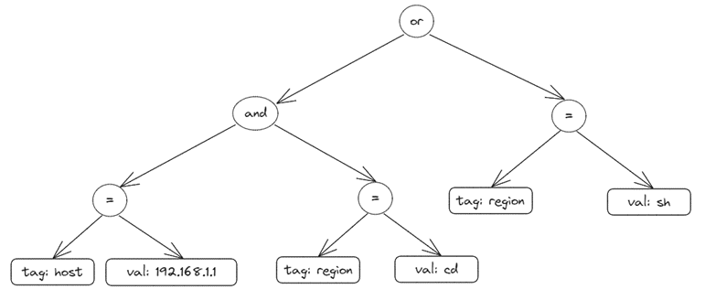
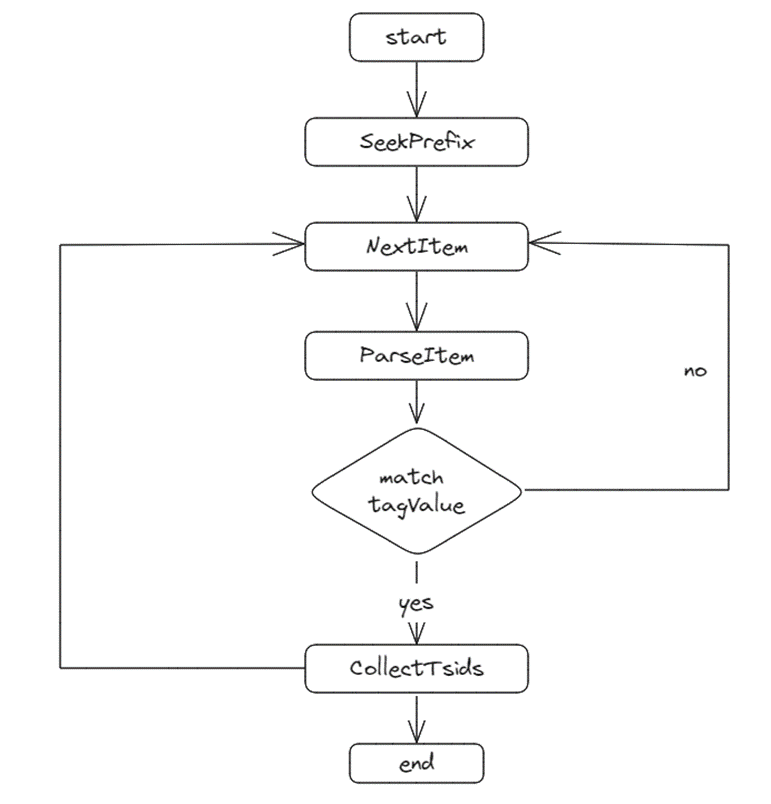

本文会结合部分源码分析openGemini 的索引的原理和读写整体流程。

## **索引介绍**

众所周知，索引是数据库系统中非常核心的组件，它是提升数据库查询性能的关键方法。在传统的关系型数据库中，常常使用 B+ 树作为索引的组织结构，B+ 树具备很好的点查和范围查询性能，非常适合对查询延时要求较高的 TP 场景。但是 B+ 树的写入会导致大量的随机 io，严重影响系统性能，并不适用于海量的时序写入场景。

同时考虑查询和写入的性能，openGemini 选择使用倒排索引这种高效的数据结构。倒排本质上是 key-value 结构，业界非常成熟的方式是使用 LSM-Tree 来存储 key-value，比如 RocksDB、HBase 等，LSM-Tree 具备高效的写入性能。同时，结合 flush 排序、cache 等技术，可以达到较好的查询性能。

## **索引数据**

索引本质上也是一堆数据，那么在 openGemini 中，会存储哪些数据呢？本节将详细介绍。

由于 openGemini 兼容 influxdb 协议，所以在数据模型上也保持一致。在 openGemini 中，指标数据在底层按照时间线组织，因此，查询数据时，首先要获取满足条件的时间线，再到存储引擎中获取具体的指标数据。为了节省存储，时间线往往以 id 的方式存储，而在索引中会存储时间线值和id的字典映射关系。如下所示：

```
seriesKey -> tsid
tsid -> seriesKey
```

seriesKey 是时间线的原始 key 值，tsid 是根据 seriesKey 生成 uuid，两者一一映射。在数据写入时，需要判断 seriesKey 对应的 tsid 是否存在，如果不存在，则会建立上述映射数据，写入索引。

倒排索引的目的是为了加快查询过滤，因此，还需要存储一个核心的映射关系：

```
tag -> tsids
```

这里的 tag 包含了 measurement、tagKey 和 tagValue，通过这个映射关系，可以找到满足 tag filter 过滤条件的 tsids，加速查询。

上述是索引存储的主要数据，下面会通过源码剖析，详细介绍索引的写入和查询原理。

## **写入流程**

索引写入的入口方法为 shard.writeIndex，该方法会提前判断写入的 points 是否需要创建索引，如果索引都已经创建则不再重复走索引流程。否则，继续将 points 往下传，进入到索引创建流程。索引创建入口IndexBuilder.CreateIndexIfNotExists，关键代码如下：

```go
func (iBuilder *IndexBuilder) CreateIndexIfNotExists(mmRows *dictpool.Dict, needSecondaryIndex bool) error {
	//...
	for mmIdx := range mmRows.D {
		rows, ok := mmRows.D[mmIdx].Value.(*[]influx.Row)
		if !ok {
			putIndexRows(iRows)
			return errno.NewError(errno.CreateIndexFailPointRowType)
		}

		for rowIdx := range *rows {
			row := &(*rows)[rowIdx]
			if row.SeriesId != 0 {
				continue
			}
			if cap(*iRows) > len(*iRows) {
				*iRows = (*iRows)[:len(*iRows)+1]
			} else {
				*iRows = append(*iRows, indexRow{})
			}
			iRow := &(*iRows)[len(*iRows)-1]
			iRow.Row = row
			iRow.Wg = &wg

			wg.Add(1)
			idx := primaryIndex.(*MergeSetIndex)
			idx.WriteRow(iRow)
		}
	}
	// Wait all rows in the batch finished.
	wg.Wait()
	//...
	return nil
}
```

在 iBuilder.CreateIndexIfNotExists 中，会遍历所有 points，并调用 idx.WriteRow 写索引。这里比较关键的是，由于 WriteRow 是异步方法，索引在遍历完 points 后需要调用 wg.wait 等待写入结果。至于 WriteRow  为什么设计成异步方法，下面会详细讲解。

上面我们讲过，seriesKey 和 tsid 是一一映射的，因此，在索引写入时，为了防止 seriesKey 产生多个 tsid，索引的创建会串行执行。很明显，串行执行无法充分发挥 CPU 的计算能力，进而影响写入性能。那怎么能提升索引写入性能呢？其实只要保证包含相同 seriesKey 的 points 串行创建索引即可，而不同 seriesKey 的 points 可以并发创建，如下：



索引内部引入多个 queue，将 serieskey hash 到相应的 queue 中，这样相同 serieskey 的 rows 必定路由到同一个 queue 中，多个 queue 可以并行处理，同一个 queue 中的 rows 串行建索引，整体并发度提升，这是典型的生产者-消费者模式。参考文件engine/index/tsi/mergeset_index.go，并发写入的代码如下：

```go
func (idx *MergeSetIndex) WriteRow(row *indexRow) {
	partId := meta.HashID(row.Row.IndexKey) & queueSizeMask
	idx.queues[partId] <- row
}
func (tsIdx *tsIndexImpl) run(idx *MergeSetIndex) {
	for i := 0; i < len(idx.queues); i++ {
		go func(index int) {
			for row := range idx.queues[index] {
				row.Row.SeriesId, row.Err = idx.CreateIndexIfNotExistsByRow(row.Row)
				row.Row.PrimaryId = row.Row.SeriesId
				row.Wg.Done()
			}
		}(i)
	}
}
```

WriteRow 充当生产者的角色，将 seriesKey 哈希并路由到相应的 queue 中，run 方法中会对每个 queue 开启一个 goroutine 消费数据。 

继续往下进入索引创建方法：

```go
func (idx *MergeSetIndex) createIndexesIfNotExists(vkey, vname []byte, tags []influx.Tag) (uint64, error) {
	tsid, err := idx.getSeriesIdBySeriesKey(vkey)
	if err != nil {
		return 0, err
	}

	if tsid != 0 {
		return tsid, nil
	}

	if err := idx.indexBuilder.SeriesLimited(); err != nil {
		return 0, err
	}

	defer func(id *uint64) {
		if *id != 0 {
			idx.cache.PutTSIDToTSIDCache(id, vkey)
		}
	}(&tsid)

	tsid, err = idx.createIndexes(vkey, vname, tags, nil, false)
	return tsid, err
}
```

根据 seriesKey 查找 tsid 是否存在，如果存在则直接返回，否则，调用 createIndexes 方法创建索引，最后会将 seriesKey -> tsid 映射关系回写 cache，提升查询性能。createIndexes  方法会创建具体的索引数据，流程如下图：




部分代码如下：

```go
func (idx *MergeSetIndex) createIndexes(seriesKey []byte, name []byte, tags []influx.Tag, tagArray [][]influx.Tag, enableTagArray bool) (uint64, error) {
	tsid := idx.indexBuilder.GenerateUUID()

	ii := idxItemsPool.Get()
	defer idxItemsPool.Put(ii)

	// Create Series key -> TSID index
	ii.B = append(ii.B, nsPrefixKeyToTSID)
	ii.B = append(ii.B, seriesKey...)
	ii.B = append(ii.B, kvSeparatorChar)
	ii.B = encoding.MarshalUint64(ii.B, tsid)
	ii.Next()

	// Create TSID -> Series key index
	ii.B = append(ii.B, nsPrefixTSIDToKey)
	ii.B = encoding.MarshalUint64(ii.B, tsid)
	ii.B = append(ii.B, seriesKey...)
	ii.Next()

	// Create Tag -> TSID index
	compositeKey := kbPool.Get()
	if enableTagArray {
		tagMap := make(map[string]map[string]struct{})
		for _, tags := range tagArray {
			for i := range tags {
				if len(tags[i].Value) == 0 {
					continue
				}
				if _, ok := tagMap[tags[i].Key]; !ok {
					tagMap[tags[i].Key] = make(map[string]struct{})
				}
				if _, ok := tagMap[tags[i].Key][tags[i].Value]; ok {
					continue
				} else {
					tagMap[tags[i].Key][tags[i].Value] = struct{}{}
				}
				ii.B = idx.marshalTagToTSIDs(compositeKey.B, ii.B, name, tags[i], tsid)
				ii.Next()
			}
		}
	} else {
		for i := range tags {
			ii.B = idx.marshalTagToTSIDs(compositeKey.B, ii.B, name, tags[i], tsid)
			ii.Next()
		}
	}

	compositeKey.B = marshalCompositeTagKey(compositeKey.B[:0], name, nil)
	ii.B = append(ii.B, nsPrefixTagToTSIDs)
	ii.B = marshalTagValue(ii.B, compositeKey.B)
	ii.B = marshalTagValue(ii.B, nil)
	ii.B = encoding.MarshalUint64(ii.B, tsid)
	ii.Next()

	kbPool.Put(compositeKey)

	if err := idx.tb.AddItems(ii.Items); err != nil {
		return 0, err
	}

	return tsid, nil
}
```

首先生成 uuid 作为 tsid，然后创建 seriesKey -> tsid，tsid -> seriesKey，tag -> tsids 的映射关系，并添加到底层索引存储中。item 是存储的最小单元，每个映射关系以 key-value 的方式存入到 item，最后再写入到底层存储结构中。

item 本质上是一个 byte slice，索引数据会按 byte 写入 item。1 byte 的 prefix 用来区分 item 类别，即通过 prefix 可以过滤要查的索引数据类型。key-value 信息将按照一定规则编码到 item。具体的编码细节本文不详细展开，感兴趣的同学可以细看 openGemini github 源码。

以上为索引写入的整体流程，接下来开始分析如何在索引中查找数据。

## **查询流程**

索引的目的就是为了加快查询，在 openGemini 中，查询条件可以包含时间范围、field过滤、tag 过滤。索引主要是加速 tag 过滤，快速找到满足条件的 tsids。接下来开始源码，索引查询执行的入口是 MergeSetIndex.SearchSeriesIterator，部分代码如下：

```go
func (idx *MergeSetIndex) SearchSeriesIterator(span *tracing.Span, name []byte, opt *query.ProcessorOptions) (index.SeriesIDIterator, error) {
	//...
	singleSeries := opt.GetHintType() == hybridqp.FullSeriesQuery
	if singleSeries {
		tsid, err = idx.GetSeriesIdBySeriesKey(opt.SeriesKey, name)
		if err != nil {
			idx.logger.Error("getSeriesIdBySeriesKey fail", zap.Error(err), zap.String("index", "mergeset"))
			return nil, err
		}
	}

	is := idx.getIndexSearch()

	is.setDeleted(idx.getDeletedTSIDs())
	itr, err := is.measurementSeriesByExprIterator(name, opt.Condition, singleSeries, tsid)
	if search != nil {
		search.Finish()
	}
	//...
}
```

这里查询做了一个优化，场景是当用户指定按照时间线查询时，这里可以根据 SeriesKey 直接查出 tsid，避免走 tag 过滤查询，从而大幅提升查询性能。如果是普通查询，会走到indexSearch.seriesByExprIterator 方法，该方法会递归遍历条件表达式树，然后将查询的结果按交并组合起来。该方法代码比较长，不再罗列。为了便于理解，举个例子，如下 SQL 语句：

```sql
SELECT * 
FROM mst 
WHERE host=192.168.1.1 AND region=cd or region=sh
```

 那么该 SQL 对应的条件表达式树如下图：



按照后序遍历的方式递归遍历节点，直到叶子节点，当遇到 "=" 操作符时，会将 tagKey 和 tagValue 取出来走具体的索引过滤流程，查出满足条件的 tsid 集合。所以，每个叶子节点对应一个最小单元的查询条件，各个叶子节点查询结果会往上返回，最后再对这些结果取交并集。

忽略掉中间步骤，直接看索引数据是如何查找出来的。代码见 indexSearch.getTSIDsForTagFilterSlow。



首先定位到第一个大于等于前缀的 item，然后从该 item 开始往后遍历解析 item 并判断 item 是否满足当前查询条件，如果满足则收集解析出来的 tsid，否则继续往下迭代，直到循环结束。要了解索引底层存储如何获取数据请参考文档：[查询索引结构解析](./kernel_index.md)