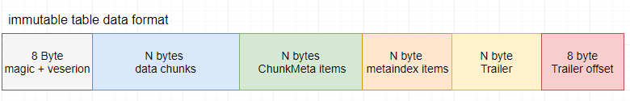
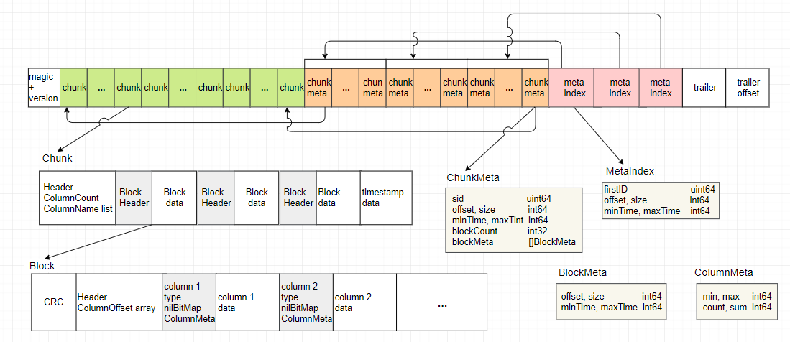

## tssp数据格式
##### openGemini数据库的持久化数据文件后缀名为tssp，数据格式如下图所示：

该存储格式分成了6个部分：

1. 文件头：一个magic及version。
2. 数据chunk。
3. 数据chunk的索引ChunkMeta。
4. ChunkMeta的索引MetaIndex。
5. Trailer：记录data chunk区、ChunkMeta区、metaIndex区的offset、size、measurement名字，及sid的范围和时间范围。
6. 最后8个字节，表是Trailer的位置。

##### 其中的名词术语：
- Chunk：某一个时间段的5行数据按列压缩后，顺序存储在一起叫一个chunk。
- Block：如果某一个时间段对应的行太大，比如有10000行，则按2000行进行一次按列压缩存放，这2000行按列分别压缩后顺序存放的数据块叫一个Block，那么10000行一共会产生5个block，这5个block合在一就是一个chunk。
- Column：每个block中的数据都是按列压缩的，一列叫一个column。
- ColumnMeta：column的min/max/sum/count等信息。
- BlockMeta：Block的索引信息，time range、offset、size等。
- ChunkMeta：Chunk data的索引，主要包含SID、time range、Chunk data在文件中的offset、size等，ChunkMeta按SID排序，查询是可按sid做二分查找。
- MetaIndex：一个稀疏索引，对ChunkMeta按一定大小抽取一条组成的数组，是ChunkMeta的索引，主要有SID，time range，ChunkMeta在文件中的offset、size等。MetaIndex常驻内存，查询的时候按sid在MetaIndex中二分查得到一条MetaIndex item，再根据MetaIndex中offset、size读取ChunkMeta数据块，再在ChunkMeta数组中二分查询到对应的ChunkMeta就可以定位到sid对应的数据在文件在的位置了。

##### 总体结构如下图所示：


## 源码解析

##### MsBuilder
数据存储主要由MsBuilder（engine/immutable/msbuilder.go）这个类负责，这个类把所有的数据保存到成员变量，最后统一写到磁盘。写记录的方法是WriteRecord，主要代码如下。
```go
func (b *MsBuilder) WriteRecord(id uint64, data *record.Record, schema record.Schemas, nextFile func(fn TSSPFileName) (seq uint64, lv uint16, merge uint16, ext uint16)) (*MsBuilder, error) {
  
  //...
  
  b.WriteData(id, data)
  
  //...
	
  if len(schema) != 0 { // write index, works for colstore
			//...
			if err := b.writeIndex(data, schema, indexFilePath, *b.lock); err != nil {
				//...
				return b, err
			}
		}

		fSize := b.Size()
		if fSize < b.Conf.fileSizeLimit || nextFile == nil {
			return b, nil
		}

		return switchTsspFile(b, data, data, rowsLimit, fSize, nextFile)
	}

  //...
}
```
上面的代码先调用了WriteData方法来写DataChunk和ChunkMeta，然后调用了writeIndex方法来写列存储的索引，最后调用了switchTsspFile返回参数供最后写入磁盘。当需要写入磁盘时调用WritIntoFile方法写入磁盘。主要代码如下。

WriteData方法调用了chunkBuilder.EncodeChunk来保存了chunk数据和chunkMeta数据。
switchTsspFile方法创建了一个新的Tssp文件，然后把所有信息放进了新的MsBuilder中返回。

```go
func (b *MsBuilder) WriteData(id uint64, data *record.Record) error {
	//...

	b.chunkBuilder.setChunkMeta(b.cm)
	b.encodeChunk, err = b.chunkBuilder.EncodeChunk(id, b.dataOffset, data, b.encodeChunk)
	//...
	b.dataOffset += int64(b.cm.size)

	if err = b.writeToDisk(int64(data.RowNums())); err != nil {
		return err
	}

	minTime, maxTime := b.cm.MinMaxTime()
	if b.trailer.idCount == 0 {
		b.trailer.minTime = minTime
		b.trailer.maxTime = maxTime
		b.trailer.minId = id
	}

	b.trailer.idCount++
	b.trailer.maxId = id
	if b.trailer.minTime > minTime {
		b.trailer.minTime = minTime
	}
	if b.trailer.maxTime < maxTime {
		b.trailer.maxTime = maxTime
	}
  //...

	return nil
}
```

```go
func (b *MsBuilder) writeIndex(writeRec *record.Record, pkSchema record.Schemas, filepath, lockpath string) error {
	// Generate the primary key record from the sorted chunk based on the primary key.
	pkRec, pkMark, err := b.pkIndexWriter.CreatePrimaryIndex(writeRec, pkSchema, colstore.RowsNumPerFragment)
	if err != nil {
		return err
	}
	indexBuilder := colstore.NewIndexBuilder(&lockpath, filepath)
	err = indexBuilder.WriteData(pkRec)
	defer indexBuilder.Reset()
	if err != nil {
		return err
	}
	b.pkRec = append(b.pkRec, pkRec)
	b.pkMark = append(b.pkMark, pkMark)

	return nil
}
```

```go
func switchTsspFile(msb *MsBuilder, rec, totalRec *record.Record, rowsLimit int, fSize int64,
	nextFile func(fn TSSPFileName) (seq uint64, lv uint16, merge uint16, ext uint16)) (*MsBuilder, error) {
	f, err := msb.NewTSSPFile(true)
	if err != nil {
		msb.log.Error("new file fail", zap.String("file", msb.fd.Name()), zap.Error(err))
		return msb, err
	}

	msb.log.Info("switch tssp file",
		zap.String("file", f.Path()),
		zap.Int("rowsLimit", rowsLimit),
		zap.Int("rows", rec.RowNums()),
		zap.Int("totalRows", totalRec.RowNums()),
		zap.Int64("fileSize", fSize),
		zap.Int64("sizeLimit", msb.Conf.fileSizeLimit))

	msb.Files = append(msb.Files, f)
	seq, lv, merge, ext := nextFile(msb.FileName)
	msb.FileName.SetSeq(seq)
	msb.FileName.SetMerge(merge)
	msb.FileName.SetExtend(ext)
	msb.FileName.SetLevel(lv)

	builder := NewMsBuilder(msb.Path, msb.Name(), msb.lock, msb.Conf, msb.MaxIds, msb.FileName, msb.tier, msb.sequencer, rec.Len())
	builder.Files = append(builder.Files, msb.Files...)
	builder.pkRec = append(builder.pkRec, msb.pkRec...)
	builder.pkMark = append(builder.pkMark, msb.pkMark...)
	builder.WithLog(msb.log)
	return builder, nil
}
```

```go
func WriteIntoFile(msb *immutable.MsBuilder, tmp bool, withPKIndex bool) error {
	f, err := msb.NewTSSPFile(tmp)
	if err != nil {
		panic(err)
	}
	if f != nil {
		msb.Files = append(msb.Files, f)
	}

	if !withPKIndex {
		err = immutable.RenameTmpFiles(msb.Files)
	} else {
		err = immutable.RenameTmpFilesWithPKIndex(msb.Files)
	}

	if err != nil {
		return err
	}
	return nil
}
```