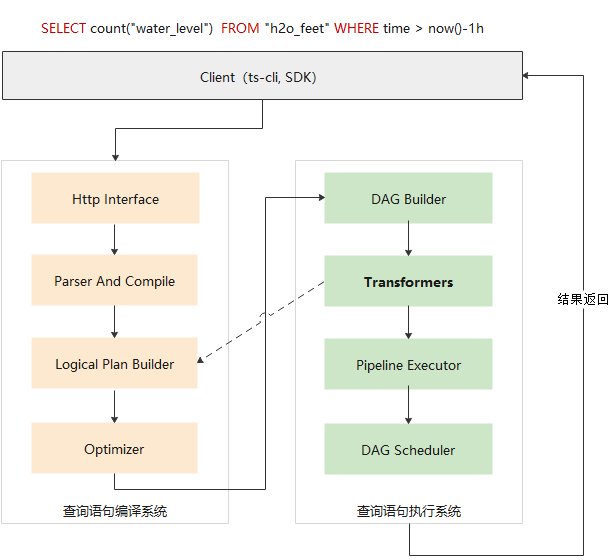
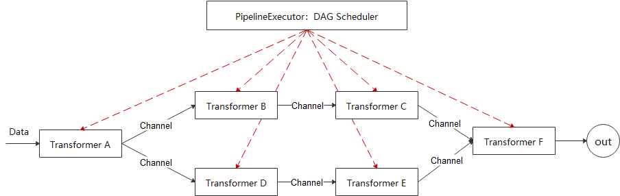
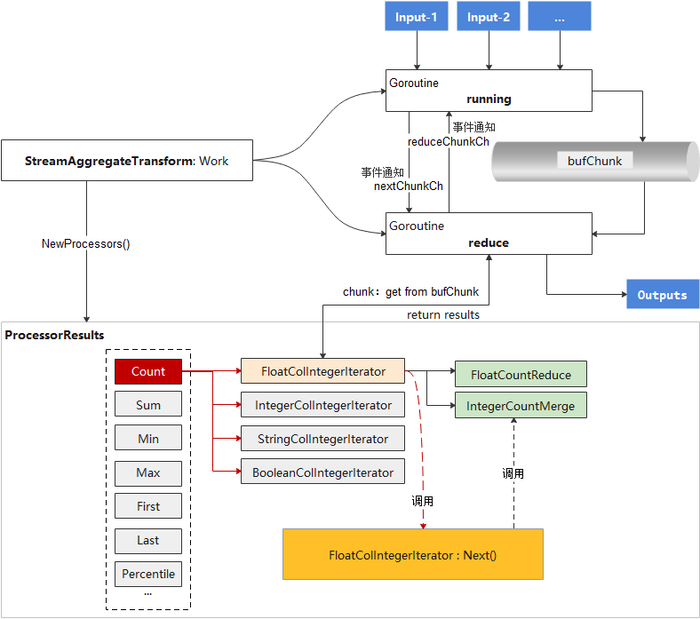
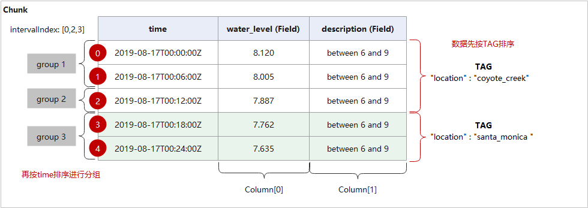
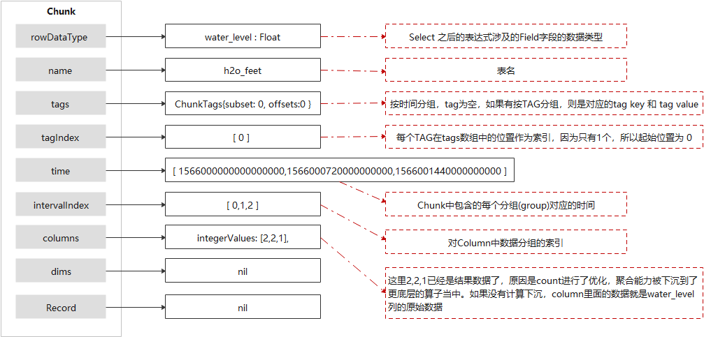

本文主要从源码层面解析openGemini的框架，并通过聚合函数的例子来分析其中一个算子（StreamAggregateTransform）的内部结构，对于新增算子开发是有帮助的。
## openGemini查询引擎框架



openGemini的查询引擎的框架如图所示，分为两部分：查询语句编译系统和查询语句执行系统。

### 编译系统

**Http Interface**，监听客户端请求。openGemini对外提供HTTP RESTFULL接口，客户端将查询语句

```sql
SELECT count(water_level) 
FROM h2o_feet
WHERE time > now()-1h
```

内部转化为HTTP消息发送到服务端(ts-sql)，调用"/query"接口

```shell
curl -i -XPOST "http://localhost:8086/query" -k --insecure --data-urlencode "q=SELECT count(water_level)  FROM h2o_feet WHERE time > now()-1h"
```

入口在open_src/influx/httpd/handler.go，h.serveQuery函数负责处理请求。核心代码如下：

```go
func NewHandler(...) {
	...
	h.AddRoutes([]Route{
   		...
   		Route {
        	"query", // Query serving route.
          	"GET", "/query", true, true, h.serveQuery,
   		},
   		Route{
          	"query", // Query serving route.
          	"POST", "/query", true, true, h.serveQuery,
   		},
   		...
	}
	...
}
```

**Parser And Compile**，对查询语句进行合法性检查、词法分析、语法分析，编译生成抽象语法树（AST），新增的函数如果没有注册，在这里会被compileFunction函数检测到，报错  ```ERR: undefined function xxx```，具体函数调用栈如下：

```
 0  0x0000000000ecbe20 in github.com/openGemini/openGemini/open_src/influx/query.(*compiledField).compileFunction
    at ./open_src/influx/query/compile.go:454
 1  0x0000000000ecb3cb in github.com/openGemini/openGemini/open_src/influx/query.(*compiledField).compileExpr
    at ./open_src/influx/query/compile.go:369
 2  0x0000000000eca26b in github.com/openGemini/openGemini/open_src/influx/query.(*compiledStatement).compileFields
    at ./open_src/influx/query/compile.go:272
 3  0x0000000000ec9dc7 in github.com/openGemini/openGemini/open_src/influx/query.(*compiledStatement).compile
    at ./open_src/influx/query/compile.go:212
 4  0x0000000000ec9465 in github.com/openGemini/openGemini/open_src/influx/query.Compile
    at ./open_src/influx/query/compile.go:129
 5  0x0000000000edaae5 in github.com/openGemini/openGemini/open_src/influx/query.Prepare
    at ./open_src/influx/query/select.go:125
 6  0x00000000011f28f0 in github.com/openGemini/openGemini/engine/executor.Select
    at ./engine/executor/select.go:49
```

**Logical Plan Builder**，根据时序数据库设计的逻辑算子和逻辑代数，从抽象语法树生成对应的逻辑计划。在这里相当于把一个个独立的逻辑算子（例如LogicalAggregate，LogicalLimit，LogicalJoin）组装在一起，共同完成查询语句所期望的功能。每一个逻辑算子对应一个物理算子（可以理解为真正计算的函数实体），所有聚合函数，比如count、min、max、mode，都归属于```LogicalAggregate```逻辑算子，```LogicalAggregate```对应的物理算子为```StreamAggregateTransform```, ```StreamAggregateTransform``` 的内部再分别实现count, min, max对应的功能。

查询计划与逻辑算子发生关联的地方在 engine/executor/logic_plan.go

```go
func (b *LogicalPlanBuilderImpl) Aggregate() LogicalPlanBuilder {
	last := b.stack.Pop()
	plan := NewLogicalAggregate(last, b.schema)   // 在这里
	b.stack.Push(plan)
	return b
}
```

调用栈如下：

```
 0  0x00000000011a8069 in github.com/openGemini/openGemini/engine/executor.NewLogicalAggregate
    at ./engine/executor/logic_plan.go:273
 1  0x00000000011b5d55 in github.com/openGemini/openGemini/engine/executor.(*LogicalPlanBuilderImpl).Aggregate
    at ./engine/executor/logic_plan.go:2235
 2  0x00000000011f57c5 in github.com/openGemini/openGemini/engine/executor.buildAggNode
    at ./engine/executor/select.go:343
 3  0x00000000011f5a35 in github.com/openGemini/openGemini/engine/executor.buildNodes
    at ./engine/executor/select.go:355
 4  0x00000000011f5fa8 in github.com/openGemini/openGemini/engine/executor.buildQueryPlan
    at ./engine/executor/select.go:424
 5  0x00000000011f6134 in github.com/openGemini/openGemini/engine/executor.buildExtendedPlan
    at ./engine/executor/select.go:431
 6  0x00000000011f32b5 in github.com/openGemini/openGemini/engine/executor.(*preparedStatement).BuildLogicalPlan
    at ./engine/executor/select.go:140
 7  0x00000000011f37cc in github.com/openGemini/openGemini/engine/executor.(*preparedStatement).Select
    at ./engine/executor/select.go:173
 8  0x00000000011f2a0f in github.com/openGemini/openGemini/engine/executor.Select
    at ./engine/executor/select.go:63
```

逻辑算子与物理算子关联的地方在 engine/executor/agg_transform.go

```go
147: var _ = RegistryTransformCreator(&LogicalAggregate{}, &StreamAggregateTransformCreator{})
```

这是一个注册器，系统启动时执行，将LogicalAggregate与StreamAggregateTransform进行绑定。其他逻辑算子与物理算子也使用同样的方式绑定，比如：

```
var _ = RegistryTransformCreator(&LogicalGroupBy{}, &GroupByTransformCreator{})
```

**Optimizer**，启发式优化器，根据设计的代数规则，对逻辑计划进行基于规则的优化和重组。新增聚合算子暂时不涉及。

## 执行系统

**DAG Builder**, 将优化后的逻辑计划生成物理计划。可以简单理解为把逻辑算子替换成与之对应的物理算子（transformer)，物理算子之间依赖关系用DAG(有向无环图)表示

**Transformers**, 所有物理执行算子的集合, 每个Transformer有输入和输出，这里的输入可以是最原始数据，也可以是其他Transformer的输出，这里的输出是Transformer的计算结果，可作为上一层Transformer的输入或者直接返回客户端的结果数据。

**Pipeline Executor**，采用流水线模式执行物理计划中的子任务，使用 DAG Scheduler 调度任务，保证任务执行的前后依赖关系。

**DAG Scheduler**，采用 work-stealing 算法调度物理计划（DAG），在任意时间保证最大任务并发度。

传统的执行计划都是串行执行，openGemini引入DAG的目的是让查询计划中的各个物理算子能并行的尽量并行起来，以此提升查询效率，该技术在ClickHouse和Flink中都有被用到。



如图所示，一个由DAG Builder产生的物理计划由A, B, C, D, E, F 6个Transformer组成，其中B和C依赖A，但互相不依赖，那么当A执行结束后，B和C就可以并行执行。DAG Scheduler的任务是效调度所有Transformer的前后执行关系以及并发处理，这是一个非常复杂的事情。openGemini巧妙利用Go语言的Goroutine和Channel特性完美解决了任务调度的问题，具体做法是遍历DAG，为每一条边创建一个单向Channel作为数据传输通道，边上的两个Transformer，例如Transformer A 和 Transformer B，Transformer A把计算结果写入Channel，Transformer B从Channel中取数据，如果Channel中没有数据，Transformer B则被阻塞。如此调度器则可以把所有的Transformer并发的运行起来，通过Channel的特性自动让位置靠后的Transformer处于阻塞状态，而一旦Channel中有数据会立刻被Golang调度执行。

物理计划主要由PipelineExecutor对象来执行，核心代码在 engine/executor/pipeline_executor.go, 核心方法是Executor()，代码如下：

```
func (exec *PipelineExecutor) Execute(ctx context.Context) error {
	...
	for _, p := range exec.processors {
		go func(processor Processor) {
			err := exec.work(processor)
			if err != nil {
				once.Do(func() {
					processorErr = err
					statistics.ExecutorStat.ExecFailed.Increase()
					exec.Crash()
				})
			}
			processor.FinishSpan()
			wg.Done()
		}(p)
	}
	...
}

func (exec *PipelineExecutor) work(processor Processor) error {
	...
	err := processor.Work(exec.context)
	if err != nil {
		...
	}
	return err
}
```

代码中Processor是一个接口，类似于一个基类，每个Transformer对象都实现了基类的work接口，这个work函数便是每个Transformer的入口。processor.Work() 相当于启动了Transformer。

Transformer之间的Channel是在PipelineExecutor初始化时完成的

```
func (exec *PipelineExecutor) init() {
	exec.processors = make(Processors, 0, len(exec.dag.mapVertexToInfo))
	for vertex, info := range exec.dag.mapVertexToInfo {
		for i, edge := range info.backwardEdges {
			_ = Connect(edge.from.transform.GetOutputs()[0], edge.to.transform.GetInputs()[i])
		}
		exec.processors = append(exec.processors, vertex.transform)
	}
}
```

## StreamAggregateTransform工作原理解析

这里我们以聚合算子为例剖析其内部实现，帮助理解如何开发一个物理算子或者在算子内部新增功能。

StreamAggregateTransform承载了所有聚合函数在openGemini内部的具体实现，先来看它的结构

```go
type StreamAggregateTransform struct {
	BaseProcessor
	
	init                 bool   //判断是否开始处理数据，在Transform退出之前检查该标志，以清空缓存
	sameInterval         bool   //
	prevSameInterval     bool
	prevChunkIntervalLen int
	bufChunkNum          int    //缓存最大容量
	proRes               *processorResults  //上一轮处理结果缓存
	iteratorParam        *IteratorParams   //迭代器参数
	chunkPool            *CircularChunkPool  //存放结果数据的池子
	newChunk             Chunk  //承载从chunkpool中拿到的chunk. trans.newChunk = trans.chunkPool.GetChunk()
	nextChunkCh          chan struct{} //用于事件通知，通过写入通知数据接收协程继续接收数据到缓存中
	reduceChunkCh        chan struct{} //用于事件通知，通过写入通知数据处理协程从缓存中拿数据处理
	bufChunk             []Chunk  //数据缓存，从Inputs中读取待处理数据，缓存在bufChunk中。
	Inputs               ChunkPorts //Transformer的输入管道
	Outputs              ChunkPorts //Transformer的输出管道
	opt                  *query.ProcessorOptions
	aggLogger            *logger.Logger
	postProcess          func(Chunk)

	span        *tracing.Span //用于信息统计使用，比如Explain命令
	computeSpan *tracing.Span //用于信息统计使用，比如Explain命令

	errs errno.Errs
}
```

### StreamAggregateTransform内部工作原理



如图所示，StreamAggregateTransform在初始化是将创建一个ProcessorResults的对象，在ProcessorResults中，会根据不同聚合函数分别注册一系列的迭代器(比如FloatColIntegerIterator，StringColIntegerIterator)和数据处理方法(比如FloatCountReduce和IntegerCountMerge)，每个迭代器(Iterator)有一个Next()方法，这个方法才是聚合函数功能的具体实现，其中会使用到事先注册的数据处理方法(比如FloatCountReduce和IntegerCountMerge)

StreamAggregateTransform的入口是Work()函数，核心功能并发启动running和reduce两个模块，running负责取数据，reduce负责调用之前已经注册好的迭代器进行聚合数据处理，并返回。

**StreamAggregateTransform工作原理的源码解析**

StreamAggregateTransform初始化在 engine/executor/agg_transform.go，核心代码如下：

```go
func NewStreamAggregateTransform(
	inRowDataType, outRowDataType []hybridqp.RowDataType, exprOpt []hybridqp.ExprOptions, opt *query.ProcessorOptions, isSubQuery bool,
) (*StreamAggregateTransform, error) {
	...
	trans := &StreamAggregateTransform{
		opt:           opt,
		bufChunkNum:   AggBufChunkNum,
		Inputs:        make(ChunkPorts, 0, len(inRowDataType)),
		Outputs:       make(ChunkPorts, 0, len(outRowDataType)),
		bufChunk:      make([]Chunk, 0, AggBufChunkNum), //这里规定了bufChunk的容量
		nextChunkCh:   make(chan struct{}),
		reduceChunkCh: make(chan struct{}),
		iteratorParam: &IteratorParams{},
		aggLogger:     logger.NewLogger(errno.ModuleQueryEngine),
		chunkPool:     NewCircularChunkPool(CircularChunkNum, NewChunkBuilder(outRowDataType[0])),
	}
	...
    //这里初始化的trans.proRes对象，NewProcessors()完成了各类迭代器的注册，新增聚合函数需要在这里实现迭代器方法和注册
	trans.proRes, err = NewProcessors(inRowDataType[0], outRowDataType[0], exprOpt, opt, isSubQuery)
	...
}
```

Work() 的核心代码如下：

```go
func (trans *StreamAggregateTransform) Work(ctx context.Context) error {
	...
	for i := range trans.Inputs {
		go trans.runnable(i, ctx, errs)  //每个Input对应一个runing协程，实则只有一个Input，预留了多个而已
	}

	go trans.reduce(ctx, errs)  //开一个reduce协程

	return errs.Err()
}
```

running和reduce模块的核心代码如下：

```go

func (trans *StreamAggregateTransform) runnable(in int, ctx context.Context, errs *errno.Errs) {
	...
	trans.running(ctx, in)
}
//running协程
func (trans *StreamAggregateTransform) running(ctx context.Context, in int) {
	for {
		select {
		case c, ok := <-trans.Inputs[in].State:
			...
			trans.init = true
			trans.appendChunk(c)  //放入缓存
			if len(trans.bufChunk) == trans.bufChunkNum {  //缓存满了就通知reduce处理数据
				trans.reduceChunkCh <- struct{}{}
			}
			<-trans.nextChunkCh //放一个chunk到缓存，等待reduce消费的信号
			...
		case <-ctx.Done():
			return
		}
	}
}
//reduce协程
func (trans *StreamAggregateTransform) reduce(_ context.Context, errs *errno.Errs,) {
	...
	// return true if transform is canceled
	reduceStart := func() {
		<-trans.reduceChunkCh
	}

	// return true if transform is canceled
	nextStart := func() {
		trans.nextChunkCh <- struct{}{}
	}

	trans.newChunk = trans.chunkPool.GetChunk()  //从池子中分配一片空间
	for {
		nextStart() //通知running继续往缓存放数据
		reduceStart() //消费管道里的事件通知，如果running还没给消息，阻塞在这里等待

        c := trans.nextChunk() //从缓存中取一个chunk（数据处理单位），1个chunk包含多行(rows)数据
		...
		tracing.SpanElapsed(trans.computeSpan, func() {
			trans.compute(c)  //在compute方法中处理chunk数据，最终会调到具体的一个迭代器来完成
			...
		})
	}
}
```

running模块主要完成从Input读取数据，放入缓存，通知Reduce处理。Reduce负责调用具体的迭代器来处理数据。Running和Reduce之间通过两个单向管道（nextChunkCh和reduceChunkCh）进行事件通知。

**聚合函数的迭代器和处理方法注册的源码解析**

NewProcessors()的实现在engine/executor/call_processor.go，主要完成了各聚合函数的迭代器和数据处理方法的注册，<font color=red>**新增聚合函数需要在这里实现迭代器方法和注册**</font>, 核心代码如下：

```go
func NewProcessors(inRowDataType, outRowDataType hybridqp.RowDataType, exprOpt []hybridqp.ExprOptions, opt *query.ProcessorOptions, isSubQuery bool) (*processorResults, error) {
	...
	for i := range exprOpt {
		...
		switch expr := exprOpt[i].Expr.(type) {
		case *influxql.Call:
			...
			name := exprOpt[i].Expr.(*influxql.Call).Name
			switch name {
			case "count":
                //聚合函数count走这里，在NewCountRoutineImpl方法中注册
				routine, err = NewCountRoutineImpl(inRowDataType, outRowDataType, exprOpt[i], isSingleCall)
				coProcessor.AppendRoutine(routine)
			case "sum":
				routine, err = NewSumRoutineImpl(inRowDataType, outRowDataType, exprOpt[i], isSingleCall)
				coProcessor.AppendRoutine(routine)
			case "first":
				...
			case "last":
				...
			case "min":
				...
			case "max":
				...
			case "percentile":
				...
			case "percentile_approx", "ogsketch_percentile", "ogsketch_merge", "ogsketch_insert":
				...
			case "median":
				...
			case "mode":
				...
			case "top":
				..
			case "bottom":
				...
			case "distinct":
				...
			case "difference", "non_negative_difference":
				...
			case "derivative", "non_negative_derivative":
				...
			case "elapsed":
				...
			case "moving_average":
				...
			case "cumulative_sum":
				...
			case "integral":
				...
			case "rate", "irate":
				...
			case "absent":
				...
			case "stddev":
				...
			case "sample":
				...
			default:
				return nil, errors.New("unsupported aggregation operator of call processor")
			}
		...
	}
	...
}
```

NewCountRoutineImpl方法的实现在engine/executor/call_processor.go，核心代码如下：

```go
func NewCountRoutineImpl(inRowDataType, outRowDataType hybridqp.RowDataType, opt hybridqp.ExprOptions, isSingleCall bool) (Routine, error) {
	...
	dataType := inRowDataType.Field(inOrdinal).Expr.(*influxql.VarRef).Type
	switch dataType {
	case influxql.Integer:  //聚合的字段是整型
		return NewRoutineImpl(
			NewIntegerColIntegerIterator(IntegerCountReduce, IntegerCountMerge, isSingleCall, inOrdinal, outOrdinal, nil, nil), inOrdinal, outOrdinal), nil
	case influxql.Float:  //聚合的字段是浮点型
		return NewRoutineImpl(
			NewFloatColIntegerIterator(FloatCountReduce, IntegerCountMerge, isSingleCall, inOrdinal, outOrdinal, nil, nil), inOrdinal, outOrdinal), nil
	case influxql.String: //聚合的字段是字符串
		return NewRoutineImpl(
			NewStringColIntegerIterator(StringCountReduce, IntegerCountMerge, isSingleCall, inOrdinal, outOrdinal, nil, nil), inOrdinal, outOrdinal), nil
	case influxql.Boolean: //聚合的字段是布尔型
		return NewRoutineImpl(
			NewBooleanColIntegerIterator(BooleanCountReduce, IntegerCountMerge, isSingleCall, inOrdinal, outOrdinal, nil, nil), inOrdinal, outOrdinal), nil
	}
}
```

因为不同数据类型，数据处理方式不同，因此要适配不同的迭代器。比如有如下数据：

```toml
h2o_feet,location=coyote_creek water_level=8.120,description="between 6 and 9 feet" 1566000000000000000
h2o_feet,location=coyote_creek water_level=8.005,description="between 6 and 9 feet" 1566000360000000000
h2o_feet,location=coyote_creek water_level=7.887,description="between 6 and 9 feet" 1566000720000000000
h2o_feet,location=coyote_creek water_level=7.762,description="between 6 and 9 feet" 1566001080000000000
h2o_feet,location=coyote_creek water_level=7.635,description="between 6 and 9 feet" 1566001440000000000
```

查询语句

```
1. SELECT count(water_level) FROM h2o_feet
2. SELECT count(description) FROM h2o_feet
```

water_level是浮点型，就用FloatColIntegerIterator，如果是description，则用StringColIntegerIterator

每个迭代器必须包含一个Reduce和Merge方法。具体什么作用？以FloatCountReduce和IntegerCountMerge举例

```go
/*
c,包含待处理数据的chunk
ordinal, 指定chunk中的数据列
star，表示chunk中数据分组的起始位置。比如查询是按时间分组再统计
end，表示chunk中数据分组的结束位置。比如查询是按时间分组再统计。如果查询没有分组，那么chunk中所有数据都属于一个分组
*/
func FloatCountReduce(c Chunk, ordinal, start, end int) (int, int64, bool) {
	var count int64
    //ordinal指定要计算chunk中第几列数据。如果指定列的数据都没有空值，直接用end-start快速计算count值
	if c.Column(ordinal).NilCount() == 0 {
		// fast path
		count = int64(end - start)
		return start, count, count == 0
	}

	//如果数据列中有空值，就要换一种计算方法
	vs, ve := c.Column(ordinal).GetRangeValueIndexV2(start, end)
	count = int64(ve - vs)
	return start, count, count == 0
}
//merge方法是做一个累计求和，把上一个chunk中统计的count值 + 当前求得的count值。因为chunk中数据量是一定的，要统计的数据可能分成了很多个chunk
func IntegerCountMerge(prevPoint, currPoint *IntegerPoint) {
	...
	prevPoint.value += currPoint.value
}
```

**Chunk数据结构解析**

Chunk可以被看着是一张表，是Transformer之间数据传输和数据处理的最小单位，是向量化的重要载体。



Chunk结构体定义如下：

```go
type ChunkImpl struct {
	rowDataType   hybridqp.RowDataType
	name          string
	tags          []ChunkTags
	tagIndex      []int
	time          []int64
	intervalIndex []int
	columns       []Column
	dims          []Column
	*record.Record
}
```

举个例子，用同样的数据：

```toml
h2o_feet,location=coyote_creek water_level=8.120,description="between 6 and 9 feet" 1566000000000000000
h2o_feet,location=coyote_creek water_level=8.005,description="between 6 and 9 feet" 1566000360000000000
h2o_feet,location=coyote_creek water_level=7.887,description="between 6 and 9 feet" 1566000720000000000
h2o_feet,location=coyote_creek water_level=7.762,description="between 6 and 9 feet" 1566001080000000000
h2o_feet,location=coyote_creek water_level=7.635,description="between 6 and 9 feet" 1566001440000000000
```

查询语句

```sql
> SHOW TAG KEYS
name: h2o_feet
tagKey
------
location

> SELECT count(water_level) FROM h2o_feet WHERE time >= 1566000000000000000 AND time <= 1566001440000000000 GROUP By time(12m)
name: h2o_feet
time                count
----                -----
1566000000000000000 2
1566000720000000000 2
1566001440000000000 1
```

摘取其一个StreamAggregateTransform接收到的Chunk，查看内部具体组成



**迭代器Next方法解析**

以FloatColIntegerIterator为例, 在engine/executor/agg_iterator.gen.go, Next()方法的核心代码如下：

```go
func (r *FloatColIntegerIterator) Next(ie *IteratorEndpoint, p *IteratorParams) {
    //inChunk存储待处理数据，即StreamAggregateTransform接收到的Chunk最终在这里被处理，outChunk存储处理后的结果数据
	inChunk, outChunk := ie.InputPoint.Chunk, ie.OutputPoint.Chunk
    //inOrdinal是一个位置信息，初始为0，遍历chunk中的所有列。当前例子中chunk只有1列
    //这里判断列是否为空，如果为空，需要给这些列数据用nil填充
	if inChunk.Column(r.inOrdinal).IsEmpty() && r.prevPoint.isNil {
		var addIntervalLen int
		if p.sameInterval {
			addIntervalLen = inChunk.IntervalLen() - 1
		} else {
			addIntervalLen = inChunk.IntervalLen()
		}
		if addIntervalLen > 0 {
			outChunk.Column(r.outOrdinal).AppendManyNil(addIntervalLen)
		}
		return
	}

	var end int
	firstIndex, lastIndex := 0, len(inChunk.IntervalIndex())-1
    //[start,end]代表一个分组数据，分组数据是chunk数据的一个子集
	for i, start := range inChunk.IntervalIndex() {
		if i < lastIndex {
			end = inChunk.IntervalIndex()[i+1]
		} else {
			end = inChunk.NumberOfRows()
		}
        //fn为FloatCountReduce方法
		index, value, isNil := r.fn(inChunk, r.inOrdinal, start, end)
		if isNil && ((i > firstIndex && i < lastIndex) ||
			(firstIndex == lastIndex && r.prevPoint.isNil && !p.sameInterval) ||
			(firstIndex != lastIndex && i == firstIndex && r.prevPoint.isNil) ||
			(firstIndex != lastIndex && i == lastIndex && !p.sameInterval)) {
			outChunk.Column(r.outOrdinal).AppendNil()
			continue
		}
        //这里主要是处理三种情况
        //1. 分组数据跨两个chunk，当前chunk的前面部分数据与上一个chunk的最后部分数据属于一个分组，
        // 当前计算结果需要加前一个数据的结果，调用fv: FloatCountmerge方法
        //2. 分组数据跨两个chunk，当前chunk的后面部分数据与下一个chunk的最前面部分数据属于一个分组，
        // 当前计算结果需要缓存起来
        //3. 分组数据不跨chunk，计算结果为最终结果
		if i == firstIndex && !r.prevPoint.isNil {
			r.processFirstWindow(inChunk, outChunk, isNil, p.sameInterval,
				firstIndex == lastIndex, index, value)
		} else if i == lastIndex && p.sameInterval {
			r.processLastWindow(inChunk, index, isNil, value)
		} else if !isNil {
			r.processMiddleWindow(inChunk, outChunk, index, value)
		}
	}
}
```

