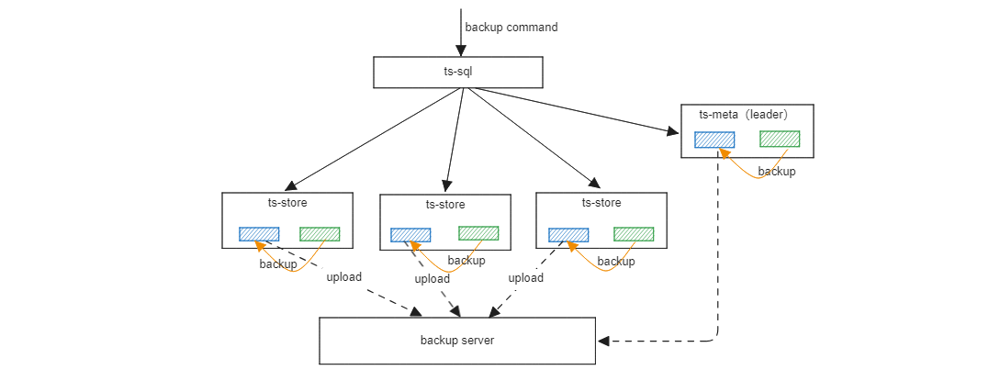
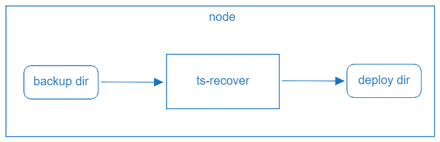

openGemini v1.3.0开始支持数据备份和恢复。

全部功能包括：

- 支持单机、集群单副本和集群多副本等多种部署形态的数据备份
- 支持数据全量备份和增量备份
- 支持数据增量和全量恢复



**特别说明**

- 当前每次增量备份都是基于上一次全量备份生成
- 后续支持基于全量备份和增量备份重建新的全量备份
- 当前仅提供备份接口处理数据备份请求，暂未提供备份的CLI命令
- Index索引文件落盘需要一定时间，执行备份时可能无法备份到新的索引信息 (新的database和新的measurement)
- 每个节点的数据暂时仅支持备份在本机（本地），如果有统一的备份服务器，需要手动将备份目录上传到服务器进行保存

## 数据备份

### 接口

```shell
POST debug/ctrl?mod=backup
```

参数说明

+ `isInc=<bool>`: false表示全量备份，true表示增量备份
+ `backupPath=<string>`: 备份路径
+ `isNode<bool>`: 设置是否只备份当前节点数据
+ `isRemote=<bool>`: 预留参数，暂不支持备份到远端

### 示例

```shell
curl -i -XPOST 'http://127.0.0.1:8086/debug/ctrl?mod=backup&backupPath=/tmp/openGemini/backup&isInc=false'
```

### ts-meta备份策略

+ meta节点每次都执行全量备份
+ 只备份leader节点

## 数据恢复

openGemini提供独立的数据恢复工具用于将备份数据恢复到之前的状态。在恢复时，在每个节点上都需要单独执行ts-recover命令恢复数据。



**恢复前准备工作**

- 如果是恢复数据到原来集群，需停掉相关进程(ts-meta,ts-store)

**恢复工具 ts-recover使用**

```
> ts-recover [flags]
```

命令行参数说明：

- **config**，openGemini配置文件路径
- **recoverMode**，数据恢复策略，1表示全量+增量的数据恢复，2表示全量数据恢复
- **fullBackupDataPath**，全量备份目录地址
- **incBackupDataPath**，增量备份目录地址

**示例**

```shell
> ts-recover -config=openGemini.conf -recoverMode=2 -fullBackupDataPath=/tmp/openGemini/backup
```

全量和增量的数据恢复

```shell
> ts-recover -config=openGemini.conf -recoverMode=1 -fullBackupDataPath=/tmp/openGemini/backup -incBackupDataPath=/tmp/openGemini/backup-inc
```
