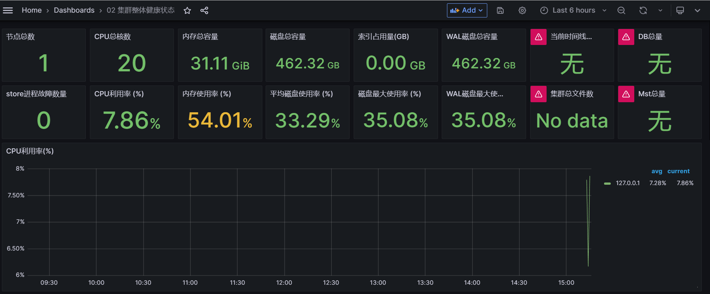

openGemini提供了260+监控指标，来监控集群的各种状态，下面将介绍如何开启监控项，并结合Grafana可视化监控数据。

相关脚本使用
- scripts/install_cluster.sh，用于在本地拉起一个集群（localhost上监听)
- scripts/install_monitor.sh, 用于在本地拉起一个ts-monitor

参考
- [Grafana看板常用查询语句](../reference/kernel_metrics.md#grafana看板查询语句示例)
- [内核指标项说明](../reference/kernel_metrics.md)

## 整体技术方案
监控系统的整体部署方案如下图所示：


该方案包含监控数据生产、采集、存储、分析告警和展示等所有功能，主要由四部分组成：

- openGemini集群

随着业务运行，openGemini持续输出内核运行状态的各项指标数据。openGemini同时支持两种方式输出指标数据，第一种将指标数据输出到日志中；第二种则为HTTP方式，采用openGemini的数据格式，接收端需使用InfluxDB或openGemini这两种数据库均可。

- 指标采集

如上所述，采用HTTP方式输出指标数据，则无需额外的数据采集工具，但会缺乏一些监控指标，如磁盘利用率、创建的表总数、时间线数量、创建的数据库总数等。如果将数据输出到日志中时，则需要使用ts-monitor进行指标数据采集，除内核运行状态指标数据之外，ts-monitor工具还将采集如磁盘利用率、创建的表总数、时间线数量、创建的数据库总数等指标。ts-monitor同样将指标数据转换为openGemini的数据格式进行上报。

- 数据存储

考虑到监控系统频繁的查询操作，长期来看，为避免对业务集群的运行资源造成竞争，从而影响业务效率，因此建议将指标数据转存到专门的存储节点。openGemini提供了单机和集群两种版本，通常对于集群自身的指标数据保存，单机性能已然足够。与此同时，openGemini同样支持Grafana，且单机性能更优于InfluxDB，建议直接使用openGemini单机版部署，用于存储监控指标数据。

- 数据可视化与告警

Grafana是业界非常普遍使用的一款开源数据可视化工具，可以做数据监控和数据统计，带有告警功能。选择它用在监控系统中最合适不过。

综上所述，该方案的优点是部署简单、易获取（所有组件开源）。<font color=green>接下来将重点介绍不同数据采集方式对应的部署和配置</font>

## 方式一：使用ts-monitor从业务日志中采集监控指标数据


如图所示，监控数据以log files方式输出，每个节点(node)上部署一个ts-monitor，用于采集该节点上所有openGemini组件的监控指标数据，然后将数据写入到远端监控节点上的openGemini中，最后使用Grafana作为监控/告警面板来展示监控数据。

当前部署方式共涉及两个配置文件：
- openGemini.conf 或 openGemini.single.conf 
- monitor.conf

openGemini.conf主要配置[monitor]，必要配置项如下表所示

|配置项|说明|
|:----|:----|
|pushers|数据输出方式，有http和file两种，当前这种方式下，选择file|
|store-enabled|设置为true，打开监控。关闭则设置为false|
|store-interval|指标采集周期|
|store-path|当前方式下，指标数据会写入到文件，这里指指标数据文件的保存路径|

### 配置示例
当前配置会将openGemini各组件的监控日志每10秒写一次到/tmp/openGemini/metric/metric.data中。
```editorconfig
[monitor]
  pushers = "file"
  store-enabled = true
  store-database = "monitor"
  store-interval = "10s"
  store-path = "/tmp/openGemini/metric/metric.data"
  compress = false
  # http-endpoint = ""
  # username = ""
  # password = ""
```
:::tip
如果是运行openGemini单机版，需要将上述配置添加到openGemini.single.conf中。
:::
接下来介绍ts-monitor组件的配置文件monitor.conf如何配置。
```editorconfig
[monitor]
  # [必填]当前节点的ip地址或者可以唯一标识该节点的信息，比如hostname
  host = "{{addr}}"
  # [必填]ts-monitor采集指标数据的目录，应与openGemini.conf -> [monitor] -> store-path配置保持一致
  metric-path = "/tmp/openGemini/metric/"
  # [必填]ts-monitor会采集集群的错误日志。应与openGemini.conf -> [logging] -> path配置保持一致
  error-log-path = "/tmp/openGemini/logs"
  # 如果当前节点没有部署ts-store组件，可注释，不配置
  # 该配置项与计算磁盘空间利用率有关，应与openGemini.conf -> [data] -> store-data-dir 配置保持一致
  disk-path = "/tmp/openGemini/data"
  # 如果当前节点没有部署ts-store组件，可注释，不填写
  # 出于安全考虑，建议把openGemini的WAL单独存储一个磁盘分区，这样数据盘和WAL互相不受影响。
  # 该配置项与计算WAL的磁盘空间利用率有关，应与openGemini.conf -> [data] -> store-wal-dir 配置保持一致
  aux-disk-path = "/tmp/openGemini/data/wal"
  # [必填]当前节点上已部署openGemini的组件，用逗号分隔。该配置项与监控进程状态有关
  process = "ts-store,ts-sql,ts-meta"
  # [可保持默认配置]保存当前已经采集过的metric.data文件信息和文件内的位置，防止ts-monitor重启后重复采集数据
  history-file = "history.txt"
  # Is the metric compressed.
  compress = false
  
[query]
  # 这部分配置，如果多个节点上都部署有ts-monitor,则在其中一个ts-monitor开启如下配置即可
  # 设置为true，表示ts-monitor可以定期向业务集群发送```SHOW DATABASES, SHOW MEASUREMENTS```等查询命令，统计创建的DB和表的数量
  query-enable = false
  # 业务集群中ts-sql的监听地址和端口
  http-endpoint = "{{query_addr}}:8086"
  # ts-monitor向openGemini业务集群发送查询命令的时间间隔
  query-interval = "5m"
  # 如果业务集群开启了https和用户密码鉴权，ts-monitor将采用https方式连接业务集群，连接过程需要携带用户名密码登陆
  # 这里有暴露业务集群用户名/密码的风险，存在安全风险
  # username = ""
  # password = ""
  # https-enable = false
  
[report]
  # ts-monitor采集的指标数据将会上报到单独的节点进行存储，这里将配置目标节点上的数据库(openGemini)地址、db、用户密码、保留策略等信息
  # 目标节点上openGemini的监听地址和端口
  address = "{{report_addr}}:8086"
  # 数据写入的db名称
  database = "monitor"
  # 如果目标节点上的openGemini开启了https和用户密码鉴权，ts-monitor将采用https方式连接，连接过程需要携带用户名密码登陆
  # username = ""
  # password = ""
  # https-enable = false
  # 数据保留策略名称和数据保留时长，可默认. 表示监控数据将在168小时后被自动删除
  rp = "autogen"
  rp-duration = "168h"
```
## 方式二：监控指标数据直接push到监控节点


如图所示，监控数据直接push到监控节点的方式不需要在业务集群中部署ts-monitor，但这种情况下要求业务集群能够直连监控节点并且会缺乏一些监控指标，如集群节点的CPU利用率、磁盘利用率、创建的表总数、时间线数量、创建的数据库总数等。

该方式下，只需要配置openGemini.conf就好，必要配置项如下表所示。
|配置项|说明|
|:----|:----|
|pushers|数据输出方式，有http和file两种，当前这种方式下，选择http|
|store-enabled|设置为true，打开监控。关闭则设置为false|
|store-database|监控数据需要写入到监控节点上单机openGemini的数据库名，需提前创建相关数据库|
|store-interval|指标采集周期|
|http-endpoint|监控节点上部署的单机openGemini的监听地址和端口|
### 配置示例
当前配置会将监控数据每隔10秒写一次到监控节点“192.70.3.43:8086”的“monitor”数据库中
```editorconfig
[monitor]
  pushers = "http"
  store-enabled = true
  store-database = "monitor"
  store-interval = "10s"
  # store-path = "/tmp/openGemini/metric/ts-sql/metric.data"
  # compress = false
  http-endpoint = "192.70.3.43:8086"
  # 如果192.70.3.43节点上的openGemini开启了https和用户密码鉴权，ts-monitor将采用https方式连接，连接过程需要携带用户名密码登陆
  # 这里可能会暴露用户名和密码，存在一定安全风险
  # username = ""
  # password = ""
  # http-endpoint = ""
```
## Grafana配置
Grafana安装过程略，启动Grafana后，通过浏览器访问http://192.70.3.43:3000 ，添加数据源选择InfluxDB（openGemini兼容InfluxDB）


进入创建数据源界面，其中name填写为新创建的数据源的名称，URL为监控节点上openGemini的地址和端口，database为监控数据所在数据库名称


数据源创建完成后可以在Grafana中新建看板来完成监控用户感兴趣的内容，如下图所示，建立一个Panel，选择Data source为刚刚建立的monitor，然后通过图形化查询选择界面来建立看板的查询语句


除了使用图形化界面查询，也可以点击“Query Inspector”来使用直接输入查询语句的方式建立Panel。如下图所示，先选择数据源为刚才建立的“monitor”，然后可以通过如下查询语句来查询数据库中cpu的平均使用率

```sql
SELECT mean("CpuUsage") 
FROM  $database.."system" 
WHERE $timeFilter 
GROUP BY time($__interval), "host" fill(null)
```


除了“CpuUsage”监控数据还包括其他的一些指标用来建立监控面板，例如跟集群整体健康状态相关的一些查询如下表所示

```sql
# 查询CPU利用率
SELECT mean("CpuUsage") 
FROM $database.."system" 
WHERE $timeFilter 
GROUP BY time($__interval), "host" fill(null)
# 查询内存使用量
SELECT max("MemUsage") 
FROM $database.."system" 
WHERE $timeFilter 
GROUP BY time($__interval), "host" fill(null)
# 查询磁盘空间利用率
SELECT max("DiskUsage") 
FROM $database.."system" 
WHERE $timeFilter 
GROUP BY time($__interval), "host" fill(null)
# 查看进程状态
SELECT last("StoreStatus") as "store", 
       last("SqlStatus") as "sql",
       last("MetaStatus") as "meta" 
FROM $database.."system" 
WHERE $timeFilter 
GROUP BY "host"
# ts-meta 主备检查
SELECT last("Status") as "status" 
FROM $database.."metaRaft" 
WHERE $timeFilter 
GROUP BY "hostname"
# store 进程健康检查
SELECT last("Status") as "status" 
FROM $database.."meta" 
WHERE $timeFilter 
GROUP BY "Host"
```

## 效果展示


