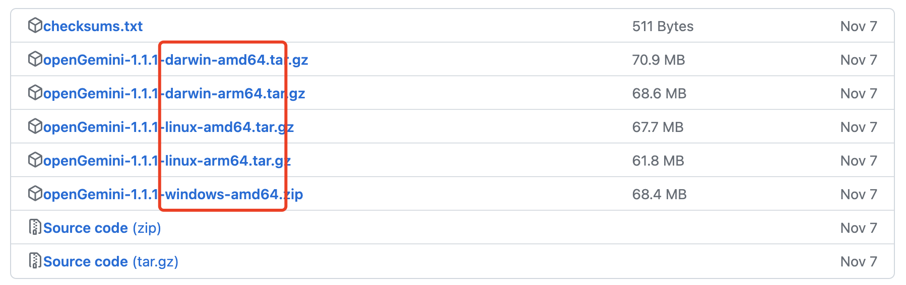

本指南介绍如何快速上手体验 openGemini时序数据库。

openGemini开源相关地址：

主仓: https://github.com/openGemini

备份仓: https://gitee.com/mirrors/opengemini

国内二进制下载: https://gitee.com/opengemini/Releases/releases ( 自v1.1.1版本开始支持) 

## 安装

::: tabs

@tab CPU架构

| 架构         | 是否支持 | 说明                                                         |
| ------------ | -------- | ------------------------------------------------------------ |
| X86-64       | &#10004; | -                                                            |
| X86-32       | &#10006; | 32bit暂不支持，但由于openGemini内核为Go语言开发，<br>可以尝试在32bit系统上进行编译 |
| ARM-64       | &#10004; | -                                                            |
| ARM-32       | &#10006; | 32bit暂不支持，但由于openGemini内核为Go语言开发，<br>可以尝试在32bit系统上进行编译 |
| 其他，如龙芯 | &#10006; | 暂不支持                                                     |

@tab 操作系统

由于绝大多数应用是在windows和Mac上开发，因此为了方便应用进行开发调试，openGemini自v1.1.0版本开始支持MacOS和 Windows操作系统。

| OS      | 是否支持 | 说明                                                         |
| ------- | -------- | ------------------------------------------------------------ |
| Linux   | &#10004; | 支持主流Linux操作系统，<br>如openEuler, Ubuntu, CentOS, RedHat等<br>验证版本：<br>- CentOS 7.3 及以上版本<br>- openEuler 22.03 LTS及以上版本<br>- Red Hat 8.4及以上 & 7.3以上的7.x版本 |
| Darwin  | &#10004; | 支持MacOS，**建议用于项目开发调试**                          |
| Windows | &#10004; | 支持Windows，**建议用于项目开发调试**，验证版本 win11        |

@tab 一键安装

使用Gemix工具一键安装部署，目前只能用于集群，支持在一台或多台虚拟机或者物理机上部署openGemini集群，具体使用方式参考[Gemix使用指南]()

使用openGemini-operator一键容器化部署，目前只能用于集群，支持K8s容器化部署，具体使用方式参考[openGemini-operator使用指南]()

@tab 二进制安装

### **二进制下载**

1. 下载合适的二进制版本

   下载地址：https://github.com/openGemini/openGemini/releases

   国内下载地址： https://gitee.com/opengemini/Releases/releases

   

   wget命令下载二进制安装包

   ```bash
   > wget https://github.com/openGemini/openGemini/releases/download/v<version>/openGemini-<version>-linux-amd64.tar.gz
   ```

   以下载openGemini-1.1.1-linux-amd64.tar.gz为例：

   ```
   > wget https://github.com/openGemini/openGemini/releases/download/v1.1.1/openGemini-1.1.1-linux-amd64.tar.gz
   ```

2. 进入到安装包所在目录，使用 `tar` 解压文件到openGemini目录。

   ```shell
   > mkdir openGemini
   > tar -zxvf openGemini-1.1.1-linux-amd64.tar.gz -C openGemini
   ```


### **运行openGemini**

1. 单机运行

   在本机启动openGemini，默认在 127.0.0.1:8086 监听，鉴权和https默认不开启，数据和日志的默认存放路径 /tmp/openGemini

   ```
   > cd openGemini
   > ./usr/bin/ts-server
   ```

   如果需要修改监听地址，修改配置文件 openGemini.singlenode.conf，替换所有127.0.0.1即可

   ```tex
   [common]
     meta-join = ["127.0.0.1:8092"]
   	...
   
   [meta]
     bind-address = "127.0.0.1:8088"
     http-bind-address = "127.0.0.1:8091"
     rpc-bind-address = "127.0.0.1:8092"
     ...
   
   [http]
     bind-address = "127.0.0.1:8086"
     flight-address = "127.0.0.1:8087"
     ...
   
   [data]
     store-ingest-addr = "127.0.0.1:8400"
     store-select-addr = "127.0.0.1:8401"
     ...
   ```

   > 配置文件路径 openGemini/etc/，openGemini为二进版本解压后的目录

   ```shell
   > ./usr/bin/ts-server --config ./etc/openGemini.singlenode.conf
   
   # 后台运行
   > nohup ./usr/bin/ts-server --config ./etc/openGemini.singlenode.conf > server_extra.log 2>&1 &
   ```

   > **openGemini.singlenode.conf配置文件相对openGemini.conf更为精简，缺失的一些配置项（比如鉴权、https等）可以在openGemini.conf中找到，拷贝到相应位置即可**

2. 集群运行

   参考[标准集群部署]()

@tab 源码编译

### **编译环境信息**

- [GO](https://go.dev/dl/) version v1.18+
- [Python](https://www.python.org/downloads/) version v3.7+
- [Git](https://git-scm.com/downloads)
- [Gcc(windows上编译需安装)](https://www.cnblogs.com/kala00k/p/16364116.html)

**GO环境变量设置**

以linux为例，打开 `~/.profile`配置文件，在文件末尾添加如下配置：

```shell
# 设置GOPATH (按实际填写)
export GOPATH=/root/go/
# 设置国内代理
export GOPROXY=https://goproxy.cn,direct
# 配置GO安装目录 (按实际填写)
export GOROOT=/usr/local/go
export PATH=$PATH:$GOROOT/bin:$GOPATH/bin/
```

windows环境下，在“我的电脑” -> “高级系统设置” -> “环境变量”进行配置。

### **下载源码**

```shell
> git clone https://github.com/openGemini/openGemini.git

# 国内镜像仓库下载
> git clone https://gitee.com/mirrors/opengemini.git
```

**进入主目录**

```shell
> cd openGemini
```

### **编译**

```shell
> python3 build.py --clean
```

编译成功后，二进制保存在`build`目录中。

运行单机版 (默认监听地址 127.0.0.1，默认数据目录 /tmp/openGemini)

```shell
> bash ./scripts/install.sh
```

运行集群版 (单机启动的伪集群，默认监听地址 127.0.0.1，默认数据目录 /tmp/openGemini))

```
> bash ./scripts/install_cluster.sh
```

@tab 规格选型

规格选型这方面，社区很难给出准确的意见，规格往往和业务量有关，希望使用者可以在社区分享，供其他人进行规格选型参考。

openGemini在华为云使用的规格多为 32U128G 或者 64U256G，支持时间线规模已达亿级。建议根据业务情况而定，我们在这里给大家一个参考[硬件规格选型](../reference/specification.md)。

具体参考信息：

1. 对比InfluxDB，openGemini对资源的占用有大幅优化，内存控制较好，相同规格下 openGemini ts-server能支持更大业务量。

2. openGemini启动后业务空转时，使用内存大约在100-200MB左右。边缘或者嵌入式设备可以参考。

3. 内存使用较大的几种查询场景：

   - 分组聚合时，分组数量大（比如几十万甚至百万）；
   - 批量查询时，目标时间线数量大（比如几十万）；
   - 流式计算时，单节点写入流量比较大；
   - 时间线规模比较大时，使用show series命令（比如百万级甚至更大）；
   - 聚合查询时，指定时间范围大，从而导致需要计算的目标数据量较大（比如查询过去3个月内数据，数据量达到数十亿甚至上百亿条）；

   **如果存在以上类似业务，建议内存大一些。**

:::

## 连接数据库 (ts-cli)

为便于执行数据库（Database）的各种查询，openGemini 提供了一个命令行客户端应用程序ts-cli，用于连接openGemini。ts-cli随版本一同发布，解压后在usr/bin目录下，亦或者在源码编译后的build目录中。

如果openGemini ts-server或者ts-sql启动后的监听地址为127.0.0.1:8086，可不带任何参数，直接执行ts-cli，默认会连接127.0.0.1和8086端口。

```sh
> ./ts-cli
```

::: tip

指定IP地址和端口连接

```shell
> ./ts-cli --host 192.168.0.1 --port 8086
```

更多帮助请使用如下命令

```shell
> ./ts-cli -h
```

:::

## 基本操作（ts-cli）

**创建数据库**

```sql
> create database db0
```

**查看数据库**

```sql
> show databases
```

运行效果

```sql
> create database db0
Elapsed: 1.446074ms
> show databases
name: databases
+------+
| name |
+------+
| db0  |
+------+
1 columns, 1 rows in set

Elapsed: 2.178147ms
```

**使用数据库**

```sql
> use db0
```

**写数据**

```sql
> insert cpu_load,host="server-01",region="west_cn" value=75.3
```

**查看表**

```sql
> show measurements
```

**查询数据**

```sql
> select * from cpu_load
```

运行效果

```sql
> use db0
Elapsed: 251ns
> insert cpu_load,host="server-01",region="west_cn" value=75.3
Elapsed: 162.328339ms
> show measurements
name: measurements
+----------+
| name     |
+----------+
| cpu_load |
| mst      |
+----------+
1 columns, 2 rows in set

Elapsed: 13.374945ms
> select * from cpu_load
name: cpu_load
+---------------------+-------------+-----------+-------+
| time                | host        | region    | value |
+---------------------+-------------+-----------+-------+
| 1681483835745490423 | "server-01" | "west_cn" | 75.3  |
+---------------------+-------------+-----------+-------+
4 columns, 1 rows in set

Elapsed: 3.259995ms
```

## 注意事项

`ts-server`为openGemini的单机版二进制文件，可简单理解为`ts-server`由一个`ts-sql`、一个`ts-meta`和一个`ts-store`组成。 注意事项：

1. 如果默认配置不能满足需求，需要使用配置文件`openGemini.singlenode.conf`启动，完整的配置项和含义参考[管理-配置项](../reference/configurations.md)章节。
2. 默认配置文件中数据、日志等默认保存在`/tmp/openGemini`目录下，建议替换为其他目录，确保有足够的存储空间。如果使用的`scripts/install.sh`脚本启动，还需要对应修改脚本中的`/tmp/`目录。
3. 如果启动过程中发现端口已占用，可以修改配置文件中的默认端口。所有端口用途请参考[管理-端口矩阵](../reference/ports.md)章节。
