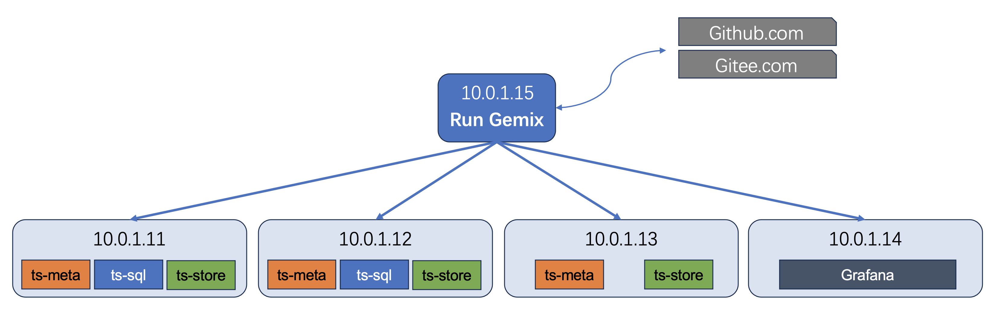

本文主要介绍Gemix如何使用，欢迎大家试用和反馈。

仓库地址：https://github.com/openGemini/gemix

问题反馈：https://github.com/openGemini/gemix/issues

## Gemix 概览

在各种系统软件和应用软件的安装管理中，包管理器有着广泛的应用，包管理工具的出现大大简化了软件的安装和升级维护工作。例如，几乎所有使用 RPM 的 Linux 都会使用 yum 来进行包管理，而 Anaconda 则可以非常方便地管理 Python 的环境和相关软件包。

在早期的 openGemini 生态中，没有专门的包管理工具，使用者只能通过相应的配置文件和文件夹命名来手动管理，由于openGemini组件多，配置参数多，配置问题是社区收到反馈最多的问题，为此我们希望开发一款工具，帮助大家更容易安装和运维openGemini。

在业界，我们看到Tiup工具做的非常好，参考之下，社区开发了Gemix，它是一款openGemini 运维工具，第一阶段主要完成了openGemini集群安装、集群启停、集群卸载、集群监控（自带Grafana的监控模板）等功能，您只需规划好集群的各组件分布，无需再配置繁杂的集群配置文件，就可以实现一键安装部署。

## 安装 Gemix 

执行如下命令安装 gemix 工具

```bash
> go install github.com/openGemini/gemix@latest
```

安装成功后，gemix二进制保存在$GOPATH/bin目录。如果是国内用户，安装失败，建议配置GOPROXY

```bash
> export GOPROXY=https://goproxy.cn
```

## 使用Gemix部署openGemini集群

安装好gemix后，就可以使用gemix部署openGemini集群了

### 1. 初始化集群拓扑文件

执行如下命令，生成集群初始化配置文件：

```bash
> gemix cluster template > topology.yaml
```

国内用户可能会因为网络原因执行不成功，请不要泄气，可以多尝试几次，若还是不成功，还可以访问如下目录：

```bash
# 如下路径是安装gemix时下载的源码，‘gemix@v0.0.0-20231228064944-577a453b6b53’可能会不一样，可根据实际目录名称填写
> cd $GOPATH/pkg/mod/github.com/open!gemini/gemix@v0.0.0-20231228064944-577a453b6b53/embed/examples/cluster
> cp topology.example.yaml $GOPATH/bin/topology.yaml
```

### 2. 配置集群拓扑文件

打开配置文件

```
> vim topology.yaml
```

配置文件topology.yaml分为如下7个部分，主要是为了告诉gemix工具，在哪些机器部署哪些组件，每个组件需要安装到目标机器什么位置，各组件的数据和日志存放到机器什么位置，是否需要部署集群监控和监控面板等。

```
global:
	...
monitored:
	...
ts_meta_servers:
	...
ts_sql_servers:
	...
ts_store_servers:
	...
grafana_servers:
	...
server_configs:
	...
```

#### **global**

global主要配置项如下

```
  ### The user who runs the openGemini cluster.
  user: "root"
  ### group is used to specify the group name the user belong to if it's not the same as user.
  # group: "root"
  ### Storage directory for cluster deployment files, startup scripts, and configuration files.
  deploy_dir: "/var/lib/openGemini/deploy"
  ### openGemini Cluster log file storage directory.
  log_dir: "/var/lib/openGemini/logs"
  ### openGemini Cluster data storage directory
  data_dir: "/gemini-data/meta"
  # operating system, linux/darwin.
  os: "linux"
  # Supported values: "amd64", "arm64" (default: "amd64").
  arch: "amd64"
```

`user` 和` group` 指定部署openGemini的机器的用户名和用户组，如果不存在该用户，gemix会自动创建该用户，并加入用户组。默认为`root`

`deploy_dir`指定openGemini组件，如ts-sql，ts-store等二进制的安装目录。**这里配置了，后面可不再配置**

`log_dir`指定openGemini各组件对应日志文件的存放目录。**这里配置了，后面可不再配置**

`data_dir` 指定openGemini组件（ts-store、ts-meta）的数据存放目录。**这里配置了，后面可不再配置**，但一般来说，ts-store会存储业务数据、WAL数据等，ts-meta会存储集群元数据、快照数据等，建议后面单独配置，使用不同目录进行区分，比如ts-store的数据目录为 /gemini-data/data, ts-meta的数据目录为/gemini-data/meta

`os`和`arch`分别指定部署机器的操作系统类型和对应CPU架构，用于下载对应的版本。目前暂不支持Windows。

#### monitored

monitored是配置是否需要为openGemini部署集群监控（参考[集群监控](../../maintenance/monitor.md)），其主要配置项如下

```
  ### Enable ts-monitor instance for all the machines
  ts_monitor_enabled: true
  ### Storage directory for deployment files, startup scripts, and configuration files of monitoring components.
  # deploy_dir: "/var/lib/openGemini/deploy"
  ### Log storage directory of the ts-monitor component.
  # log_dir: "/var/lib/openGemini/logs"

```

`ts_monitor_enabled`为`true`表示需要为openGemini部署集群监控，`false`则不会安装

`deploy_dir`和`log_dir`表示采集集群监控指标的组件被部署的目录和产生的日志存储目录。在前面的`global`中若有配置deploy_dir，则这里可不用配置。

#### ts_meta_servers

ts_meta_servers主要配置部署openGemini的ts-meta组件的机器信息。主要配置项如下

```
	### The ip address of the ts-meta Server.
  - host: 10.0.1.11
    ### SSH port of the server.
    # ssh_port: 22
    ### Access the ts-meta cluster port. (for devops)
    client_port: 8091
    ### communication port among ts-meta Server nodes.
    # peer_port: 8092
    ### communication raft port among ts-meta Server nodes.
    # raft_port: 8088
    ### communication gossip port among ts-meta and ts-store Server nodes.
    # gossip_port: 8010
    ### ts-meta Server deployment file, startup script, configuration file storage directory.
    deploy_dir: "/var/lib/openGemini/deploy"
    ### ts-meta Server logs storage directory.
    log_dir: "/var/lib/openGemini/logs"
    ### ts-meta Server meta data storage directory.
    data_dir: "/var/lib/openGemini/meta"
```

部署ts-meta组件，openGemini要求ts-meta要部署三个节点，以确保元数据的可靠性。一般建议部署在三台不同的虚拟机或物理机上，ts-meta可以与ts-store，ts-sql合部在一台机器上。如果希望两个及以上ts-meta要部署在同一台机器上，需要参考[openGemini端口矩阵](./ports.md)对ts-meta的相关端口进行调整，避免出现端口冲突。

这里以ts-meta部署在三台不同虚拟机为例

`host`指定部署ts-meta的其中第一台机器IP地址

`client_port`, `peer_port`, `raft_port`, `gossip_port`等保持默认。除非要修改对应端口号，参考[openGemini端口矩阵](./ports.md)

`deploy_dir`指定ts-meta二进制的存放目录，**在前面的`global`中若有配置deploy_dir，则这里可不用配置。**

`log_dir`指定ts-meta的日志存放目录，**在前面的`global`中若有配置log_dir，则这里可不用配置。**

`data_dir`指定ts-meta存放数据的目录，建议配置

上述为一个节点的配置，其余两个节点的配置可参考上述配置。总结起来，绝大多数情况下，只需配置`host`和`data_dir`即可。

#### ts_sql_servers

ts_sql_servers主要配置部署openGemini的ts-sql组件的机器信息。主要配置项如下

```
	### The ip address of the ts-sql Server.
  - host: 10.0.1.14
    ### Access the openGemini cluster port.
    # port: 8086
    ### ts-sql Server deployment file, startup script, configuration file storage directory.
    deploy_dir: "/var/lib/openGemini/deploy"
    ### ts-sql Server logs storage directory.
    log_dir: "/var/lib/openGemini/logs"
```

`host`指定部署ts-sql的机器IP地址

`port`可以保持默认。除非要修改对应端口号，参考[openGemini端口矩阵](./ports.md)

`deploy_dir`指定ts-sql二进制的存放目录，**在前面的`global`中若有配置deploy_dir，则这里可不用配置。**

`log_dir`指定ts-sql的日志存放目录，**在前面的`global`中若有配置log_dir，则这里可不用配置。**

若需要部署多个ts-sql，可参考上述配置多台机器信息。

#### ts_store_servers

ts_sql_servers主要配置部署openGemini的ts-store组件的机器信息。主要配置项如下

```
	### The ip address of the ts-store Server.
	- host: 10.0.1.14
    ### ingest data port
    # ingest_port: 8400
    ### select data port
    # select_port: 8401
    ### communication gossip port among ts-meta and ts-store Server nodes.
    # gossip_port: 8011
    ### ts-store Server deployment file, startup script, configuration file storage directory.
    deploy_dir: "/var/lib/openGemini/deploy"
    ### ts-store Server logs storage directory.
    log_dir: "/var/lib/openGemini/logs"
    ### ts-store Server meta data storage directory.
    data_dir: "/var/lib/openGemini/data"
```

`host`指定部署ts-store的机器IP地址

`ingest_port`, `select_port`, `gossip_port`可以保持默认。除非要修改对应端口号，参考[openGemini端口矩阵](./ports.md)

`deploy_dir`指定ts-store二进制的存放目录，**在前面的`global`中若有配置deploy_dir，则这里可不用配置。**

`log_dir`指定ts-store的日志存放目录，**在前面的`global`中若有配置log_dir，则这里可不用配置。**

`data_dir`指定ts-store存放数据的目录，建议配置

若需要部署多个ts-store，可参考上述配置多台机器信息。

#### grafana_servers

grafana_servers主要配置部署Grafana的机器信息。主要配置项如下

```
	### The ip address of the Grafana Server.
  - host: 10.0.1.17
    ### Grafana Web monitoring service client (browser) access port
    # port: 3000
    ### Grafana deployment file, startup script, configuration file storage directory.
    # deploy_dir: /var/lib/openGemini/deploy/grafana-3000
    ### grafana dashboard dir on gemix machine
    # dashboard_dir: /home/gemini/dashboards
```

`host`指定部署Grafana的机器IP地址

`port`可以保持默认。除非要修改Grafana服务的监听端口

`deploy_dir`指定Grafana的安装目录，**在前面的`global`中若有配置deploy_dir，则这里可不用配置。**

`dashboard_dir`指定存放openGemini监控面板模板的目录，**建议配置。**

#### server_configs

server_configs 用于配置具体的openGemini内核组件，生成各组件的配置文件，主要配置项如下：

```
  # server_configs:
  # ts-meta:
  # ts-sql:
  # ts-store:
  # ts-monitor:
```

`ts-sql`：ts-sql 服务的相关配置，完整配置请参考 [ts-sql配置文件描述](./configurations.md#http)

`ts-store`：ts-store 服务的相关配置，完整配置请参考 [ts-store 配置文件描述](./configurations.md#data)

`ts-meta`：ts-meta 服务的相关配置，完整配置请参考 [ts-meta 配置文件描述](./configurations.md#meta)

`ts-monitor`：ts-monitor 服务的相关配置，完整配置请参考 [ts-monitor 配置文件描述]()

### 3. 部署集群

上述配置文件准备好之后，就可以执行如下命令开始部署openGemini集群

```bash
> gemix cluster install gemini_test v1.1.1 ./topology.yaml --user root -p --skip-create-user
```

这条命令会部署一个名为`gemini_test`的openGemini集群，部署的openGemini版本为`v1.1.1`，集群部署的拓扑文件是`topology.yaml`，部署时访问机器的方式是用户名+密码，用户名为`root`，`--skip-create-user`跳过对root用户的创建。

**国内用户如果访问github存在网络问题，可以执行如下命令进行安装**

```bash
> GEMIX_MIRRORS_REPO=gitee.com gemix cluster install gemini_test v1.1.1 ./topology.yaml --user root -p
```

`GEMIX_MIRRORS_REPO=gitee.com`环境变量将指定从国内Gitee上下载openGemini的二进制版本。

::: tip

⚠️ 值得注意的是，选择从Gitee下载版本，只能安装v1.1.1及以上版本。

:::

如果使用密钥方式

```bash
> gemix cluster install gemini_test v1.1.1 ./topology.yaml --user root -k /home/root/.ssh/id_rsa
```

如果配置了免密登录

```
> gemix cluster install gemini_test v1.1.1 ./topology.yaml --user root
```

::: tip

一般情况下 gemix 会在目标机器上创建 topology.yaml 中约定的用户和组，以下情况例外：

- `topology.yaml` 中设置的用户名在目标机器上已存在。
- 在命令行上使用了参数 `--skip-create-user` 明确指定跳过创建用户的步骤。

:::

### 4. 集群启动

使用以下命令会将所有实例节点的相关进程启动。

```bash
> gemix cluster start gemini-test
```

预期结果输出 `Started cluster gemini-test successfully`，表示启动成功。

### 5.集群下线

使用以下命令会将所有实例节点的相关进程退出。

```bash
> gemix cluster stop gemini-test
```

预期结果输出 `Stop cluster gemini-test successfully`，表示下线成功。

::: tip

集群部署好之后，如果重新修改了ts-sql或者ts-store的配置文件，则需要将集群重启，具体操作方式为先将集群下线，再重新启动。

若是修改了topology.yaml，则需要重新安装

:::

### 6.集群卸载

当业务下线之后，如果想将集群占有的机器释放出来让给其他业务使用，执行如下命令将销毁集群

```bash
> gemix cluster uninstall
```

执行该命令需要谨慎：

- 停止集群
- 对于每个服务，删除其日志目录，部署目录，数据目录
- 如果各个服务的数据目录/部署目录的父目录是由 gemix-cluster 创建的，也一并删除

## 配置示例



以三台虚拟机部署openGemini集群为例, 额外一台机器作为运行gemix的执行机器，再一台机器用于部署Grafana，拓扑配置文件示例如下：

```yaml
global:
  user: "root"
  deploy_dir: "/usr/local/openGemini"
  log_dir: "/var/openGemini/logs"
  os: "linux"
  arch: "amd64"
monitored:
	ts_monitor_enabled: true
ts_meta_servers:
	- host: 10.0.1.11
		data_dir: "/var/openGemini/data/meta"
	- host: 10.0.1.12
		data_dir: "/var/openGemini/data/meta"
	- host: 10.0.1.13
		data_dir: "/var/openGemini/data/meta"
ts_sql_servers:
	- host: 10.0.1.11
	- host: 10.0.1.12
ts_store_servers:
	- host: 10.0.1.11
		data_dir: "/var/openGemini/data/data"
	- host: 10.0.1.12
		data_dir: "/var/openGemini/data/data"
	- host: 10.0.1.13
		data_dir: "/var/openGemini/data/data"
grafana_servers:
	- host: 10.0.1.14
server_configs:
	ts-sql:
	  # 开启鉴权和https
		http.auth-enabled: true
	  http.https-enabled: true
	ts-store:
	  # 指定ts-store的wal文件目录
		data.store-wal-dir: "/var/openGemini/data/wal"
	ts-monitor:
	  # 修改存储监控数据的库名，默认为集群名
		report.database: "_internal"
    # 监控数据默认被写入当前集群的目标数据库中，如果需要将监控数据写入单独节点上的openGemini，可修改地址
    report.address: "11.0.1.14:8086"
```

