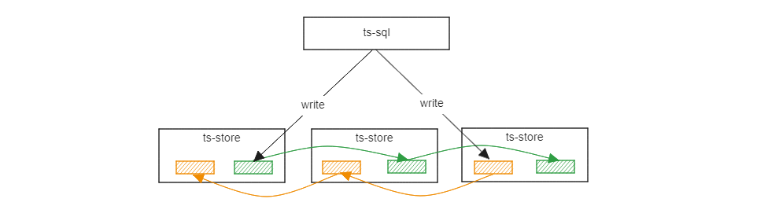

:::tip

社区版本下载：https://github.com/openGemini/openGemini/releases

Gitee版本下载：https://gitee.com/opengemini/Releases/releases

:::

## 特性

1. 支持promQL

   `PromQL(Prometheus Query Language)` 是 Prometheus 内置的数据查询语言，其提供对时间序列数据丰富的查询，聚合以及逻辑运算能力的支持。当前版本开始支持HTTP API使用PromQL直接从openGemini中查找数据。

   

   举个例子：

   查询指标`http_requests_total`的全部数据。

   ```sql
   // PromQL语法
   http_requests_total
   
   // openGemini HTTP API
   curl -i -XPOST 'http://127.0.0.1:8086/api/v1/query?query=http_requests_total'
   ```

   给定标签条件`job="apiserver"`和`handler="/api/comments"`，查询指标`http_requests_total`的全部数据。

   ```shell
   // PromQL语法
   http_requests_total{job="apiserver", handler="/api/comments"}
   
   // openGemini HTTP API
   curl -i -XPOST 'http://127.0.0.1:8086/api/v1/query?' --data-urlencode 'query=http_requests_total{job="apiserver", handler="/api/comments"}'
   ```

   给定标签条件`job="apiserver"`和`handler="/api/comments"`，查询从现在起，去过5分钟内，指标`http_requests_total`的全部数据。

   ```sql
   // PromQL语法
   http_requests_total{job="apiserver", handler="/api/comments"}[5m]
   
   // openGemini HTTP API
   curl -i -XPOST 'http://127.0.0.1:8086/api/v1/query?' --data-urlencode 'query=http_requests_total{job="apiserver", handler="/api/comments"}[5m]'
   ```

   对PromQL的支持程度以及用法，参考文档[PromQL查询](https://docs.opengemini.org/zh/guide/query_data/promql.html)

2. 数据可靠性

   openGemini在v1.2.0版本及早期版本，数据只存在一份。从当前版本开始，openGemini支持数据3副本能力，满足工业、能源、物联网等多数场景对数据可靠性的要求。

   

   具体用法，请参考[数据副本](https://docs.opengemini.org/zh/guide/features/replication.html)

3. 备份恢复

   支持单机和集群的数据备份，包括全量备份和增量备份。支持离线数据恢复，可以恢复到原节点，也可以恢复到新节点。数据是备份到本地，在生产环境上，建议配置FTP或者其他工具将备份数据upload到备份服务器上。

   

   备份恢复用法，请参考[备份恢复](https://docs.opengemini.org/zh/guide/maintenance/back_restore.html)

4. 支持Prometheus从openGemini拉取内核的监控指标数据

   ```shell
   curl -i -XPOST 'http://127.0.0.1:8086/metrics'
   ```

5. 新增`show cluster`命令查看集群状态信息

   ```sql
   > show cluster
   time                status hostname       nodeID nodeType availability
   ----                ------ --------       ------ -------- ------------
   1725071376777471503 alive  127.0.0.3:8091 1      meta     available
   1725071376777471503 alive  127.0.0.1:8091 2      meta     available
   1725071376777471503 alive  127.0.0.2:8091 3      meta     available
   1725071376777471503 alive  127.0.0.1:8400 4      data     available
   1725071376777471503 alive  127.0.0.2:8400 5      data     available
   1725071376777471503 alive  127.0.0.3:8400 6      data     available
   ```


## 性能优化

1. **topn() 查询性能优化**

   优化时间范围查询条件，实际业务场景中，100并发查询，平均时延从256ms下降到68ms，端到端业务性能提升2~4倍

2. **数据写入优化**

   针对TAG数量特别大，或者TAG Value特别长，或者TAG数组比较大的数据写入场景，通过优化WAL网络传输、Cache压缩、索引更新逻辑等，实现CPU开销降低20%。实际业务场景测试，写性能从37万rows/s提升到60万rows/s

   优化配置

   ```toml
   [index]
     cache-compress-enable = true
     bloom-filter-enable = true
   ```

3. **批量查询优化**

   针对批量点查场景，比如看板应用，大部分查询条件都相同，通过缓存倒排索引查询结果，实际业务场景测试，时间线规模1000万，批量查询性能提升近1倍。

4. **show tag values性能优化**

   针对于高基数且查询带limit的查询场景，通过优化查询策略，性能可提升5-10倍

5. **Memtable查询性能优化**

   针对大量时间线实时数据写入，使得Memtable数据较多，同时存在多个并发查询执行，导致CPU较高，查询性能下降的问题，通过减少数据深拷贝和GC优化，进一步提升查询性能。

6. **多Field查询优化**

   针对查询请求存在非常多FIELD过滤的场景，会出现查询时延高，CPU开销大的问题，通过优化索引扫描算法，将多field扫描场景在Index Scan阶段的CPU消耗从75.36%降低到了0.53%。

## Bug Fix

1. 修复了删表不能指定RP的问题 #666
2. 修复批量删除表时，部分表删除失败的问题 #482
3. 修复ts-cli翻看历史命令时出现命令行文本损坏的问题 #651
4. 修复ts-store重启Panic问题 #481
5. 修复文本索引文件加载失败的问题 #700
