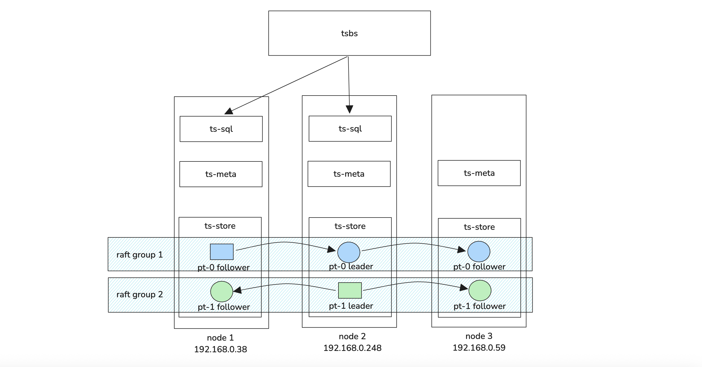

:::tip

社区版本下载：https://github.com/openGemini/openGemini/releases

:::

openGemini v1.4.0版本是一个多副本性能优化版本

## 测试集群规格和拓扑

### 机器规格

华为云ECS **8vcpu 16GB** c7n,2xlarge.2, SSD 40GB 共4台，1台用作执行机，3台用于部署集群。

### 数据规模

10万设备（时间线），846000000（8亿4千6百万行数据），**一行数据包含10个指标数据**，gzip压缩后30GB。

### 集群配置

数据3副本，每节点1或2PT，其余默认，集群拓扑见上图。

### 写入性能

:::tip

如下性能数据仅做参考，不可直接用于任何商业决策

:::

- 8并发往1个ts-sql批量写，1pt, batchsize为1000，写性能 90795.71 rows/sec（平均 9万rows/s）
  - 资源消耗
    - Node-1:  cpu 67%, mem  40%, 磁盘I/O利用率最大值 29%
    - Node-2:  cpu 20%, mem  37%，磁盘I/O利用率最大 26%
    - Node-3:  cpu 21%, mem  38%，磁盘I/O利用率 27%
- 8并发往1个ts-sql批量写，2pt, batchsize为1000，写性能 108758.62 rows/sec（平均 10万rows/s）
  - 资源消耗
    - Node-1:  cpu 70%, mem  51%, 磁盘I/O利用率 最大值 32%
    - Node-2:  cpu 30%, mem  47%，磁盘I/O利用率最大值 30%
    - Node-3:  cpu 26%, mem  40%，磁盘I/O利用率最大值 25%
- 8并发往2个ts-sql批量写，2pt, batchsize为1000，写性能 107886.40 rows/sec（平均 10万rows/s）
  - 资源消耗
    - Node-1:  cpu 71%, mem  47%, 磁盘I/O利用率 最大值 29%
    - Node-2:  cpu 37%, mem  44%，磁盘I/O利用率最大值 28%
    - Node-3:  cpu 26%, mem  43%，磁盘I/O利用率最大值 25%
- 16并发往2个ts-sql批量写，2pt, batchsize为1000，写性能 112811.15 rows/sec（平均 11万rows/s）
  - 资源消耗
    - Node-1:  cpu 72%, mem  51%, 磁盘I/O利用率 最大值 30%
    - Node-2:  cpu 37%, mem  44%，磁盘I/O利用率最大值 28%
    - Node-3:  cpu 26%, mem  43%，磁盘I/O利用率最大值 25%
- 8并发写单机，1pt，batchsize为1000，写性能 377977.89 rows/sec（平均 37万rows/s）
  - 资源消耗
    - Node-1:  cpu 90%, mem  10%, 磁盘I/O利用率 最大值 43%

### 查询性能

| 查询场景              | 并发数 | 查询平均时延（单位ms） |
| --------------------- | ------ | ---------------------- |
| single-groupby-1-1-1  | 4      | 1.98                   |
| single-groupby-1-1-12 | 4      | 11.94                  |
| single-groupby-1-8-1  | 4      | 5.23                   |
| single-groupby-5-1-1  | 4      | 2.07                   |
| single-groupby-5-1-12 | 4      | 5.17                   |
| single-groupby-5-1-8  | 4      | 3.93                   |
| cpu-max-all-1         | 4      | 2.64                   |
| cpu-max-all-8         | 4      | 5.07                   |
| double-groupby-1      | 4      | 4630.04                |
| double-groupby-5      | 4      | 10141.8                |
| double-groupby-all    | 4      | 17060.1                |
| high-cpu-all          | 1      | 35,201.1               |
| high-cpu-1            | 4      | 6.19                   |
| lastpoint             | 4      | 89.24                  |
| groupby-orderby-limit | 1      | 9,225.74               |

由于内存只有16GB，因此并发数调整为4，high-cpu-all 和 groupby-orderby-limit这两个场景要消耗大量计算资源，因此并发数设置为1。

## 问题修复

1. 修复了2个备份恢复问题，其中包括Panic问题
2. 修复查询结果数据的时间格式默认为rfc3339
3. 修复子查询支持distinct

## 安全问题

1. CVE-2024-45337

   升级依赖  golang.org/x/net from v0.26.0 to v0.33.0

2. CVE-2025-30204

   升级依赖  github.com/golang-jwt/jwt/v5 from v5.0.0 to v5.2.2

