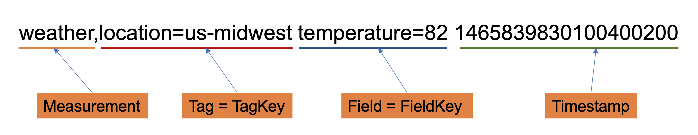

## 背景

当前，openGemini主要的写入方式是与influxDB类似的行协议，其基于文本，使用一行文字来代表某个measurement中的单个point。在写入服务端时，客户端会把所有待写入的points作为HTTP请求体，提交给服务端进行处理。

这种写入方式易于让用户理解和检查待写入的内容，然而，当我们准备往同一个measurement中写入大量的point时，行协议的缺点就显现出来了：每行数据都必须声明表名称，tag key 和 field key，引入了较多的信息冗余。另外，相较于直接使用 TCP 协议，HTTP协议偏重，其使用的GZIP 压缩解压效率也偏低。

针对上述两个问题，我们提出了新的写入协议，即基于record的数据列写入协议。首先，我们使用了一个新的数据结构，即record，来表示一组points。其由一组measurement的元数据和对应的数据组成，减少了冗余的表信息。其次，我们使用了更轻量级的gRPC协议来减少数据传输时在协议层面的性能开销。

## 数据结构
列写入协议相关的数据结构如下图所示：

`WriteRequest`是每次写入时调用gRPC方法的参数，其中包含了鉴权相关的用户名，密码，待写入的数据库和数据保留策略等信息。`records`数组则包含了多个`Record`结构，每个`Record`都声明了写入的`measurement` 和经过压缩的二进制数据`block` ，其压缩算法被声明在`compress_method`中，当前支持LZ4，ZSTD和SNAPPY三种压缩算法。block数据是由openGemini内部的record.Record结构二进制编码得来的。如果想更进一步地了解该结构可查看：[Record-结构详解](https://github.com/openGemini/openGemini/wiki/Record-%E7%BB%93%E6%9E%84%E8%AF%A6%E8%A7%A3)。

如果想手动完成列数据的填写与上传可能较为不便，因此更推荐使用封装好的SDK进行列协议的写入。

## SDK写入
::: tip

待完善

:::

## 参数配置
服务端的参数配置项及说明位于：[列协议参数配置](https://docs.opengemini.org/zh/guide/reference/configurations.html#record-write)