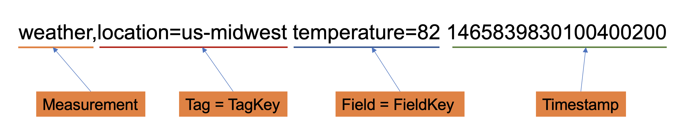

Line Protocol（行协议） 是InfluxDB提出的一种基于文本的数据格式，openGemini使用相同Line Protocol，用于将points 写入 openGemini。

**了解更多关于行协议的详细定义、用法、特殊字符等**，可以参考[InfluxDB Line Protocol](https://docs.influxdata.com/influxdb/cloud/reference/syntax/line-protocol/) 或者 [openGemini数据行协议](../reference/line_protocol.md)

## 行协议数据格式

Line protocol 格式的单行文本代表一个point，换言之，point由measurement（表名）、tag set（多个tag的集合），field set（多个field的集合）以及timestamp组成。

```
<measurement>[,<tag_key>=<tag_value>[,<tag_key>=<tag_value>]] <field_key>=<field_value>[,<field_key>=<field_value>] [<timestamp>]
```

**举个例子**



表示该Point属于表`Weather`，`Location`表示温度传感器的位置在`us-midwest`，在这个时刻`1465839830100400200`的温度是82华氏度。

**再举个例子**


表示该Point属于表`monitor`，`region`和`host`标识`beijing`区域的`10.0.1.11`这台机器，在这个时刻`1465839830100400200`的cpu利用率和内存利用率分别是43%和1465839KB

::: tip

行协议数据格式记住下面口诀：

- measurement与tag之间用“逗号”分割
- Tag与Tag之间、Field和Field之间用“逗号”分割，“逗号”后不能再有空格。
- Tag与Field、Field与timestamp之间要用“空格”分开。

:::

## 行协议数据格式写入

::: tabs

@tab CLI

使用ts-cli命令将数据写入openGemini数据库，启动命令行界面（CLI）写入相关的数据库，并将Insert放在line procotol前面:

```sql
> INSERT weather,location=us-midwest temperature=82 1465839830100400200
```

@tab API

使用openGemini API将数据写入openGemini，使用`POST`向`/write方法发起请求，并在请求正文中提供您的line protocol：

```bash
> curl -i -XPOST "http://localhost:8086/write?db=science_is_cool" --data-binary 'weather,location=us-midwest temperature=82 1465839830100400200'
```

批量写入数据：

```bash
> curl -i -XPOST "http://localhost:8086/write?db=db0" --data-binary '
weather,location=us-midwest temperature=82 1465839830100400200
weather,location=us-midwest temperature=83 1465839830100400300
weather,location=us-midwest temperature=84 1465839830100400400
'
```

写入文件数据:  

假设数据按line protocol data保存在文件data.txt中

```
weather,location=us-midwest temperature=82 1465839830100400200
weather,location=us-midwest temperature=83 1465839830100400300
weather,location=us-midwest temperature=84 1465839830100400400
```

可通过如下命令把数据写入openGemini

```bash
> curl -i -XPOST 'http://localhost:8086/write?db=db0' --data-binary @data.txt
```

:::
