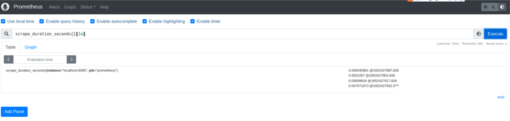
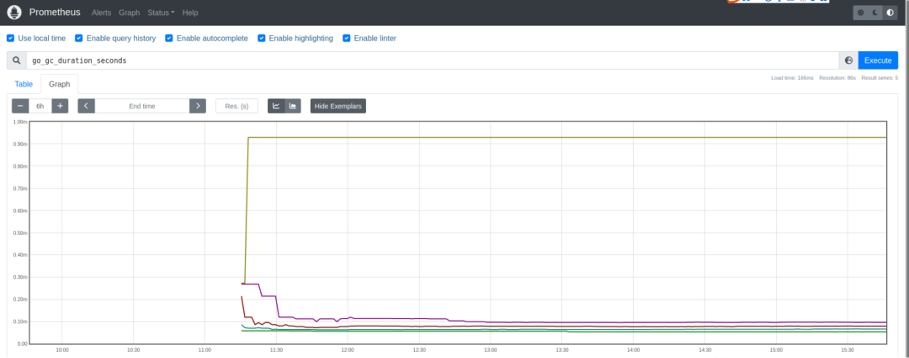

Prometheus是一个开源的完整监控解决方案，其对传统监控系统的测试和告警模型进行了彻底的颠覆，形成了基于中央化的规则计算、统一分析和告警的新模型，通过对数据的采集能达到长期趋势分析，对照分析，告警，故障分析与定位，数据可视化等目标。

Prometheus的本地存储设计可以减少其自身运维和管理的复杂度，同时能够满足一定用户场景的需求。但是本地存储也意味着Prometheus无法长期持久化数据，无法存储大量历史数据，同时也无法灵活扩展和迁移，为保持Prometheus的简单性，Prometheus通过定义两个标准接口(remote_write/remote_read)，让用户可以基于这两个接口对接将数据保存到任意第三方的存储服务中，这种方式在Promthues中称为Remote Storage。

openGemini+Prometheus的搭配，解决了海量数据存储和长期历史数据存储的问题，与此同时，openGemini具有更加快速的查询效率，更加低成本的数据存储等优点，是Prometheus远端存储数据，数据持久化的一个更优方案。

## 方案介绍


openGemini支持分布式集群部署以及单机部署，可支撑多个Prometheus节点同时写入和查询数据，在本方案中可以额外添加Grafana插件，接入数据源为openGemini或者Prometheus任意节点，尽管在数据可视化方面，Prometheus和Grafana存在一定的功能重叠，但这种解决方案其实是互补的。Prometheus采集的指标更为丰富，并提供强大的查询语言；Grafana作为可视化监控系统，相比Prometheus来说，功能更强大，界面更美观。事实上，DevOps团队在Prometheus之上运行Grafana是非常常见的。

### **环境准备**

安装openGemini，参考[安装部署](../quick_start/get_start.md)

安装Prometheus

> https://prometheus.io/download/

安装Grafana（可选）

> https://grafana.com/docs/grafana/latest/setup-grafana/installation/

### **Prometheus环境配置**

openGemini兼容Prometheus对InfluxDB的远端读写配置，主要使用接口为：/api/v1/prom/read，/api/v1/prom/read/write。

> 参考文档：https://docs.influxdata.com/influxdb/v1.7/supported_protocols/prometheus/
>

openGemini需要在Prometheus启动之前手动创建对应的数据库。

修改Prometheus配置文件prometheus.yml：

```yaml
> vim prometheus.yml
# 在配置文件底部添加：
remote_write:
# ip和端口对应openGemini的节点ip和端口（本地ip可用127.0.0.1，openGemini默认端口为
# 8086，db字段表示prometheus数据采集写入的库名）
- url: "http://127.0.0.1:8086/api/v1/prom/write?db=prometheus"
remote_read:
- url: "http://127.0.0.1:8086/api/v1/prom/read?db=prometheus"
> systemctl restart prometheus
> systemctl status prometheus
```

如果openGemini开启了鉴权或者启用Https，需要修改对应配置:

```yaml
> vim prometheus.yml
# 在配置文件底部添加：
remote_write:
# ip和端口对应openGemini的节点ip和端口（本地ip可用127.0.0.1，openGemini默认端口为
# 8086，db字段表示prometheus数据采集写入的库名, username和password为openGemini创建的具体用户名和密码）
- url: "https://127.0.0.1:8086/api/v1/prom/write?
db=prometheus&u=username&p=password""
remote_read:
- url: "https://127.0.0.1:8086/api/v1/prom/read?
db=prometheus&u=username&p=password""
> systemctl restart prometheus
> systemctl status prometheus
```

### **openGemini环境配置**

**创建数据库**

```
> create database prometheus
> use prometheus
Using database prometheus
### 检查prometheus数据是否正常写入
> show measurements
name: measurements
name
----
go_gc_cycles_automatic_gc_cycles_total
go_gc_cycles_forced_gc_cycles_total
go_gc_cycles_total_gc_cycles_total
go_gc_duration_seconds
go_gc_duration_seconds_count
go_gc_duration_seconds_sum
go_gc_heap_allocs_by_size_bytes_total_bucket
go_gc_heap_allocs_by_size_bytes_total_count
go_gc_heap_allocs_by_size_bytes_total_sum
go_gc_heap_allocs_bytes_total
go_gc_heap_allocs_objects_total
go_gc_heap_frees_by_size_bytes_total_bucket
go_gc_heap_frees_by_size_bytes_total_count
go_gc_heap_frees_by_size_bytes_total_sum
go_gc_heap_frees_bytes_total
go_gc_heap_frees_objects_total
go_gc_heap_goal_bytes
go_gc_heap_objects_objects
go_gc_heap_tiny_allocs_objects_total
go_gc_pauses_seconds_total_bucket
go_gc_pauses_seconds_total_count
go_goroutines
go_info
go_memory_classes_heap_free_bytes
go_memory_classes_heap_objects_bytes
go_memory_classes_heap_released_bytes
go_memory_classes_heap_stacks_bytes
go_memory_classes_heap_unused_bytes
go_memory_classes_metadata_mcache_free_bytes
go_memory_classes_metadata_mcache_inuse_bytes
go_memory_classes_metadata_mspan_free_bytes
up
```

### **数据可视化**

进入Prometheus Client界面：http://127.0.0.1:9090，实际使用请根据Prometheus节点ip以及进程端口自行切换。

执行查询(示例）：

```
scrape_duration_seconds{}[1m]
```



查看Graph示例：

```bash
# 查询语句
go_gc_duration_seconds
```



相关阅读 [Grafana对接Prometheus ](https://grafana.com/docs/grafana/latest/getting-started/get-started-grafana-prometheus/)
